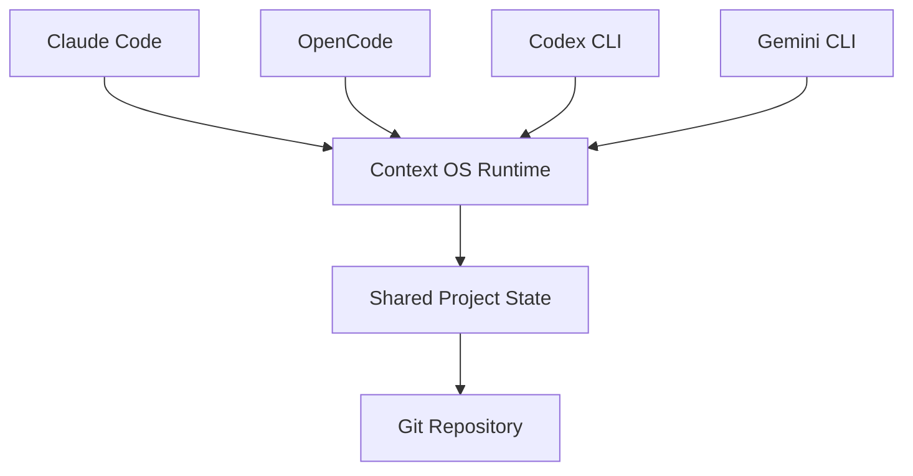

# Context OS Design Document

**Version:** 0.1.0
**Status:** Draft
**Authors:** Pranav Bajaj
**Last Updated:** June 2026

---

# Chapter 1 — Executive Summary

---

# 1. Introduction

Large Language Models have fundamentally changed software engineering.

Instead of developers writing every line of code manually, modern software development increasingly involves delegating work to autonomous or semi-autonomous coding assistants such as:

* OpenCode
* Claude Code
* Codex CLI
* Gemini CLI
* Cursor
* Continue
* Cline
* RooCode
* Aider
* Goose
* OpenHands
* Devin

These tools have dramatically improved developer productivity.

However, they all share one fundamental limitation:

> **They own their context instead of the project owning its context.**

This architectural decision makes every coding assistant an isolated island.

Switching between assistants loses workflow continuity, architectural understanding, checkpoints, reasoning history, and project memory.

---

# 2. Problem Statement

Today's coding assistants are tightly coupled to their own execution environments.

```
Claude Code
    │
    └── .claude/

OpenCode
    │
    └── .opencode/

Cursor
    │
    └── .cursor/

Codex CLI
    │
    └── .codex/
```

Each assistant independently maintains:

* Conversation history
* Temporary reasoning
* Workflow state
* Checkpoints
* Prompts
* Session context

There is no shared runtime.

If a developer switches from OpenCode to Claude Code, the new assistant must rebuild project understanding almost from scratch.

The project itself possesses no persistent intelligence.

---

# 3. Motivation

Modern software development increasingly relies on multiple AI coding assistants.

A typical workflow might look like:

```
Research
        │
        ▼
Claude Code

        │

Planning
        │
        ▼
OpenCode

        │

Implementation
        │
        ▼
Codex CLI

        │

Review
        │
        ▼
Claude Code

        │

Testing
        │
        ▼
Gemini CLI
```

Although all of these assistants contribute toward the same software project, none of them share a common understanding of:

* Current milestone
* Completed work
* Pending work
* Architectural decisions
* Generated artifacts
* Previous failures
* Project memory

Every transition incurs context loss.

---

# 4. Vision

The long-term vision of Context OS is to become the operating system for AI software engineering workflows.

Just as Git standardized source control across editors and IDEs, Context OS standardizes project memory and workflow across AI coding assistants.

Rather than replacing existing assistants, Context OS provides the infrastructure that allows them to collaborate through a shared runtime.



The runtime becomes the single source of truth.

Assistants become interchangeable execution engines.

---

# 5. Vision Statement

> **Context OS is a universal runtime that enables AI coding assistants to collaborate through shared project state, persistent workflow, durable memory, and standardized execution contracts independent of any specific model, provider, or IDE.**

---

# 6. Project Philosophy

Context OS is built upon six guiding principles.

## 6.1 Project-Centric Intelligence

Project knowledge belongs to the project, not the assistant.

The runtime persists knowledge independent of whichever assistant is currently active.

---

## 6.2 Provider Agnostic

Context OS never depends upon:

* Claude
* GPT
* Gemini
* DeepSeek
* Qwen
* Codex

Models are replaceable.

Project memory is not.

---

## 6.3 CLI First

The MVP targets existing command-line coding assistants.

API integrations are intentionally postponed.

This enables rapid adoption while avoiding vendor lock-in.

---

## 6.4 Human Readable State

Whenever practical, runtime data should be inspectable by humans.

Preferred formats:

* Markdown
* YAML
* JSON

Developers should never require proprietary tooling to understand project state.

---

## 6.5 Local First

All project state is stored locally.

Cloud synchronization is an optional future enhancement.

Benefits include:

* Offline support
* Privacy
* Reproducibility
* Portability

---

## 6.6 Extensibility

Every subsystem exposes extension points.

Examples include:

* Providers
* Workflows
* Storage backends
* Plugins
* Adapters
* UI components

The core runtime remains stable while capabilities evolve independently.

---

# 7. Goals

Version 1.0 aims to provide:

## Persistent Runtime

Maintain durable project state independent of the coding assistant.

## Workflow Engine

Represent software development as resumable workflows rather than conversations.

## Shared Memory

Maintain project memory that survives:

* Process termination
* Context window exhaustion
* Provider switching

## Artifact Management

Store generated outputs such as:

* Design documents
* Implementation plans
* Code reviews
* Benchmarks
* Research
* Build logs

## Checkpoint System

Allow projects to resume from meaningful milestones.

## Provider Abstraction

Support multiple coding assistants through a common execution interface.

## Interactive Terminal UI

Provide visibility into runtime execution.

## CLI Interface

Expose automation-friendly commands suitable for scripting and CI/CD.

---

# 8. Non-Goals

Context OS intentionally avoids several responsibilities.

* It is **not** an LLM.
* It is **not** an IDE.
* It is **not** a Git replacement.
* It is **not** a build system.
* It is **not** a package manager.
* It does **not** invent workflows; it executes them.

---

# 9. Success Metrics

The success of Context OS will be measured through objective outcomes.

## Runtime Continuity

Projects resume with minimal loss of state.

## Provider Switching

Changing providers requires only configuration changes.

## Context Reduction

Relevant context is assembled from project state instead of replaying entire conversations.

## Workflow Persistence

Tasks survive:

* Terminal restarts
* Machine restarts
* Provider changes

## Extensibility

Adding a new provider requires implementing a single adapter interface.

---

# 10. Design Principles

Every engineering decision within Context OS should satisfy these principles.

* Simplicity
* Explicitness
* Determinism
* Modularity
* Replaceability
* Testability
* Observability

Developers should always understand:

* Current workflow
* Active provider
* Runtime state
* Pending tasks
* Generated artifacts
* Checkpoints
* Execution history

---

# 11. Document Scope

This design document specifies the architecture for Context OS Version 1.

It defines:

* System architecture
* Runtime model
* Storage model
* Execution lifecycle
* Provider framework
* Workflow engine
* Memory architecture
* Plugin framework
* Repository layout
* Implementation roadmap

This specification serves as the canonical reference for all future development.
