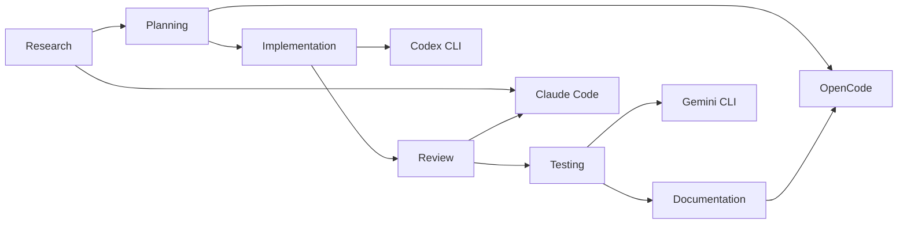
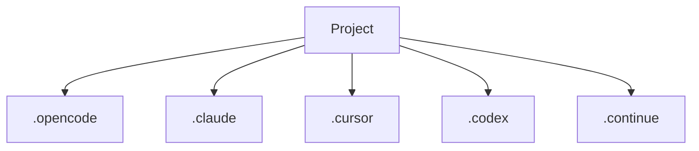
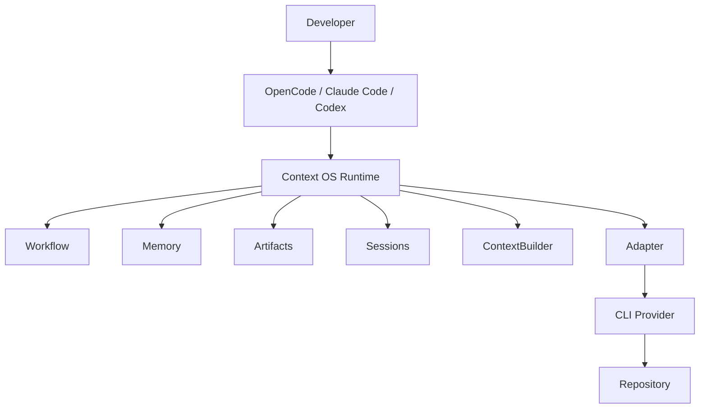

# Chapter 3 — Problem Definition

---

# 3. Problem Definition

## 3.1 Background

Software engineering is no longer performed exclusively by humans.

Modern development workflows increasingly involve multiple AI coding assistants working alongside developers throughout the software development lifecycle.

A typical engineering workflow may involve different assistants specializing in different tasks.



Each assistant contributes valuable work.

However, every transition introduces context loss because each assistant owns its own runtime.

The project itself has no persistent operating system.

---

# 3.2 Current State

Today, project intelligence is fragmented.



Each assistant maintains:

* prompts
* conversations
* temporary memory
* workflow state
* checkpoints
* execution history

None of this information is shared.

---

# 3.3 Fundamental Problem

The problem is **not** limited context windows.

Large context windows merely postpone the issue.

The real problem is that project state exists only as transient conversational context instead of durable structured knowledge.

Current systems answer the question:

> **"What has the model seen?"**

Context OS answers a different question:

> **"What does the project know?"**

---

# 3.4 Problem Statement

Context OS exists to solve the following problem.

> There is currently no universal runtime that allows multiple AI coding assistants to share durable project state while remaining independent of any specific model, IDE, provider or execution environment.

This results in:

* duplicated reasoning
* repeated planning
* context reconstruction
* workflow interruption
* inconsistent project understanding

---

# 3.5 Why Existing Approaches Fail

## Approach 1 — Larger Context Windows

Increasing context size delays context loss.

It does not eliminate it.

Problems remain:

* expensive inference
* slower execution
* repeated information
* no explicit project state

Context windows are transport mechanisms.

They are not databases.

---

## Approach 2 — Conversation Summarization

Many assistants summarize previous conversations.

Problems:

* summaries lose detail
* summaries are model-generated
* summaries are difficult to query
* summaries are assistant-specific

The project still lacks structured state.

---

## Approach 3 — Persistent Chats

Saving conversations improves continuity.

However conversations are poor databases.

Finding information inside conversations remains expensive and unreliable.

---

## Approach 4 — Knowledge Files

Many teams maintain files such as:

```text
CLAUDE.md

AGENTS.md

README.md

NOTES.md
```

These help.

However they remain:

* manually maintained
* incomplete
* disconnected
* static

They cannot represent execution state.

---

# 3.6 Core Insight

Projects should own their own intelligence.

Assistants should consume project intelligence.

Not the other way around.

Instead of

```text
Assistant

↓

Conversation

↓

Project
```

Context OS proposes

```text
Project

↓

Runtime

↓

Assistant
```

The assistant becomes a worker.

The runtime becomes the source of truth.

---

# 3.7 Design Goals

The runtime should answer questions such as:

## Project State

* What is the current milestone?
* What task is running?
* Which tasks are blocked?
* What remains?

---

## Workflow

* What was the previous step?
* What is the next step?
* Can execution resume?

---

## Memory

* What architectural decisions were made?
* Why were they made?
* Which patterns should be reused?

---

## Artifacts

* Where are review reports?
* Where are benchmark results?
* Where is the implementation plan?

---

## Sessions

* Which agent executed this task?
* Which provider was used?
* When was execution interrupted?

---

## Context

* What information is actually relevant right now?

---

# 3.8 Responsibilities

Context OS owns the following domains.

## Project State

Current project status.

Examples:

* active workflow
* progress
* milestones
* blockers

---

## Memory

Long-lived project knowledge.

Examples:

* architecture
* conventions
* design decisions
* implementation notes

---

## Workflow

Execution lifecycle.

Examples:

* planning
* implementation
* testing
* review

---

## Artifacts

Generated outputs.

Examples:

* reviews
* design docs
* benchmarks
* reports
* plans

---

## Sessions

Execution continuity.

Examples:

* active tasks
* resumable checkpoints
* interrupted work

---

## Context Assembly

Construct minimal context required for execution.

Instead of replaying conversations.

---

## Provider Integration

Launch external coding assistants.

Examples:

* Claude Code
* Codex CLI
* OpenCode
* Gemini CLI

---

# 3.9 Non Responsibilities

Context OS deliberately avoids responsibility for:

## Model Inference

Inference belongs to providers.

---

## Code Editing

Editors edit files.

Providers generate code.

---

## Version Control

Git owns source history.

---

## Package Management

Language ecosystems manage dependencies.

---

## Build Systems

Build tools remain unchanged.

---

## IDE Features

Editors continue providing navigation, completion and debugging.

---

# 3.10 Guiding Principle

Context OS should feel similar to Git.

Git owns source history.

Context OS owns project intelligence.

Neither replaces the other.

---

# 3.11 Context OS Architecture



The runtime becomes an operating system.

Assistants become interchangeable applications.

---

# 3.12 Architectural Separation

One of the primary design goals is strict separation of concerns.

| Component       | Responsibility             |
| --------------- | -------------------------- |
| Planner         | Understand user intent     |
| Runtime         | Maintain project state     |
| Workflow Engine | Execute workflows          |
| Context Builder | Assemble relevant context  |
| Adapter         | Translate runtime requests |
| Provider        | Execute AI coding task     |
| Repository      | Store source code          |

This separation ensures that replacing one component does not require changes to others.

---

# 3.13 Success Criteria

Context OS succeeds when:

* Developers can switch providers without losing workflow continuity.
* Project knowledge survives assistant changes.
* Context is assembled from structured project state instead of conversations.
* Workflows resume after interruptions.
* Artifacts become first-class project assets.
* AI assistants become replaceable execution engines.

---

# 3.14 Architectural Principles Derived

The problem definition leads directly to the following architectural principles.

1. **Project-first architecture** — project state outlives assistants.
2. **Conversation-free runtime** — workflows are independent of chat history.
3. **Provider abstraction** — execution engines are interchangeable.
4. **Workflow over prompts** — execution follows explicit state machines.
5. **Artifacts over transcripts** — durable outputs replace conversational logs.
6. **Context by retrieval** — assemble only relevant information.
7. **Local-first storage** — project state remains portable and offline.
8. **Composable architecture** — runtime services evolve independently.

---

# 3.15 Chapter Summary

The central premise of Context OS is simple:

> **Projects should own their intelligence. Assistants should temporarily borrow it.**

By separating project state from AI assistants, Context OS transforms coding assistants from isolated conversational systems into interchangeable workers operating on a shared, durable runtime.

The next chapter translates these principles into concrete functional and non-functional requirements that define the scope of Version 1.
