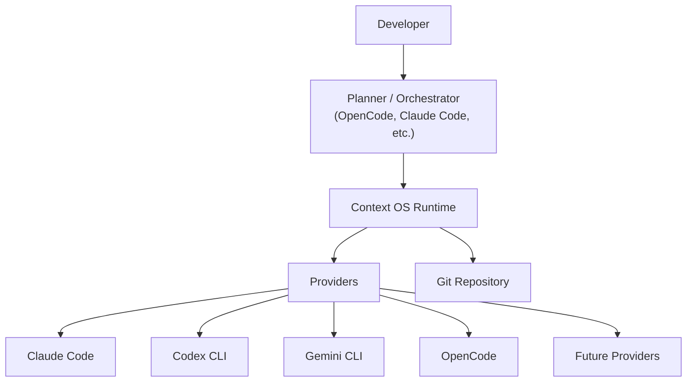
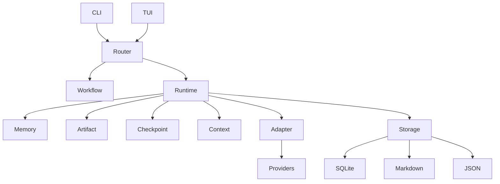
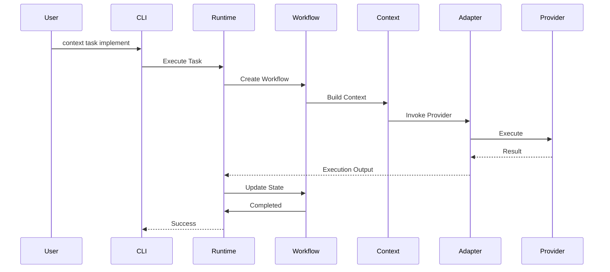
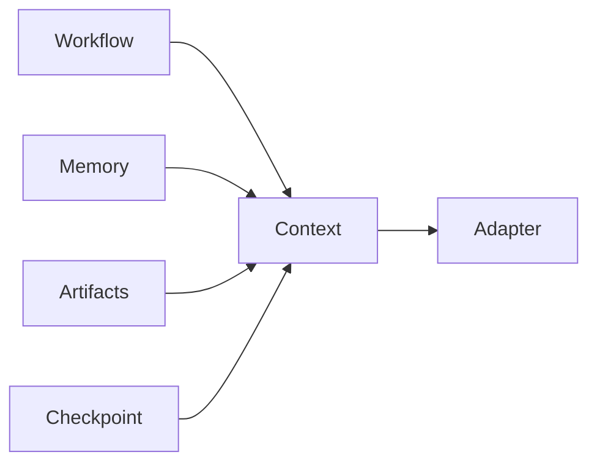

# Chapter 5 — High-Level Architecture

---

# 5. High-Level Architecture

## 5.1 Overview

Context OS is designed as a **local-first runtime** that sits between AI planning systems (OpenCode, Claude Code, Codex CLI, etc.) and the software project.

It does **not** replace existing coding assistants.

Instead, it provides the missing infrastructure that today's assistants lack:

* Persistent project state
* Durable workflow execution
* Long-lived project memory
* Artifact management
* Checkpointing
* Context construction
* Provider abstraction

Context OS should be viewed as an **operating system for AI-assisted software engineering**, not as another coding assistant.

---

# 5.2 Architectural Philosophy

Modern AI coding assistants typically combine four responsibilities into a single application.

```text
Understand User
        │
Plan Work
        │
Maintain Context
        │
Execute
```

This creates several problems:

* Project state becomes provider-specific.
* Memory becomes conversation-centric.
* Workflows become difficult to resume.
* Switching assistants requires rebuilding context.

Context OS separates these responsibilities.

---

# 5.3 Architectural Principles

The architecture follows six fundamental principles.

## Separation of Concerns

Every subsystem owns exactly one responsibility.

---

## Provider Independence

The runtime never depends on a specific AI model.

---

## Local First

Project state is stored inside the repository.

---

## Explicit State

Nothing important exists only in memory.

---

## Layered Design

Higher layers never access storage directly.

---

## Extensibility

Every major subsystem exposes stable interfaces.

---

# 5.4 System Context

The following diagram illustrates Context OS within the larger development ecosystem.



---

## Architectural Observation

Notice that the runtime does **not** communicate directly with models.

It communicates only with provider adapters.

This ensures provider independence.

---

# 5.5 Runtime Architecture

The runtime itself consists of several independent services.



Each service owns one clearly defined responsibility.

---

# 5.6 Runtime Components

## Command Router

Responsibilities

* Parse commands
* Validate input
* Resolve workflows
* Dispatch execution

Never performs business logic.

---

## Workflow Engine

Responsible for:

* Workflow lifecycle
* State transitions
* Recovery
* Progress tracking

The workflow engine is the heart of Context OS.

---

## Runtime Manager

Maintains current project execution state.

Examples:

* active workflow
* active session
* running provider
* execution status

---

## Memory Manager

Maintains durable project knowledge.

Memory includes:

* architecture
* conventions
* design decisions
* implementation notes

Memory is independent from conversations.

---

## Context Builder

Constructs execution context.

Inputs include:

* workflow
* memory
* artifacts
* repository
* checkpoints

Outputs:

Provider-ready execution package.

---

## Artifact Manager

Responsible for:

* storing outputs
* indexing artifacts
* versioning metadata
* cleanup

---

## Checkpoint Manager

Creates resumable execution points.

Supports:

* create
* restore
* compare
* archive

---

## Adapter Manager

Provides abstraction over external coding assistants.

Examples

* Claude Code
* Codex CLI
* Gemini CLI
* OpenCode

---

## Storage Engine

Responsible for persistence.

Storage implementations include:

* SQLite
* Markdown
* JSON
* Local filesystem

---

# 5.7 Layer Responsibilities

| Layer          | Responsibility       |
| -------------- | -------------------- |
| Presentation   | CLI & TUI            |
| Application    | Command Routing      |
| Runtime        | Workflow Services    |
| Domain         | Project Intelligence |
| Infrastructure | Storage & Providers  |

No layer may bypass another.

---

# 5.8 Runtime Execution Flow

A typical execution follows this lifecycle.



---

# 5.9 Why Context OS Exists

The runtime intentionally owns responsibilities that current coding assistants typically do not.

| Capability          | Coding Assistant | Context OS        |
| ------------------- | ---------------- | ----------------- |
| Code Generation     | ✅                | ❌                 |
| Planning            | ✅                | ❌ (planner-owned) |
| Workflow State      | Partial          | ✅                 |
| Checkpoints         | Partial          | ✅                 |
| Shared Memory       | ❌                | ✅                 |
| Artifact Management | Limited          | ✅                 |
| Provider Switching  | ❌                | ✅                 |
| Runtime Recovery    | Limited          | ✅                 |

Context OS complements coding assistants rather than replacing them.

---

# 5.10 Core Runtime Services

The runtime can be viewed as six cooperating services.



Every provider invocation passes through the Context service.

---

# 5.11 Command Lifecycle

Every command follows a deterministic execution pipeline.

```text
User Command
      │
      ▼
Parse
      │
Validate
      │
Load Project
      │
Restore Runtime
      │
Execute Workflow
      │
Persist State
      │
Return Result
```

This lifecycle is identical regardless of provider.

---

# 5.12 Data Ownership

One of the key architectural principles is explicit ownership.

| Component | Owns                 |
| --------- | -------------------- |
| Workflow  | Task execution       |
| Memory    | Project knowledge    |
| Artifact  | Generated outputs    |
| Runtime   | Current execution    |
| Context   | Prompt assembly      |
| Adapter   | Provider translation |
| Storage   | Persistence          |

Ownership never overlaps.

---

# 5.13 Failure Isolation

Each subsystem should fail independently.

Examples:

If a provider crashes:

* Workflow survives.
* Runtime survives.
* Checkpoint survives.
* Memory remains intact.

If SQLite becomes unavailable:

The storage layer reports failure.

Higher layers remain isolated.

---

# 5.14 Design Decisions

## Decision 1 — Runtime over Framework

Context OS is a runtime.

It is not an orchestration framework.

Planning remains the responsibility of the external assistant.

---

## Decision 2 — Provider Adapters

Every external coding assistant is represented through an adapter.

The runtime never invokes providers directly.

---

## Decision 3 — Structured State

Workflows are represented explicitly.

Conversations are never considered the source of truth.

---

## Decision 4 — Layered Services

Subsystems communicate only through interfaces.

No service accesses another service's internal storage.

---

# 5.15 Alternatives Considered

## Monolithic Runtime

Rejected.

Reasons:

* difficult testing
* poor extensibility
* tight coupling

---

## Provider-Owned Runtime

Rejected.

Reasons:

* vendor lock-in
* duplicated implementations
* impossible interoperability

---

## Database-Only Design

Rejected.

Reasons:

* difficult inspection
* poor developer experience
* less portable

---

# 5.16 Open Questions

The following architectural questions remain open for later chapters.

* Should workflows support nested execution?
* Should runtime state be event sourced?
* Should providers stream execution events?
* Should adapters support capability negotiation?
* Should checkpoints be incremental?

These questions do not block Version 1.

---

# 5.17 Chapter Summary

This chapter introduced the high-level architecture of Context OS.

The key architectural decision is that **Context OS is not another AI coding assistant**.

Instead, it acts as the operating system beneath AI coding assistants, providing durable project state, workflow execution, memory, checkpoints, and context construction while treating planners and providers as replaceable components.

The next chapter refines this architecture into a layered design, defining clear boundaries between presentation, application, domain, infrastructure, and storage layers. That layered architecture will become the foundation for package organization, dependency rules, and implementation.
