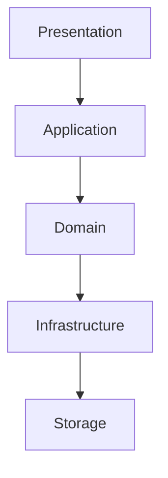
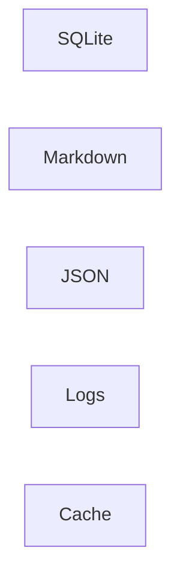
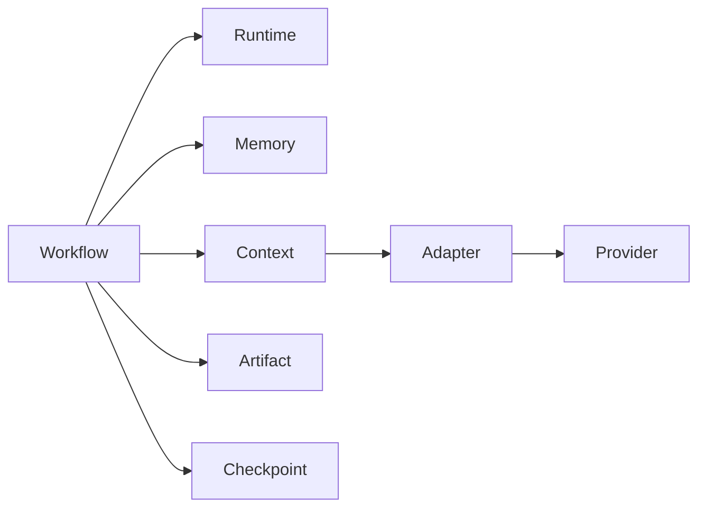
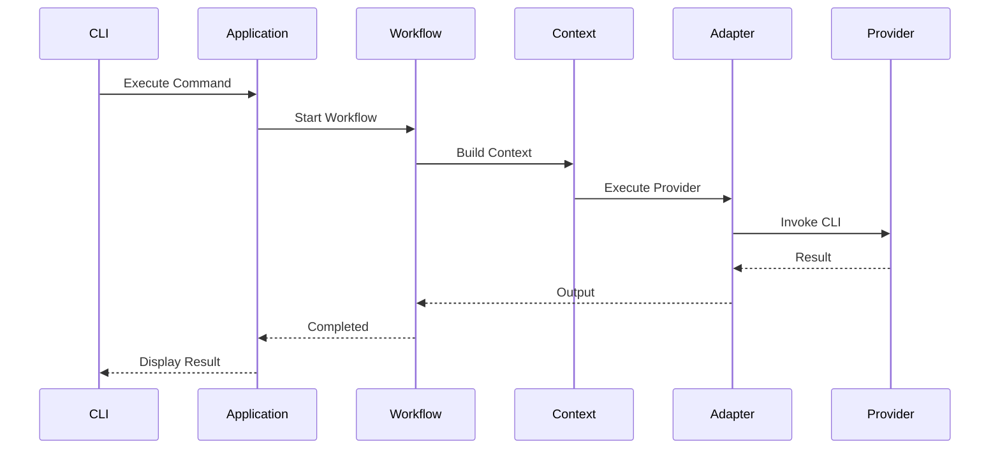

# Chapter 6 — Layered Architecture

---

# 6. Layered Architecture

## 6.1 Overview

One of the primary architectural goals of Context OS is **strict separation of concerns**.

Rather than organizing the system around folders or technologies, Context OS is organized around **architectural layers**.

Each layer has a single responsibility.

Each layer communicates only with adjacent layers.

This makes the runtime:

* easier to reason about
* independently testable
* highly extensible
* resilient to future architectural changes

The layered architecture is inspired by Domain-Driven Design (DDD), Clean Architecture, and Hexagonal Architecture, while remaining pragmatic for a CLI-first application.

---

# 6.2 Layer Overview

Context OS consists of five primary layers.



Each layer exposes stable interfaces to the layer above it.

No layer may bypass another.

---

# 6.3 Layer Responsibilities

| Layer          | Responsibility                        |
| -------------- | ------------------------------------- |
| Presentation   | User interaction (CLI, TUI, Web, IDE) |
| Application    | Command execution and orchestration   |
| Domain         | Business rules and runtime services   |
| Infrastructure | External integrations                 |
| Storage        | Data persistence                      |

---

# 6.4 Presentation Layer

## Purpose

The Presentation Layer provides user interfaces.

Examples include:

* CLI
* Terminal UI (Bubble Tea)
* Future Web UI
* Future IDE Extensions
* Future REST/gRPC APIs

This layer should **never** contain business logic.

---

## Responsibilities

* Parse user commands
* Validate syntax
* Display progress
* Display runtime state
* Render logs
* Render dashboards

---

## Does NOT Own

* workflow execution
* storage
* context construction
* provider invocation

---

## Components

```text
presentation/

cli/

tui/

views/

renderers/

commands/
```

---

# Example

```text
context workflow start

↓

Presentation

↓

Application Layer
```

The Presentation Layer does not know **how** workflows execute.

---

# 6.5 Application Layer

## Purpose

The Application Layer coordinates runtime services.

Think of it as the conductor of an orchestra.

It owns:

* command routing
* lifecycle
* validation
* transaction boundaries

---

## Responsibilities

Examples

```text
context init

↓

Project Service

↓

Runtime Service

↓

Storage
```

Another example

```text
context implement

↓

Workflow Service

↓

Context Builder

↓

Provider Adapter

↓

Checkpoint
```

---

## Components

```text
application/

runtime/

project/

commands/

workflow/

checkpoint/
```

---

## Rules

Application Services

may call

✓ Domain

✓ Infrastructure

may NOT call

✗ SQLite

✗ Filesystem

directly.

---

# 6.6 Domain Layer

The Domain Layer is the heart of Context OS.

Everything important lives here.

If the Presentation Layer disappeared,

and

Storage changed,

the Domain Layer would remain almost unchanged.

---

## Responsibilities

Business rules.

Examples:

* workflow lifecycle
* memory policies
* checkpoint rules
* artifact rules
* runtime rules
* provider contracts

---

## Domain Components

```text
Workflow

Memory

Artifact

Checkpoint

Session

Project

Context

Provider
```

---

## Example

When a workflow changes state

```text
Running

↓

Completed
```

Only the Domain Layer knows whether that transition is legal.

---

# 6.7 Infrastructure Layer

Infrastructure connects Context OS with the outside world.

---

## Responsibilities

Examples

* SQLite
* Shell execution
* Provider adapters
* Git
* Filesystem
* Logging
* Caching

---

## Components

```text
providers/

storage/

filesystem/

logging/

shell/

sqlite/

cache/
```

---

## Rule

Infrastructure never contains business rules.

It only implements interfaces defined by the Domain Layer.

---

# 6.8 Storage Layer

Storage is the lowest layer.

It owns persistence.

Nothing more.

---

## Storage Types



---

## Responsibilities

Persist

* runtime
* workflows
* sessions
* checkpoints
* events
* artifacts

---

## Does NOT Know

* providers
* workflows
* business rules
* CLI

---

# 6.9 Dependency Rule

Dependencies always point downward.

```mermaid
flowchart TD

Presentation

↓

Application

↓

Domain

↓

Infrastructure

↓

Storage
```

Never upward.

---

# Invalid Dependency

```text
Storage

↓

Workflow
```

Not allowed.

---

# Invalid Dependency

```text
SQLite

↓

Runtime

↓

CLI
```

Not allowed.

---

# 6.10 Clean Architecture Mapping

Context OS loosely maps onto Clean Architecture.

| Clean Architecture | Context OS          |
| ------------------ | ------------------- |
| Frameworks         | CLI / TUI           |
| Interface Adapters | Application         |
| Use Cases          | Domain Services     |
| Entities           | Domain Models       |
| Drivers            | Storage & Providers |

---

# 6.11 Domain Ownership

Every concept has exactly one owner.

| Domain Object | Owner              |
| ------------- | ------------------ |
| Workflow      | Workflow Service   |
| Session       | Session Service    |
| Memory        | Memory Service     |
| Artifact      | Artifact Service   |
| Runtime       | Runtime Service    |
| Provider      | Adapter Service    |
| Checkpoint    | Checkpoint Service |

Ownership never overlaps.

---

# 6.12 Service Interaction

The following diagram illustrates communication between services.



Notice

Everything originates from the Workflow Engine.

---

# 6.13 Runtime Request Lifecycle



---

# 6.14 Layer Isolation

Each layer can be replaced independently.

Examples

Replace

SQLite

↓

BadgerDB

No changes to Domain.

---

Replace

Bubble Tea

↓

Web UI

No changes to Runtime.

---

Replace

Claude

↓

Gemini

No changes to Workflow.

---

# 6.15 Cross-Cutting Concerns

Some concerns span multiple layers.

Examples

* Logging
* Metrics
* Tracing
* Error handling
* Configuration

These are implemented through middleware rather than business logic.

---

# 6.16 Error Propagation

Errors always travel upward.

```text
Filesystem

↓

Storage

↓

Infrastructure

↓

Domain

↓

Application

↓

Presentation
```

Higher layers decide how errors are presented.

Lower layers never display UI.

---

# 6.17 Testing Strategy

Each layer has independent tests.

| Layer          | Test Type          |
| -------------- | ------------------ |
| Presentation   | CLI Snapshot Tests |
| Application    | Integration Tests  |
| Domain         | Unit Tests         |
| Infrastructure | Adapter Tests      |
| Storage        | Persistence Tests  |

This minimizes coupling and improves maintainability.

---

# 6.18 Design Decisions

## Decision 1 — Layered over Monolithic

A layered architecture enables long-term maintainability and easier contributor onboarding.

---

## Decision 2 — Domain-Centric

Business logic lives exclusively in the Domain Layer.

All other layers support it.

---

## Decision 3 — Storage Isolation

Persistence is an implementation detail.

The Domain Layer should not know whether data is stored in SQLite, Markdown, or another backend.

---

## Decision 4 — Replaceable Presentation

The same runtime should support multiple frontends.

CLI, TUI, IDE, Web, and future interfaces should all consume identical application services.

---

# 6.19 Architectural Constraints

Every future contribution to Context OS must satisfy the following constraints.

* No business logic outside the Domain Layer.
* No direct filesystem access from Application Services.
* No provider-specific logic inside the Workflow Engine.
* No CLI-specific code inside Runtime Services.
* No Storage implementation leaking into Domain Models.

Violations should be treated as architectural defects.

---

# 6.20 Future Evolution

This layered architecture intentionally supports future capabilities without major refactoring.

Examples include:

* REST APIs
* MCP servers
* Remote runtimes
* Distributed execution
* Team collaboration
* Cloud synchronization
* Plugin marketplace

All of these can be added by extending the Presentation and Infrastructure layers while preserving the Domain Layer.

---

# 6.21 Chapter Summary

The layered architecture establishes the structural foundation of Context OS.

Rather than coupling user interfaces, workflows, providers, and storage into a single application, Context OS separates these concerns into independent layers connected through stable interfaces.

This separation enables:

* Long-term maintainability
* Provider independence
* Testability
* Extensibility
* Future UI support
* Future API support

The next chapter builds upon this foundation by selecting the implementation technologies for each layer and justifying every major technology choice through explicit architectural trade-offs.
