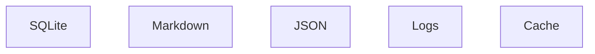

# Chapter 7 — Technology Stack

---

# 7. Technology Stack

## 7.1 Overview

Selecting the correct technology stack is one of the most important architectural decisions for Context OS.

Unlike many developer tools, Context OS is expected to become:

* Cross-platform
* Easily installable
* Fast
* Lightweight
* Extensible
* Offline-first
* Long-lived

The chosen technologies should optimize for maintainability over the next 5–10 years rather than short-term development speed.

This chapter documents every major technology decision, the rationale behind it, alternatives considered, and future migration paths.

---

# 7.2 Design Principles

Technology selection follows these principles:

1. **Single executable distribution**
2. **Minimal runtime dependencies**
3. **Cross-platform compatibility**
4. **Fast startup time**
5. **Strong ecosystem**
6. **Excellent developer experience**
7. **Production-ready libraries**
8. **Easy onboarding for OSS contributors**

---

# 7.3 Technology Overview

| Layer                | Technology           |
| -------------------- | -------------------- |
| Language             | Go                   |
| CLI Framework        | Cobra                |
| Configuration        | Viper                |
| TUI                  | Bubble Tea           |
| Styling              | Lip Gloss            |
| Storage              | SQLite               |
| Serialization        | YAML + JSON          |
| Logging              | slog                 |
| Markdown             | Goldmark             |
| Build                | Goreleaser           |
| CI                   | GitHub Actions       |
| Testing              | Go Testing           |
| Dependency Injection | Native Go Interfaces |
| Release              | Goreleaser           |

---

# 7.4 Programming Language

## Selected

> **Go**

---

## Why Go?

Context OS is fundamentally a systems application.

It needs to:

* launch processes
* monitor execution
* interact with the filesystem
* manage concurrency
* parse configuration
* expose a CLI
* render a TUI
* run on multiple operating systems

Go excels at all of these.

---

## Advantages

### Single Binary

```bash
context
```

No runtime.

No interpreter.

No virtual environment.

---

### Cross Platform

Native builds for

* Linux
* macOS
* Windows

using one toolchain.

---

### Fast Startup

CLI startup time is typically

<20ms.

---

### Concurrency

Workflow execution and provider monitoring naturally map to goroutines.

---

### Standard Library

Go includes:

* HTTP
* JSON
* Filesystem
* Logging
* Context
* Testing

reducing dependencies.

---

### Mature Tooling

Excellent support for

* testing
* formatting
* linting
* profiling
* releases

---

# Why Not Rust?

Rust offers:

* better memory safety
* lower memory usage

However,

Context OS is I/O bound rather than CPU bound.

The additional development complexity outweighs performance gains.

Decision:

❌ Rejected

---

# Why Not Python?

Python provides:

* rapid development
* large ecosystem

However,

it introduces

* virtual environments
* dependency management
* slower startup
* packaging complexity

Context OS should install like Git.

Decision:

❌ Rejected

---

# Why Not Node.js?

Node has excellent CLI tooling.

However,

shipping Node applications generally requires either:

* npm
* Node runtime
* bundled executables

Go provides a cleaner deployment model.

Decision:

❌ Rejected

---

# 7.5 CLI Framework

## Selected

> Cobra

---

## Why Cobra?

Cobra is the de facto standard for production Go CLIs.

Used by:

* Kubernetes
* Hugo
* Helm
* GitHub CLI

Features

* nested commands
* auto completion
* help generation
* command validation

---

## Example

```bash
context init

context workflow start

context checkpoint create

context provider list
```

---

# Why Not urfave/cli?

Simpler,

but less suitable for large command trees.

Decision:

Rejected.

---

# 7.6 Configuration

## Selected

Viper

---

Responsibilities

* YAML
* environment variables
* configuration discovery
* defaults
* overrides

---

Configuration hierarchy

```text
System Defaults

↓

Global Config

↓

Project Config

↓

Environment Variables

↓

CLI Flags
```

---

# 7.7 Terminal UI

## Selected

Bubble Tea

---

Why Bubble Tea?

Modern architecture.

Excellent ecosystem.

Strong async support.

Used throughout the Charm ecosystem.

---

Supporting libraries

Lip Gloss

for styling.

---

Planned TUI

```text
Project

Workflow

Sessions

Artifacts

Providers

Logs

Context Usage
```

---

# Why Not ncurses?

Too low level.

Bubble Tea provides

* reusable components
* declarative updates
* cross platform rendering

---

# 7.8 Logging

## Selected

Go slog

---

Reasons

* standard library
* structured
* performant
* future proof

---

Example

```json
{
  "workflow":"implementation",
  "provider":"claude",
  "duration":"4.3s"
}
```

---

# 7.9 Storage

## Selected

Hybrid Storage Model

Rather than storing everything inside one database,

Context OS intentionally combines multiple storage mechanisms.



Each serves a different purpose.

---

## SQLite

Stores

* runtime
* workflow
* metadata
* indexes
* sessions
* events

---

Reasons

* transactional
* ACID
* fast
* embedded
* mature

---

## Markdown

Stores

* reviews
* research
* designs
* implementation plans
* documentation

Reason

Developers should be able to read artifacts without Context OS.

---

## JSON

Stores

* provider output
* temporary execution
* import/export

---

# Why Not PostgreSQL?

Too heavy.

Requires installation.

Not portable.

---

# Why Not MongoDB?

No transactional guarantees.

Poor fit for local runtime.

---

# 7.10 Markdown

## Selected

Goldmark

---

Reasons

* CommonMark compliant
* extensible
* actively maintained

Used for

* rendering
* indexing
* future semantic search

---

# 7.11 Serialization

Project configuration

YAML

Runtime interchange

JSON

Documentation

Markdown

This separation keeps every format optimized for its purpose.

---

# 7.12 Build System

## Selected

GoReleaser

---

Supports

* Homebrew
* Scoop
* GitHub Releases
* Checksums
* Docker
* Archives

---

Installation becomes

```bash
brew install context-os
```

or

```bash
go install github.com/context-os/context@latest
```

---

# 7.13 Testing

Testing strategy

| Layer    | Test Type       |
| -------- | --------------- |
| Domain   | Unit Tests      |
| Workflow | Integration     |
| Storage  | Persistence     |
| Provider | Mock Tests      |
| CLI      | Snapshot Tests  |
| TUI      | Component Tests |

Target

> 80%+ coverage

for core runtime.

---

# 7.14 Dependency Injection

Context OS intentionally avoids heavy DI frameworks.

Instead,

Go interfaces provide dependency inversion.

Example

```go
type Provider interface {
    Execute(ctx context.Context, req ExecutionRequest) (*ExecutionResult, error)
}
```

Simple.

Testable.

Idiomatic.

---

# 7.15 Project Layout

```text
cmd/
internal/
pkg/
configs/
docs/
examples/
scripts/
```

Detailed package organization is described in Chapter 8.

---

# 7.16 External Dependencies

The runtime intentionally minimizes dependencies.

Primary external libraries

| Library       | Purpose       |
| ------------- | ------------- |
| Cobra         | CLI           |
| Bubble Tea    | TUI           |
| Lip Gloss     | Styling       |
| Viper         | Configuration |
| Goldmark      | Markdown      |
| SQLite Driver | Storage       |

No dependency should be included without architectural justification.

---

# 7.17 Technology Decision Matrix

| Technology | Selected | Reason                    |
| ---------- | -------- | ------------------------- |
| Go         | ✅        | Performance, distribution |
| Cobra      | ✅        | Mature CLI                |
| Bubble Tea | ✅        | Modern TUI                |
| SQLite     | ✅        | Embedded database         |
| YAML       | ✅        | Human-readable config     |
| Markdown   | ✅        | Human-readable artifacts  |
| JSON       | ✅        | Structured interchange    |
| slog       | ✅        | Standard logging          |
| Goreleaser | ✅        | OSS releases              |

---

# 7.18 Risks

Potential risks include:

* SQLite migration complexity
* Bubble Tea learning curve
* Go module compatibility
* Cross-platform shell execution differences

Mitigation strategies will be described in later chapters.

---

# 7.19 Future Technology Evolution

Potential future additions include:

* Vector database (optional plugin)
* MCP server
* REST API
* WebAssembly plugins
* Cloud synchronization
* Embedded search engine

These are intentionally excluded from Version 1.

---

# 7.20 Chapter Summary

The selected technology stack reflects the long-term goals of Context OS:

* A single statically compiled binary.
* Cross-platform support.
* Local-first architecture.
* Human-readable project state.
* Minimal dependencies.
* Production-grade developer experience.

By choosing mature, widely adopted technologies, Context OS prioritizes stability, maintainability, and ease of contribution over novelty.

The next chapter defines the repository structure and package organization, translating this technology stack into a concrete codebase layout that supports long-term scalability and clean separation of concerns.
