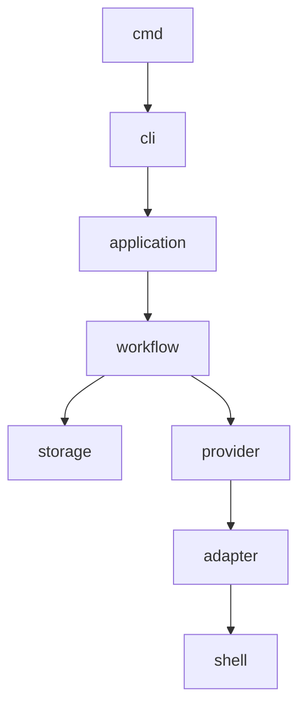

# Chapter 8 — Repository Structure

---

# 8. Repository Structure

## 8.1 Overview

A well-designed repository structure directly impacts the long-term maintainability of Context OS.

The project is expected to evolve over many years, support multiple contributors, and grow to include additional providers, plugins, storage backends, user interfaces, and deployment targets.

The repository must therefore satisfy the following goals:

* Clear ownership
* Low coupling
* High cohesion
* Easy discoverability
* Independent testability
* Future extensibility

The repository structure follows standard Go project conventions while adapting them to the layered architecture defined in the previous chapter.

---

# 8.2 Repository Layout

```text
context-os/

├── cmd/
│   └── context/
│       └── main.go
│
├── internal/
│   ├── adapter/
│   ├── application/
│   ├── artifact/
│   ├── checkpoint/
│   ├── cli/
│   ├── config/
│   ├── contextbuilder/
│   ├── event/
│   ├── memory/
│   ├── plugin/
│   ├── project/
│   ├── provider/
│   ├── runtime/
│   ├── session/
│   ├── storage/
│   ├── tui/
│   ├── workflow/
│   └── shared/
│
├── pkg/
│
├── api/
│
├── configs/
│
├── docs/
│
├── examples/
│
├── plugins/
│
├── scripts/
│
├── test/
│
├── go.mod
├── go.sum
├── Makefile
├── LICENSE
├── README.md
└── CONTRIBUTING.md
```

---

# 8.3 Why This Structure?

The repository is divided into four logical areas.


Where:

* `cmd/` contains executable entrypoints.
* `internal/` contains implementation.
* `pkg/` exposes stable public APIs.
* Everything else supports development.

---

# 8.4 cmd/

```
cmd/
    context/
        main.go
```

## Purpose

Contains executable entrypoints.

Only responsibilities:

* Initialize application
* Wire dependencies
* Execute CLI

No business logic belongs here.

---

# Example

```go
func main() {
    cmd.Execute()
}
```

Nothing more.

---

# 8.5 internal/

This is the heart of Context OS.

Every runtime service lives here.

Go's `internal` package prevents external projects from depending upon implementation details.

---

## internal/application

Responsibilities

* Use cases
* Command handlers
* Application services

Examples

```
StartWorkflow

ResumeWorkflow

CreateCheckpoint

InitializeProject
```

Application services coordinate domain objects.

They do **not** contain business rules.

---

## internal/runtime

The runtime orchestrates execution.

Responsibilities

* Runtime lifecycle
* Execution state
* Runtime bootstrap
* Shutdown

Owns:

```
RuntimeManager

RuntimeState

ExecutionContext
```

---

## internal/workflow

Probably the most important package.

Responsibilities

* Workflow lifecycle
* State transitions
* Workflow execution
* Recovery

Owns

```
Workflow

Step

WorkflowState

WorkflowManager
```

---

## internal/contextbuilder

Constructs execution context.

Inputs

* Project
* Memory
* Workflow
* Artifacts
* Sessions
* Current task

Output

```
ExecutionContext
```

This package deliberately contains **no provider logic**.

---

## internal/memory

Owns project memory.

Responsibilities

* Architecture memory
* Design decisions
* Conventions
* Long-term knowledge

Memory is independent of workflows.

---

## internal/artifact

Responsible for generated outputs.

Examples

```
Design

Research

Review

Benchmarks

Plans

Reports
```

---

## internal/checkpoint

Owns execution recovery.

Responsibilities

```
Create

Restore

Archive

Compare
```

---

## internal/provider

Defines provider interfaces.

Example

```
Provider

Capability

ProviderRegistry

ProviderFactory
```

Concrete implementations live elsewhere.

---

## internal/adapter

Bridges providers with the runtime.

Example

```
Claude Adapter

Codex Adapter

OpenCode Adapter

Gemini Adapter
```

Adapters translate runtime requests into provider-specific execution.

---

## internal/project

Represents repository-level state.

Responsibilities

```
Project Discovery

Initialization

Migration

Metadata
```

---

## internal/session

Owns execution sessions.

Responsibilities

```
Resume

Pause

Interrupt

Recover
```

---

## internal/storage

Abstracts persistence.

Never exposes SQLite directly.

Contains

```
Repositories

Transactions

Persistence APIs
```

---

## internal/event

Responsible for event sourcing.

Examples

```
WorkflowStarted

WorkflowCompleted

ArtifactCreated

ProviderInvoked

CheckpointCreated
```

Events become the audit log.

---

## internal/config

Loads configuration.

Supports

* global config
* project config
* environment variables
* CLI overrides

---

## internal/plugin

Future plugin runtime.

Responsibilities

```
Plugin Loading

Registration

Capability Discovery

Hooks
```

---

## internal/cli

Cobra command definitions.

Responsibilities

```
context init

context status

context workflow

context checkpoint
```

No business logic.

---

## internal/tui

Bubble Tea application.

Contains

```
Views

Components

Models

Update Loop
```

---

## internal/shared

Shared utilities.

Examples

```
Errors

Constants

Utilities

IDs

Validation
```

This package should remain intentionally small.

---

# 8.6 pkg/

```
pkg/
```

Contains public APIs.

Version 1 may expose:

```
Provider SDK

Plugin SDK

Storage SDK
```

Only stable interfaces belong here.

---

# 8.7 api/

Reserved for future

* REST API
* gRPC
* MCP Server

Version 1 leaves this empty.

---

# 8.8 configs/

Contains

```
Default Config

Example Config

Provider Templates

Workflow Templates
```

No runtime state.

---

# 8.9 docs/

Architecture.

Guides.

RFCs.

Examples.

Diagrams.

---

Suggested structure

```
docs/

architecture/

adr/

tutorials/

api/

images/
```

---

# 8.10 examples/

Contains working repositories.

Examples

```
Go Project

Node Project

Python Project

Java Project
```

Useful for testing.

---

# 8.11 plugins/

Reference plugins.

Future marketplace.

Version 1 includes sample implementations only.

---

# 8.12 scripts/

Development tooling.

Examples

```
Generate

Release

Benchmark

Migration

Lint
```

These scripts are not shipped with the runtime.

---

# 8.13 test/

Large-scale integration tests.

Example

```
Provider Tests

Workflow Tests

Performance Tests

Recovery Tests
```

---

# 8.14 Dependency Rules



Only downward dependencies are allowed.

---

# 8.15 Package Ownership

Every package owns one domain.

| Package    | Owns                     |
| ---------- | ------------------------ |
| workflow   | Workflow lifecycle       |
| runtime    | Runtime                  |
| memory     | Memory                   |
| artifact   | Artifacts                |
| session    | Sessions                 |
| checkpoint | Recovery                 |
| project    | Project metadata         |
| provider   | Provider contracts       |
| adapter    | Provider implementations |
| storage    | Persistence              |
| config     | Configuration            |

Ownership must never overlap.

---

# 8.16 Future Growth

The repository structure intentionally leaves room for:

* API providers
* Cloud runtime
* Team collaboration
* Marketplace
* Web UI
* IDE extensions
* MCP support

without restructuring the repository.

---

# 8.17 Repository Principles

Every contributor should follow these rules.

1. One package owns one responsibility.
2. No cyclic dependencies.
3. Business logic belongs only in domain packages.
4. Infrastructure implements interfaces.
5. Public APIs belong in `pkg/`.
6. Internal implementation remains inside `internal/`.
7. Packages should remain small enough to understand independently.

---

# 8.18 Architectural Review

This repository layout directly supports the layered architecture from Chapter 6.

Each package has:

* clear ownership
* well-defined boundaries
* minimal coupling
* independent testing
* future extensibility

As Context OS evolves, new capabilities should primarily involve adding new packages rather than modifying existing ones.

---

# 8.19 Chapter Summary

This chapter defines the physical organization of the Context OS codebase.

The repository is organized around architectural responsibilities rather than technologies, ensuring that the codebase remains understandable as it grows.

The next chapter shifts focus from the implementation repository to the **project runtime layout**—the `.context/` directory generated inside every user project by `context init`. That structure represents the persistent operating system state that Context OS manages throughout the lifecycle of a software project.
