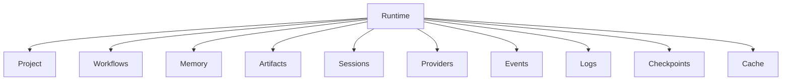
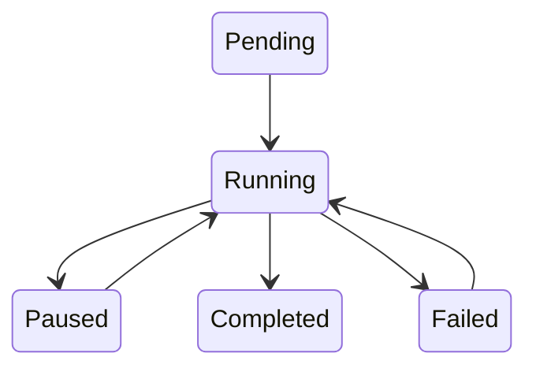
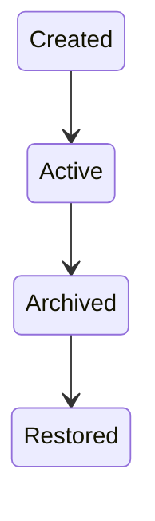
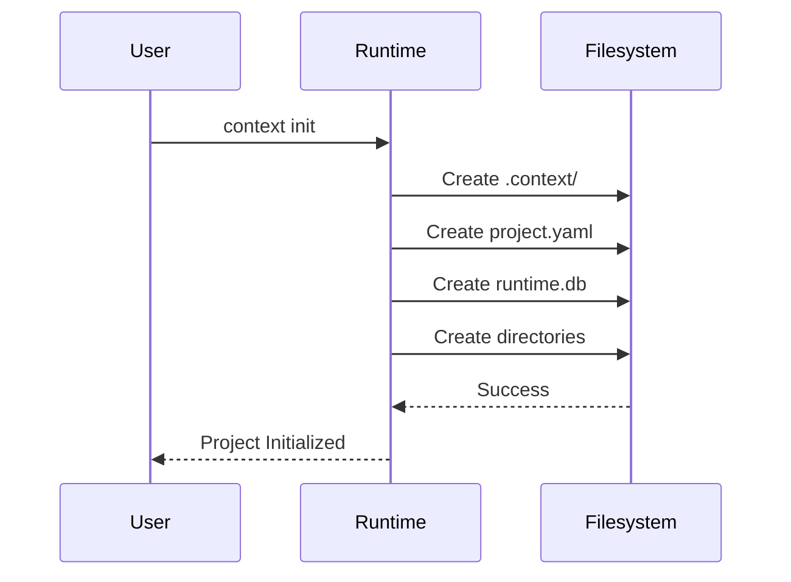

# Chapter 9 — Project Runtime Structure

---

# Chapter 9 — Project Runtime Structure

## 9.1 Overview

Unlike the previous chapter, which described the **Context OS source code repository**, this chapter defines the **runtime structure generated inside every project**.

When a developer runs:

```bash
context init
```

Context OS bootstraps a lightweight runtime inside the repository.

Unlike Git, which owns source history through `.git/`, Context OS owns **project intelligence** through a dedicated runtime directory.

This directory is the heart of Context OS.

It stores:

* runtime state
* workflows
* project memory
* artifacts
* checkpoints
* sessions
* provider configuration
* logs
* caches

Every AI coding assistant interacts with this runtime rather than maintaining isolated project knowledge.

---

# 9.2 Design Goals

The runtime directory must satisfy several architectural goals.

### Human Readable

Developers should be able to inspect project state without proprietary tooling.

---

### Local First

Everything required to resume work exists inside the repository.

---

### Git Friendly

Developers should choose what belongs in Git and what remains local.

---

### Provider Agnostic

Nothing inside the runtime references Claude, Codex, Gemini, or OpenCode directly.

The runtime stores project state—not provider state.

---

### Portable

Copying a repository should copy its intelligence.

---

# 9.3 Runtime Directory

Running

```bash
context init
```

creates

```text
.context/

├── project.yaml
├── runtime.db
├── README.md
│
├── workflows/
│
├── sessions/
│
├── memory/
│
├── artifacts/
│
├── checkpoints/
│
├── providers/
│
├── cache/
│
├── logs/
│
├── events/
│
├── temp/
│
└── plugins/
```

Every directory has a single responsibility.

---

# 9.4 Runtime Architecture



---

# 9.5 project.yaml

The project manifest.

Example

```yaml
name: payment-service

version: 1

language: java

runtime: v1

created: 2026-07-01

providerProfile: default
```

---

## Responsibilities

Stores

* project metadata
* runtime version
* migration version
* configuration pointers

---

## Does NOT Store

* workflow state
* memory
* artifacts

Those belong elsewhere.

---

# 9.6 runtime.db

SQLite database.

Stores structured metadata.

Contains

* workflow metadata
* session metadata
* indexes
* events
* references

Large artifacts are **not** stored inside SQLite.

---

# 9.7 workflows/

Stores workflow definitions and snapshots.

Example

```text
workflows/

oauth-login/

workflow.yaml

steps/

step-001.yaml

step-002.yaml

state.json
```

---

Each workflow is isolated.

Deleting one workflow does not affect others.

---

# Example Workflow



---

# 9.8 sessions/

Stores execution sessions.

Example

```text
sessions/

session-20260701/

metadata.json

runtime.json

provider.json

timeline.json
```

---

A session represents one execution lifecycle.

Multiple sessions may exist simultaneously.

---

# Session Metadata

Example

```json
{
  "id":"session-42",
  "workflow":"oauth-login",
  "provider":"claude",
  "startedAt":"...",
  "status":"running"
}
```

---

# 9.9 memory/

Project knowledge.

This is one of the most important directories.

Example

```text
memory/

architecture.md

coding-guidelines.md

decisions/

ADR-001.md

ADR-002.md

knowledge/

patterns.md

api-conventions.md
```

---

Memory changes slowly.

It survives workflows.

It survives sessions.

It survives providers.

---

# 9.10 artifacts/

Stores generated outputs.

Examples

```text
artifacts/

design/

review/

research/

benchmark/

implementation/

documentation/
```

---

Example

```text
artifacts/

review/

oauth-review.md

benchmark/

build-v4.md
```

---

Artifacts are immutable.

Corrections generate new versions.

---

# 9.11 checkpoints/

Stores resumable execution snapshots.

Example

```text
checkpoints/

checkpoint-001/

metadata.json

workflow.json

memory.json
```

---

Checkpoint lifecycle



---

# 9.12 providers/

Contains provider-specific configuration.

Example

```text
providers/

default.yaml

profiles/

development.yaml

production.yaml
```

---

Example

```yaml
planning:

command: hrclaudeff

implementation:

command: hrcodex

review:

command: hrclaudeff
```

---

Notice

Only commands are configured.

No runtime logic belongs here.

---

# 9.13 events/

Append-only event log.

Example

```text
events/

2026-07-01.jsonl

2026-07-02.jsonl
```

---

Event Example

```json
{
 "type":"WorkflowStarted",
 "workflow":"oauth",
 "time":"..."
}
```

---

Events are never edited.

They support

* auditing
* debugging
* analytics

---

# 9.14 logs/

Developer logs.

Examples

```text
logs/

runtime.log

provider.log

workflow.log
```

---

Logs are ephemeral.

Events are permanent.

---

# 9.15 cache/

Cache should be completely disposable.

Examples

```text
cache/

provider/

markdown/

search/

embeddings/
```

Everything inside cache may be safely deleted.

---

# 9.16 temp/

Temporary files.

Never committed.

Examples

```text
temp/

provider-output/

stream/

partial/
```

---

Automatically cleaned.

---

# 9.17 plugins/

Future extension point.

Example

```text
plugins/

jira/

github/

slack/
```

---

Version 1 leaves this empty.

---

# 9.18 .gitignore Strategy

Not everything should be committed.

Recommended

```gitignore
.context/cache/

.context/temp/

.context/logs/

.context/runtime.db-shm

.context/runtime.db-wal
```

Everything else is project dependent.

Teams may choose whether

* memory

* workflows

* artifacts

belong in Git.

---

# 9.19 Directory Ownership

| Directory   | Owner              |
| ----------- | ------------------ |
| workflows   | Workflow Engine    |
| sessions    | Session Manager    |
| memory      | Memory Manager     |
| artifacts   | Artifact Manager   |
| checkpoints | Checkpoint Manager |
| providers   | Provider Manager   |
| cache       | Cache Manager      |
| logs        | Runtime Logger     |
| events      | Event Manager      |

Each directory has exactly one owner.

---

# 9.20 Runtime Lifecycle



---

# 9.21 Migration Strategy

Every runtime has a schema version.

```yaml
runtimeVersion: 1

schemaVersion: 1
```

Future versions perform automatic migrations.

```bash
context migrate
```

Migration should always be backward compatible where possible.

---

# 9.22 Recovery Strategy

Runtime recovery follows this order:

1. Validate `project.yaml`
2. Open `runtime.db`
3. Rebuild workflow state
4. Restore active session
5. Load project memory
6. Resume pending workflows
7. Reconstruct runtime

Recovery should be deterministic.

---

# 9.23 Design Decisions

## Decision 1 — Hybrid Storage

SQLite stores metadata.

Markdown stores knowledge.

Filesystem stores artifacts.

Each technology is used for what it does best.

---

## Decision 2 — Explicit Directories

Every major subsystem owns its own directory.

Developers can immediately locate runtime information.

---

## Decision 3 — Git Compatibility

The runtime never assumes all state belongs in Git.

Teams decide which runtime components are version-controlled.

---

## Decision 4 — Provider Independence

No directory should be named after a provider.

The runtime owns project intelligence.

Providers merely execute tasks.

---

# 9.24 Architectural Observation

The `.context/` directory is conceptually similar to:

| Tool       | Runtime Directory |
| ---------- | ----------------- |
| Git        | `.git/`           |
| Docker     | `/var/lib/docker` |
| Terraform  | `.terraform/`     |
| npm        | `node_modules/`   |
| Context OS | `.context/`       |

However, unlike those tools, `.context/` stores **project intelligence**, not implementation artifacts.

---

# 9.25 Chapter Summary

The project runtime structure defines the persistent operating system state managed by Context OS.

Unlike conversations or provider-specific configuration, the runtime captures the enduring knowledge of a software project—its workflows, memory, checkpoints, artifacts, and execution history—in a provider-agnostic format.

This directory becomes the shared foundation that allows different AI coding assistants to collaborate on the same project without losing continuity.

In the next chapter, we move from storage to behavior by examining the **Runtime Components** themselves: the services that own workflows, memory, checkpoints, context construction, provider execution, and runtime lifecycle.
