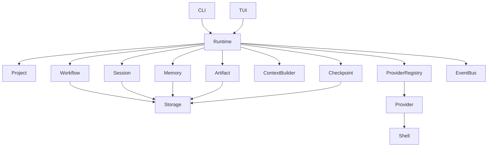
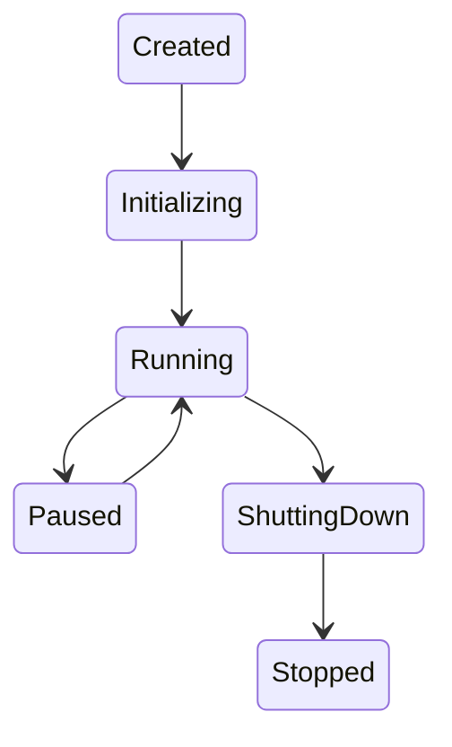
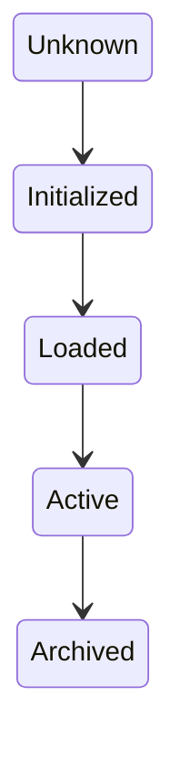
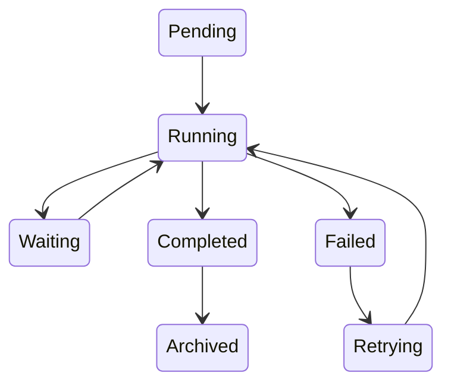
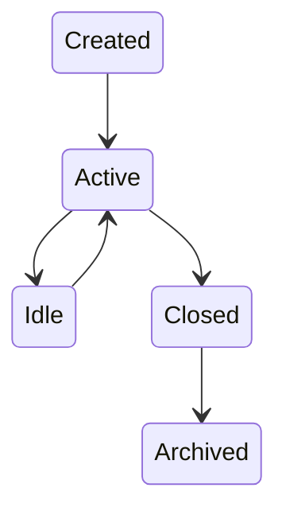
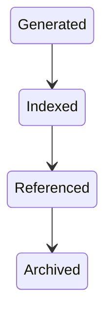
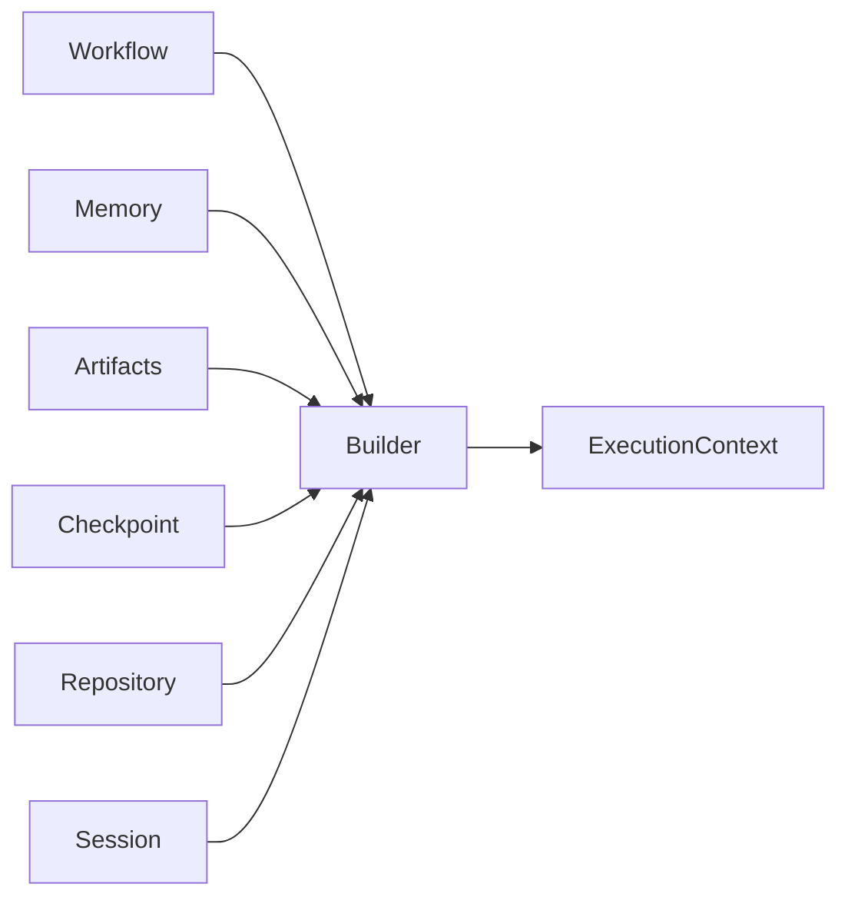
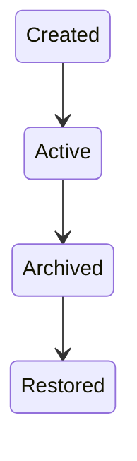
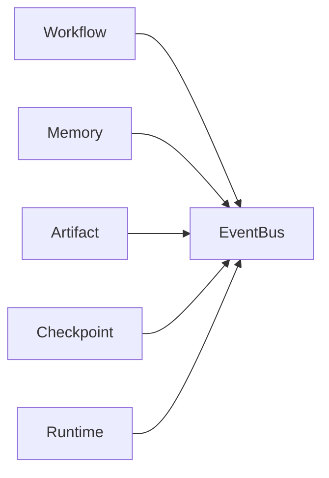
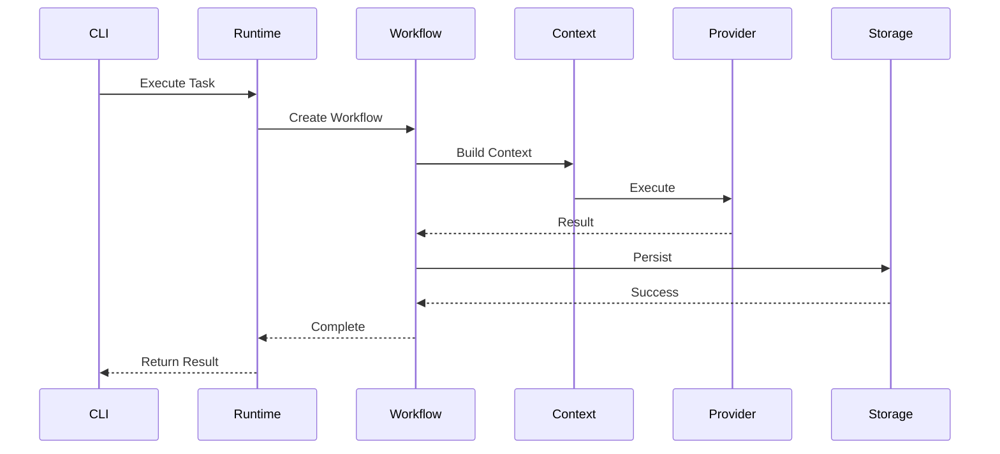

# Chapter 10 — Runtime Components

---

# Chapter 10 — Runtime Components

## 10.1 Overview

The Context OS Runtime is the execution engine responsible for maintaining persistent project intelligence throughout the lifecycle of a software project.

Unlike traditional coding assistants, which primarily focus on prompt execution, the runtime manages:

* project state
* workflows
* memory
* checkpoints
* sessions
* artifacts
* provider execution
* context construction

Every operation inside Context OS eventually passes through the Runtime.

This chapter defines every runtime service, its responsibilities, interfaces, lifecycle, dependencies, ownership, and failure modes.

---

# 10.2 Runtime Overview



Every component has a single responsibility.

---

# 10.3 Runtime Manager

## Purpose

The Runtime Manager coordinates the entire execution lifecycle.

It is the entry point for every command executed by Context OS.

---

## Responsibilities

* Bootstrap runtime
* Load project
* Restore runtime state
* Coordinate services
* Manage lifecycle
* Graceful shutdown
* Error recovery

---

## Public Interface

```go
type Runtime interface {
    Start(ctx context.Context) error
    Stop(ctx context.Context) error
    Execute(cmd Command) error
    Status() RuntimeStatus
}
```

---

## Lifecycle



---

## Dependencies

* Project Manager
* Workflow Engine
* Memory Manager
* Provider Registry
* Storage

---

## Failure Modes

| Failure               | Recovery                    |
| --------------------- | --------------------------- |
| Database unavailable  | Retry → Read-only mode      |
| Project missing       | Abort initialization        |
| Provider unavailable  | Continue runtime            |
| Checkpoint corruption | Restore previous checkpoint |

---

# 10.4 Project Manager

## Purpose

Owns repository discovery and project metadata.

---

## Responsibilities

* Discover project root
* Initialize runtime
* Read project.yaml
* Runtime migration
* Project validation

---

## Interface

```go
type ProjectManager interface {
    Init(path string) error
    Load(path string) (*Project, error)
    Validate() error
    Migrate() error
}
```

---

## State Machine



---

# 10.5 Workflow Engine

## Purpose

The Workflow Engine is the heart of Context OS.

Everything else exists to support workflows.

---

## Responsibilities

* Execute workflows
* Resume workflows
* Pause workflows
* Track progress
* Handle retries
* Recover interrupted execution

---

## Public Interface

```go
type WorkflowEngine interface {
    Start(req WorkflowRequest) error
    Resume(id WorkflowID) error
    Pause(id WorkflowID) error
    Complete(id WorkflowID) error
}
```

---

## Workflow Lifecycle



---

## Dependencies

* Session Manager
* Context Builder
* Provider Registry
* Checkpoint Manager
* Artifact Manager

---

## Recovery Strategy

When interrupted

Workflow

↓

Restore Session

↓

Restore Checkpoint

↓

Rebuild Context

↓

Continue Execution

---

# 10.6 Session Manager

## Purpose

Tracks active execution sessions.

---

## Responsibilities

* Session creation
* Session restore
* Session persistence
* Session cleanup

---

## Interface

```go
type SessionManager interface {
    Create() (*Session,error)
    Load(id SessionID) (*Session,error)
    Save(*Session) error
    Close(id SessionID) error
}
```

---

## Session Lifecycle



---

# 10.7 Memory Manager

## Purpose

Maintains durable project intelligence.

Memory is independent from providers.

---

## Responsibilities

* Long-term memory
* Architectural decisions
* Coding conventions
* Learned patterns
* Retrieval

---

## Memory Hierarchy

```mermaid
flowchart TD

SessionMemory

↓

WorkflowMemory

↓

ProjectMemory

↓

KnowledgeMemory

↓

Archive
```

---

## Interface

```go
type MemoryManager interface {
    Store(MemoryEntry) error
    Search(Query) []MemoryEntry
    Retrieve(ID) MemoryEntry
}
```

---

## Design Decision

Memory is append-oriented.

Entries are rarely modified.

---

# 10.8 Artifact Manager

## Purpose

Stores durable outputs.

Artifacts represent work products rather than runtime state.

---

## Examples

* Design document
* Review report
* Benchmark
* Build log
* Architecture proposal

---

## Interface

```go
type ArtifactManager interface {
    Create(Artifact) error
    Get(ID) Artifact
    Search(Query) []Artifact
}
```

---

## Lifecycle



---

# 10.9 Context Builder

## Purpose

Constructs execution context for providers.

This is arguably the most important service in Context OS.

---

## Inputs

* Current workflow
* Active task
* Project memory
* Recent artifacts
* Repository state
* Previous checkpoint
* Session metadata

---

## Output

ExecutionContext

---

## Context Pipeline



---

## Interface

```go
type ContextBuilder interface {
    Build(Task) (*ExecutionContext,error)
}
```

---

## Design Principle

The provider should receive only the information required for the current task.

Never replay conversations.

---

# 10.10 Checkpoint Manager

## Purpose

Provides resumable execution.

---

## Responsibilities

* Create
* Restore
* Compare
* Archive

---

## Interface

```go
type CheckpointManager interface {
    Save(SessionID) error
    Restore(CheckpointID) error
    List() []Checkpoint
}
```

---

## Lifecycle



---

# 10.11 Provider Registry

## Purpose

Maintains available providers.

Examples

* Claude Code
* Codex CLI
* Gemini CLI
* OpenCode

---

## Responsibilities

* Registration
* Capability lookup
* Selection
* Validation

---

## Interface

```go
type ProviderRegistry interface {
    Register(Provider)
    Resolve(Role) Provider
    List() []Provider
}
```

---

# 10.12 Event Bus

## Purpose

Coordinates communication between runtime services.

Instead of direct coupling,

services emit events.

---

## Example Events

* WorkflowStarted
* ArtifactCreated
* SessionRestored
* ProviderInvoked
* CheckpointCreated

---

## Flow



---

# 10.13 Storage Service

## Purpose

Persistence abstraction.

Runtime services never access SQLite directly.

---

## Responsibilities

* Transactions
* Persistence
* Recovery
* Indexing

---

## Interface

```go
type Storage interface {
    Save(Entity) error
    Load(ID) Entity
    Delete(ID) error
}
```

---

# 10.14 Runtime Execution Sequence



---

# 10.15 Component Dependency Matrix

| Component         | Depends On                 |
| ----------------- | -------------------------- |
| Runtime           | All Managers               |
| Workflow          | Session, Context, Provider |
| Session           | Storage                    |
| Memory            | Storage                    |
| Artifact          | Storage                    |
| Context           | Workflow, Memory, Artifact |
| Provider Registry | Adapter                    |
| Checkpoint        | Storage                    |
| Event Bus         | None                       |

Dependencies only flow downward.

---

# 10.16 Failure Recovery

```mermaid
flowchart TD

Failure

↓

Runtime Detects

↓

Checkpoint Restore

↓

Workflow Resume

↓

Context Rebuild

↓

Provider Restart

↓

Continue
```

No provider failure should permanently lose project state.

---

# 10.17 Component Ownership

| Component         | Owns                   |
| ----------------- | ---------------------- |
| Runtime           | Execution lifecycle    |
| Workflow          | Task execution         |
| Session           | Active execution       |
| Memory            | Long-term knowledge    |
| Artifact          | Work products          |
| Context Builder   | Prompt assembly        |
| Checkpoint        | Recovery               |
| Provider Registry | Provider discovery     |
| Event Bus         | Internal communication |
| Storage           | Persistence            |

Ownership is exclusive.

---

# 10.18 Design Decisions

## Decision 1 — Service-Oriented Runtime

The runtime is composed of independent services rather than a monolithic engine.

---

## Decision 2 — Event-Driven Coordination

Services communicate through domain events where appropriate to reduce coupling.

---

## Decision 3 — Context Builder as a First-Class Service

Prompt construction is treated as a core runtime responsibility rather than being delegated to providers.

---

## Decision 4 — Explicit Ownership

Every subsystem owns exactly one domain concept.

---

# 10.19 Future Evolution

Future runtime services may include:

* Scheduler
* Remote Executor
* Team Collaboration Manager
* Knowledge Graph Manager
* Vector Retrieval Engine
* Telemetry Service
* MCP Runtime

These additions should integrate without modifying existing runtime services.

---

# 10.20 Chapter Summary

The Runtime is the execution heart of Context OS.

By decomposing responsibilities into focused services—Workflow Engine, Memory Manager, Context Builder, Checkpoint Manager, Session Manager, Provider Registry, and others—the runtime remains modular, testable, and extensible.

Most importantly, **Context Builder emerges as the central intelligence layer**, assembling the minimum necessary project knowledge for provider execution while remaining completely independent of any specific AI model or CLI.

The next chapter formalizes these concepts through the **Domain Model and UML Class Diagrams**, defining the core entities, aggregates, relationships, and interfaces that underpin the runtime.
