# Chapter 11 — Domain Model & Class Diagrams

---

# Chapter 11 — Domain Model & Class Diagrams

## 11.1 Overview

The previous chapters defined **what** Context OS does and **how** it is architecturally organized.

This chapter defines **what the runtime actually manages**.

Instead of discussing services or packages, we now define the **domain model**—the core business entities that represent project intelligence.

These entities are independent of:

* Go
* SQLite
* CLI
* Bubble Tea
* AI providers

The domain model should remain stable even if implementation technologies change.

---

# 11.2 Domain Overview

Context OS revolves around one central concept:

> **Project Intelligence**

Everything in the runtime ultimately belongs to a Project.

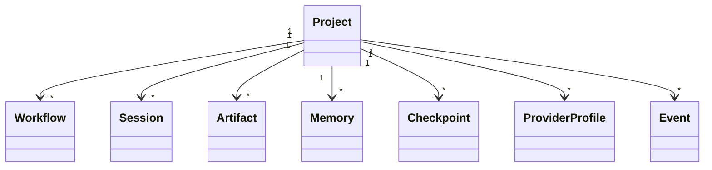

Project is therefore the **Aggregate Root** of the system.

---

# 11.3 Aggregate Hierarchy

```text
Project
│
├── Workflow
│   ├── Step
│   └── WorkflowState
│
├── Session
│   ├── Context
│   └── Timeline
│
├── Memory
│
├── Artifact
│
├── Checkpoint
│
├── Event
│
└── ProviderProfile
```

Every aggregate owns its children.

Cross-aggregate communication happens through IDs rather than object references.

---

# 11.4 Project

## Purpose

Represents the software project managed by Context OS.

Everything belongs to exactly one project.

---

## Attributes

```text
Project

id

name

rootPath

runtimeVersion

schemaVersion

language

createdAt

updatedAt
```

---

## Responsibilities

* Project metadata
* Runtime configuration
* Aggregate ownership
* Migration version

---

## Invariants

* One runtime per project
* One project manifest
* Immutable Project ID

---

# UML

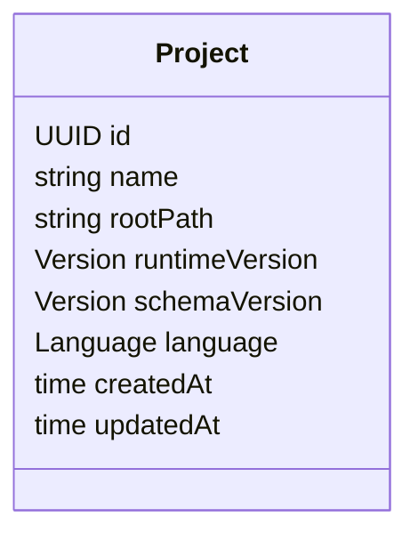

---

# 11.5 Workflow

## Purpose

Represents a long-running engineering activity.

Examples

* OAuth implementation
* Payment refactor
* Architecture review
* Build optimization

---

## Attributes

```text
Workflow

id

name

status

steps

priority

owner

createdAt
```

---

## Responsibilities

* Execute tasks
* Resume execution
* Progress tracking
* Failure recovery

---

## State Machine

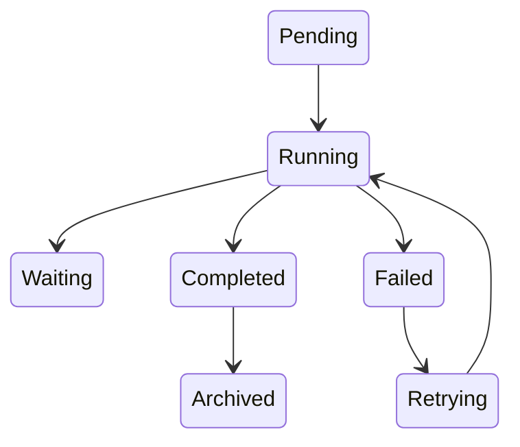

---

## UML

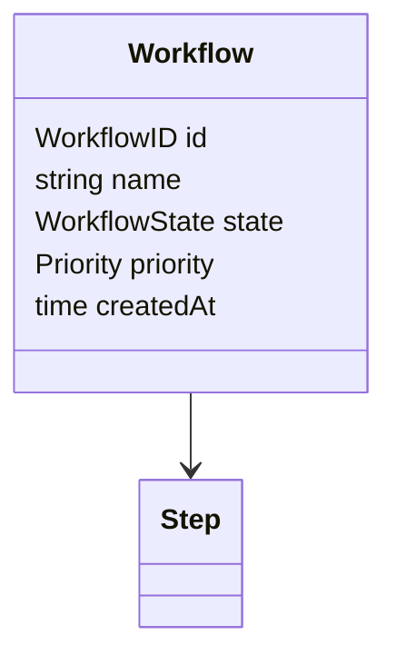

---

# 11.6 Step

A workflow consists of ordered execution steps.

Examples

* Research
* Planning
* Review
* Implementation
* Testing

---

## Attributes

```text
Step

id

workflowId

name

state

provider

startedAt

completedAt
```

---

## UML

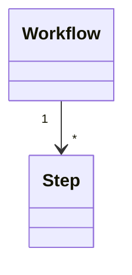

---

# 11.7 Session

## Purpose

Represents one execution lifecycle.

Unlike workflows,

sessions are transient.

---

## Example

```text
Workflow

OAuth

↓

Session

Run #12

↓

Checkpoint

42
```

---

## Attributes

```text
Session

id

workflowId

provider

status

startedAt

endedAt
```

---

## UML

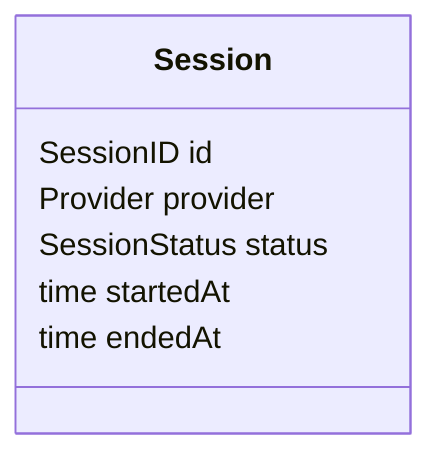

---

# 11.8 Context

Context is **not** persisted as a conversation.

Instead,

it is assembled dynamically.

---

## Sources

* Memory
* Workflow
* Artifacts
* Repository
* Checkpoints

---

## UML

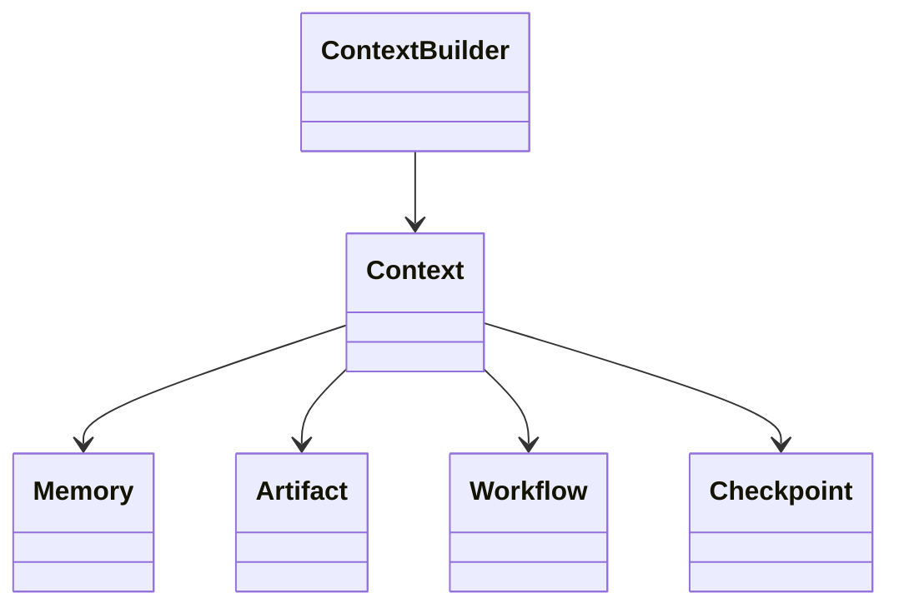

---

# 11.9 Memory

## Purpose

Stores durable project knowledge.

---

## Types

```text
Architecture

Convention

Decision

Pattern

Lesson

Fact
```

---

## Attributes

```text
Memory

id

title

category

content

tags

createdAt
```

---

## UML

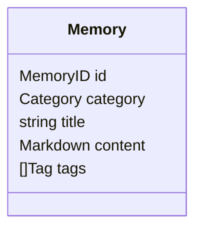

---

# 11.10 Artifact

Artifacts are generated outputs.

Unlike Memory,

Artifacts are produced during execution.

---

## Examples

* Review
* Benchmark
* Design
* Research
* Build log

---

## Attributes

```text
Artifact

id

workflow

type

path

createdAt
```

---

## UML

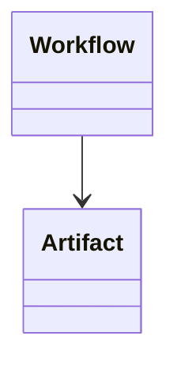

---

# 11.11 Checkpoint

Represents a resumable execution snapshot.

---

## Attributes

```text
Checkpoint

id

workflow

session

state

createdAt
```

---

## Lifecycle

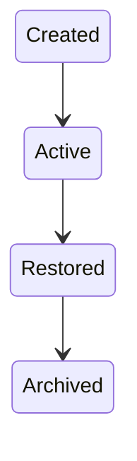

---

# 11.12 ProviderProfile

A ProviderProfile maps runtime roles to providers.

Example

```yaml
planning:

command: hrclaudeff

implementation:

command: hrcodex

review:

command: hrclaudeff
```

---

## UML

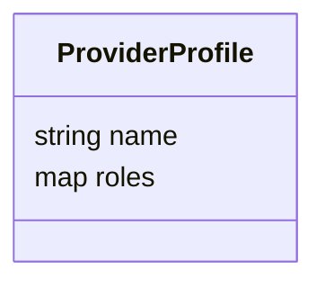

---

# 11.13 Event

Events form the immutable audit trail.

Examples

```text
WorkflowStarted

WorkflowCompleted

ProviderInvoked

CheckpointCreated

ArtifactGenerated

MemoryUpdated
```

---

## Attributes

```text
Event

id

type

timestamp

payload
```

---

## UML

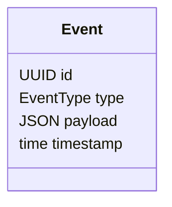

---

# 11.14 Relationships

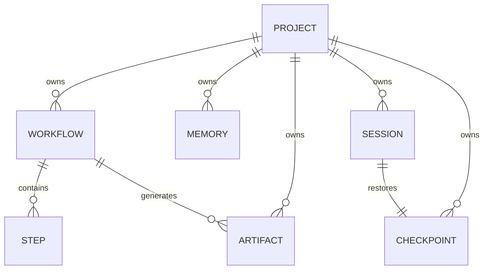

---

# 11.15 Value Objects

The following are immutable value objects.

```text
WorkflowID

SessionID

CheckpointID

ArtifactID

MemoryID

ProviderID

Version

Path

Timestamp
```

Value Objects have no identity beyond their values.

---

# 11.16 Domain Services

Not everything belongs inside an entity.

The following concepts are modeled as Domain Services.

| Service            | Reason                          |
| ------------------ | ------------------------------- |
| Workflow Engine    | Coordinates multiple aggregates |
| Context Builder    | Builds execution context        |
| Provider Registry  | Resolves providers              |
| Checkpoint Manager | Creates snapshots               |
| Session Manager    | Coordinates execution           |
| Memory Manager     | Retrieval and indexing          |

---

# 11.17 Aggregate Boundaries

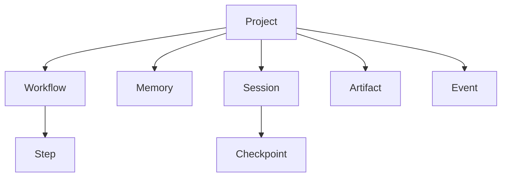

Only Project owns aggregates.

No aggregate owns another aggregate directly.

---

# 11.18 Design Decisions

## Decision 1 — Project as Aggregate Root

Everything belongs to a project.

This simplifies ownership and migration.

---

## Decision 2 — Context Is Derived

Context is never stored.

It is assembled on demand.

---

## Decision 3 — Events Are Immutable

Events are append-only.

Historical execution is never rewritten.

---

## Decision 4 — Memory and Artifacts Are Different

Memory represents durable knowledge.

Artifacts represent generated work.

This distinction keeps retrieval efficient and semantically meaningful.

---

# 11.19 Future Domain Objects

Potential future aggregates include:

* KnowledgeGraph
* Team
* RemoteWorkspace
* CloudProfile
* AgentCapability
* PromptTemplate
* SemanticIndex

These are intentionally excluded from Version 1.

---

# 11.20 Chapter Summary

This chapter formalized the core domain model of Context OS.

By separating entities (Project, Workflow, Session, Memory, Artifact, Checkpoint, Event) from domain services (Workflow Engine, Context Builder, Session Manager, etc.), the runtime achieves a clean and extensible model that is independent of implementation details.

Most importantly, **Context** is modeled as a **derived object**, not a stored one. This reinforces one of the central principles of Context OS: project intelligence is reconstructed from durable knowledge rather than replayed from conversations.

The next chapter moves from the domain model to the **Package & Dependency Architecture**, showing how these concepts map onto Go packages while enforcing strict dependency rules and clean architectural boundaries.
