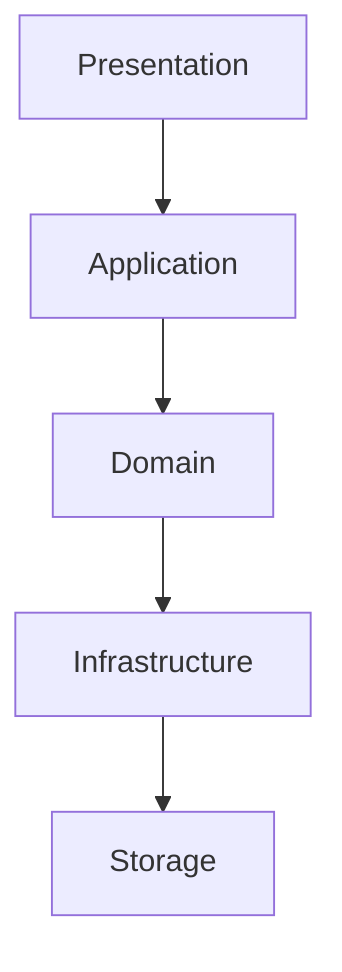
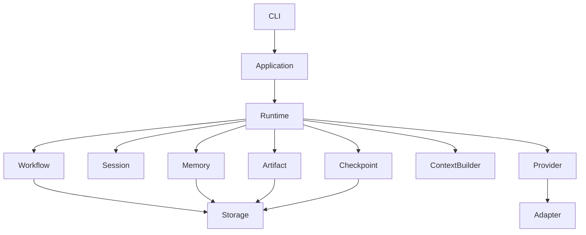
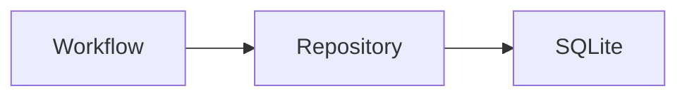
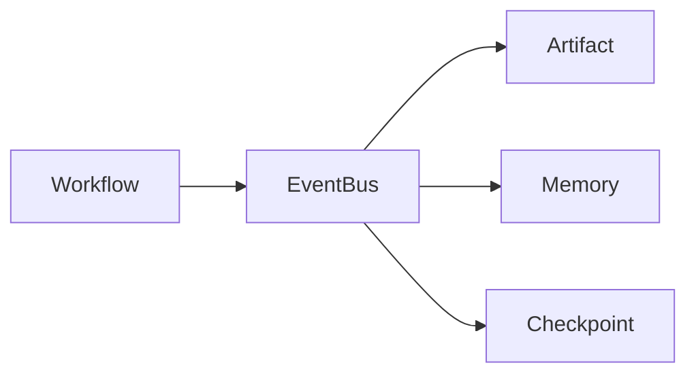
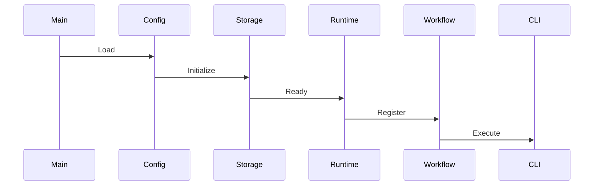

# Chapter 12 — Package Architecture & Dependency Graph

---

# Chapter 12 — Package Architecture & Dependency Graph

## 12.1 Overview

The previous chapter defined the **Domain Model**.

This chapter maps those domain concepts into actual Go packages while enforcing architectural boundaries.

The primary goals of the package architecture are:

* High cohesion
* Low coupling
* Dependency inversion
* Independent testing
* Clear ownership
* Easy extensibility

Unlike many Go projects that organize packages around technologies (e.g., `sqlite`, `http`, `cobra`), Context OS organizes packages around **business capabilities**.

---

# 12.2 Architectural Layers

The package structure mirrors the layered architecture introduced in Chapter 6.



Each layer may only depend on the layer directly beneath it.

---

# 12.3 Package Hierarchy

```text
cmd/
    context/

internal/

    application/

    runtime/

    workflow/

    project/

    session/

    checkpoint/

    contextbuilder/

    artifact/

    memory/

    provider/

    adapter/

    event/

    storage/

    config/

    plugin/

    tui/

    shared/

pkg/
```

Every package owns a single business capability.

---

# 12.4 Package Dependency Graph



Notice that Storage is only accessed through services.

No package talks directly to SQLite.

---

# 12.5 Package Responsibilities

## application/

Coordinates use cases.

Examples

```text
InitializeProject

StartWorkflow

ResumeWorkflow

RunProvider

CreateCheckpoint
```

Application Services coordinate.

They never contain business rules.

---

## runtime/

Responsible for runtime lifecycle.

Owns

* startup
* shutdown
* dependency wiring
* runtime state
* health

Everything begins here.

---

## workflow/

Owns

* workflows
* workflow execution
* transitions
* retries
* recovery

This package contains the runtime's state machine.

---

## session/

Owns

* active execution
* session lifecycle
* interruption
* restoration

---

## contextbuilder/

Responsible for constructing execution context.

Input

* Workflow
* Session
* Memory
* Repository
* Checkpoint
* Artifacts

Output

ExecutionContext

No provider-specific logic exists here.

---

## memory/

Owns durable project knowledge.

Responsible for

* retrieval
* storage
* indexing
* tagging

---

## artifact/

Owns generated outputs.

Examples

* Reviews
* Designs
* Benchmarks
* Documentation

---

## checkpoint/

Responsible for resumable execution.

Supports

* create
* restore
* archive
* compare

---

## provider/

Defines runtime contracts.

Contains

```go
type Provider interface {
    Execute(...)
}
```

No concrete implementation belongs here.

---

## adapter/

Concrete implementations.

Examples

```text
Claude Adapter

Codex Adapter

Gemini Adapter

OpenCode Adapter

Shell Adapter
```

---

## event/

Owns runtime events.

Everything important eventually becomes an Event.

---

## storage/

Persistence abstraction.

Implements

Repositories

Transactions

Indexes

Nothing else.

---

## config/

Loads

* YAML
* Environment Variables
* Defaults

---

## plugin/

Future extension framework.

Version 1 provides registration only.

---

## tui/

Bubble Tea application.

Contains

Views

Components

Navigation

Rendering

---

## shared/

Common utilities.

Examples

* IDs
* Errors
* Validation
* Helpers

Should remain intentionally small.

---

# 12.6 Package Ownership Matrix

| Package    | Owns                     | Does Not Own       |
| ---------- | ------------------------ | ------------------ |
| runtime    | Lifecycle                | Workflow logic     |
| workflow   | State machine            | Provider execution |
| provider   | Interfaces               | Claude/Codex logic |
| adapter    | Provider implementations | Workflow           |
| memory     | Knowledge                | Artifacts          |
| artifact   | Outputs                  | Memory             |
| checkpoint | Recovery                 | Sessions           |
| storage    | Persistence              | Runtime            |
| tui        | Rendering                | Business logic     |

Ownership is exclusive.

---

# 12.7 Dependency Rules

## Rule 1

Packages communicate only through exported interfaces.

---

## Rule 2

Infrastructure packages never import Presentation packages.

---

## Rule 3

Workflow never imports CLI.

---

## Rule 4

Storage never imports Workflow.

---

## Rule 5

Provider implementations never import Runtime.

---

## Rule 6

Context Builder never knows which provider is being used.

---

## Rule 7

Domain packages never import Cobra or Bubble Tea.

---

# 12.8 Dependency Inversion

Instead of

```text
Workflow

↓

SQLite
```

Context OS uses



Workflow depends on an interface.

SQLite implements it.

---

# 12.9 Repository Pattern

Every aggregate owns a repository.

Example

```go
type WorkflowRepository interface {

    Save(...)

    Load(...)

    List(...)

}
```

Implementation

```text
SQLiteWorkflowRepository
```

Future

```text
BadgerWorkflowRepository

CloudWorkflowRepository
```

No Workflow code changes.

---

# 12.10 Factory Pattern

Factories create runtime objects.

Examples

```text
ProviderFactory

WorkflowFactory

SessionFactory

CheckpointFactory
```

Factories isolate construction.

---

# 12.11 Registry Pattern

Registries discover runtime capabilities.

Examples

```text
ProviderRegistry

PluginRegistry

WorkflowRegistry
```

Registries own discovery.

Factories own creation.

---

# 12.12 Strategy Pattern

Strategies allow replaceable algorithms.

Examples

```text
ContextStrategy

RecoveryStrategy

StorageStrategy

RetryStrategy
```

Each strategy implements a common interface.

---

# 12.13 Observer Pattern

Runtime services communicate through Events.

Instead of

```text
Workflow

↓

Memory

↓

Artifact

↓

Checkpoint
```

they publish events.



This reduces coupling.

---

# 12.14 Package Initialization Order



Initialization is deterministic.

---

# 12.15 Cross-Cutting Concerns

Some capabilities span multiple packages.

Examples

* Logging
* Metrics
* Tracing
* Configuration
* Error Handling

These should be implemented through middleware or decorators rather than embedded into business logic.

---

# 12.16 Testing Strategy

Every package should be independently testable.

```text
workflow/
    workflow_test.go

memory/
    memory_test.go

checkpoint/
    checkpoint_test.go
```

Provider tests should use mocks.

Storage tests should use temporary databases.

---

# 12.17 Circular Dependency Prevention

Circular imports are architectural defects.

Example

❌

```text
Workflow

↓

Storage

↓

Workflow
```

Correct

```text
Workflow

↓

Repository Interface

↓

Storage
```

---

# 12.18 Future Packages

Potential additions

```text
scheduler/

knowledgegraph/

telemetry/

cloud/

api/

mcp/

analytics/
```

The current dependency rules allow these to be introduced without restructuring the repository.

---

# 12.19 Design Decisions

## Decision 1 — Package by Capability

Packages are organized around business concepts rather than frameworks or technologies.

---

## Decision 2 — Interface-Driven Design

All external dependencies are hidden behind interfaces owned by the Domain Layer.

---

## Decision 3 — No Shared "Utils" Package

Only genuinely shared primitives belong in `shared/`.

Business logic should remain in its owning package.

---

## Decision 4 — Event-Driven Coordination

Runtime components communicate through events where possible, reducing compile-time coupling and improving extensibility.

---

# 12.20 Chapter Summary

This chapter translates the conceptual architecture of Context OS into a concrete package structure.

By organizing packages around domain capabilities, enforcing strict dependency rules, and relying on interfaces rather than implementations, the codebase remains modular, testable, and adaptable to future growth.

The package architecture ensures that providers, storage engines, user interfaces, and future integrations can evolve independently while preserving the integrity of the core runtime.

The next chapter shifts from static structure to dynamic behavior by exploring the **execution lifecycle** of Context OS through detailed sequence diagrams covering project initialization, workflow execution, provider invocation, checkpoint restoration, and session recovery.
