# Chapter 13 — Execution Lifecycle & Sequence Diagrams

---

# Chapter 13 — Execution Lifecycle & Sequence Diagrams

## 13.1 Overview

Previous chapters described the static architecture of Context OS.

This chapter describes the **dynamic behavior** of the runtime.

Instead of answering:

> **"What components exist?"**

this chapter answers:

> **"How do they collaborate during execution?"**

Every user command follows a deterministic lifecycle.

Regardless of whether the provider is:

* Claude Code
* Codex CLI
* Gemini CLI
* OpenCode
* Future Providers

the runtime behaves identically.

---

# 13.2 Runtime Lifecycle

Every Context OS command follows the same execution pipeline.

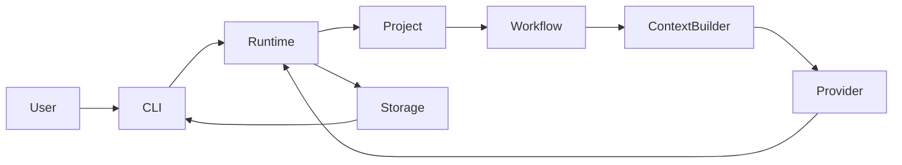

Notice:

The provider is **only one step** in the pipeline.

The runtime owns everything else.

---

# 13.3 General Execution Lifecycle

Every command executes the following stages.

```text
User Command

↓

Argument Parsing

↓

Configuration Loading

↓

Project Discovery

↓

Runtime Bootstrap

↓

Workflow Resolution

↓

Context Construction

↓

Provider Execution

↓

Result Processing

↓

Artifact Generation

↓

Checkpoint Creation

↓

Runtime Persistence

↓

Response
```

This lifecycle is invariant across all providers.

---

# 13.4 Project Initialization

Command

```bash
context init
```

---

## Sequence Diagram

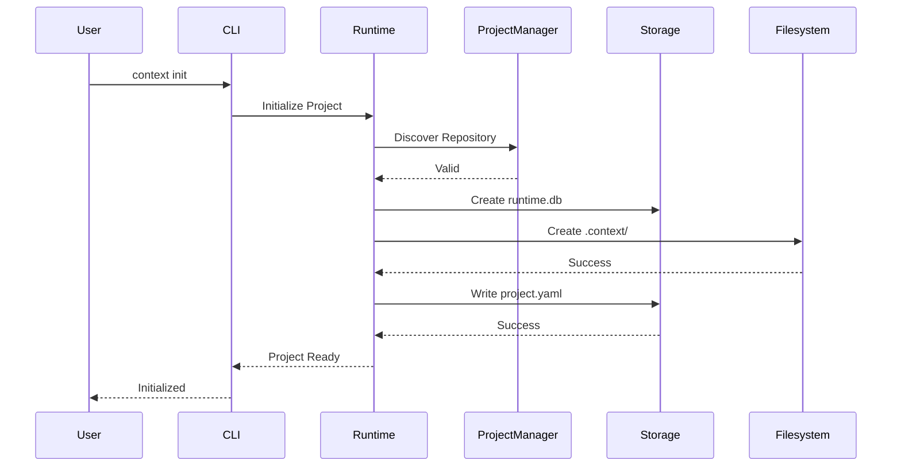

---

## Result

```
.context/

runtime.db

project.yaml

memory/

artifacts/

workflows/

sessions/

...
```

---

# 13.5 Runtime Startup

Every command begins by restoring runtime state.

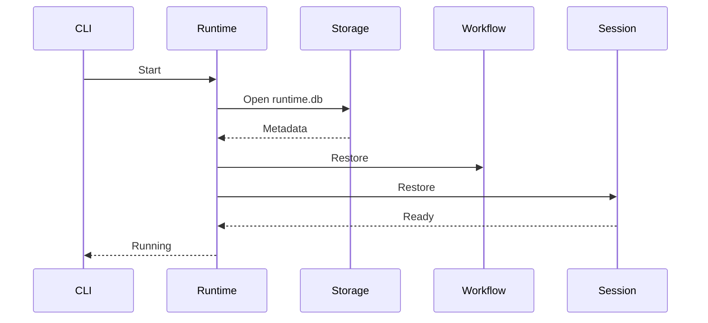

Runtime startup is deterministic.

---

# 13.6 Workflow Execution

Command

```bash
context workflow start oauth-login
```

---

## Sequence

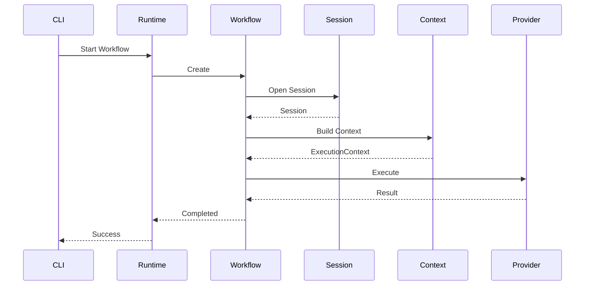

---

## Responsibilities

Workflow Engine

* lifecycle
* retries
* progress
* persistence

Provider

* execute task only

---

# 13.7 Context Construction

This is the most important runtime operation.

Unlike traditional assistants,

Context OS builds context from project state.

---

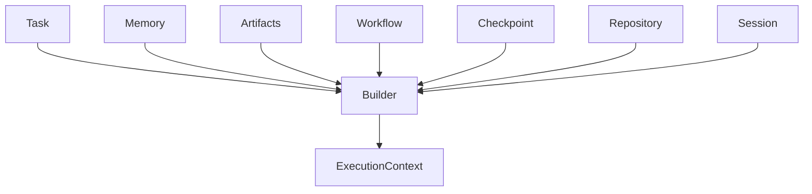

---

ExecutionContext becomes the provider request.

---

# 13.8 Provider Execution

Provider execution is intentionally isolated.

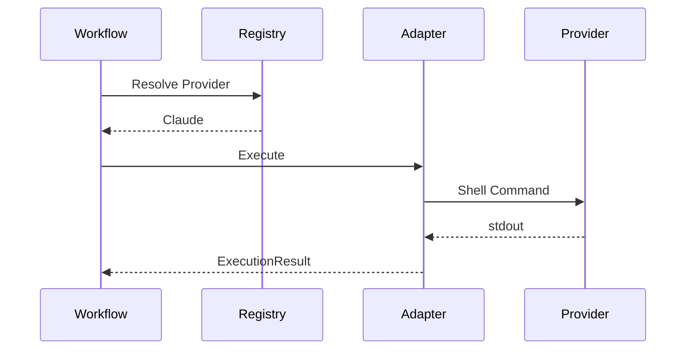

The runtime never invokes providers directly.

---

# 13.9 Artifact Creation

Generated outputs become artifacts.

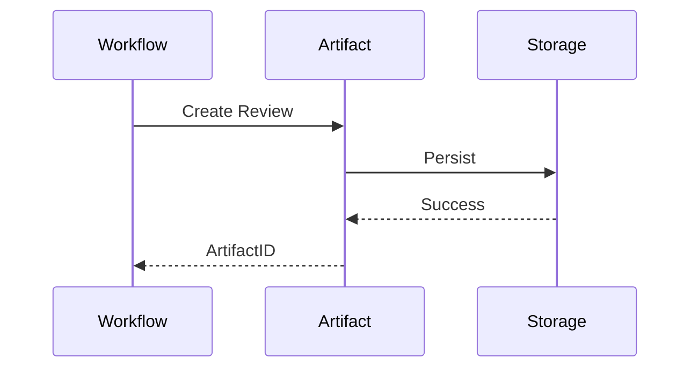

Artifacts are immutable.

---

# 13.10 Checkpoint Creation

After successful execution,

the runtime creates a checkpoint.

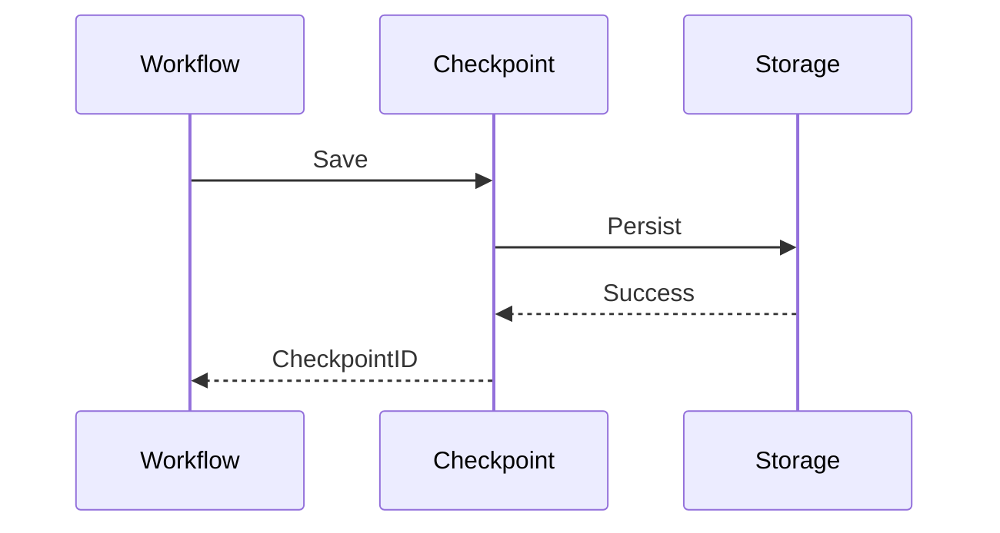

---

# 13.11 Session Recovery

If execution stops unexpectedly,

the runtime resumes from the latest checkpoint.

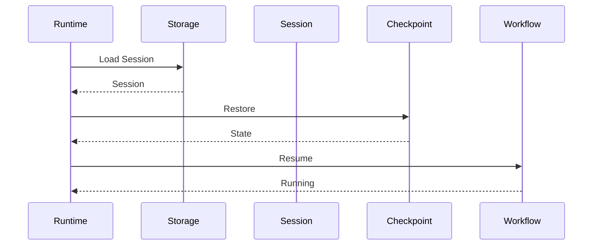

---

# 13.12 Runtime Shutdown

Every command performs graceful shutdown.

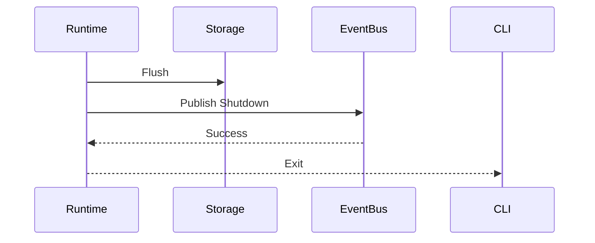

No runtime state should be lost.

---

# 13.13 Provider Failure

Suppose

Claude crashes.

Runtime behavior

```mermaid
flowchart TD

ProviderCrash

↓

Runtime Detects

↓

Workflow Suspended

↓

Checkpoint Saved

↓

Provider Retry

↓

Resume
```

Project intelligence survives.

Only provider execution failed.

---

# 13.14 Storage Failure

If persistence fails,

the runtime enters recovery mode.

```mermaid
flowchart TD

StorageFailure

↓

Retry

↓

Read Only

↓

Abort
```

Runtime corruption is never acceptable.

---

# 13.15 Event Flow

Everything important becomes an event.

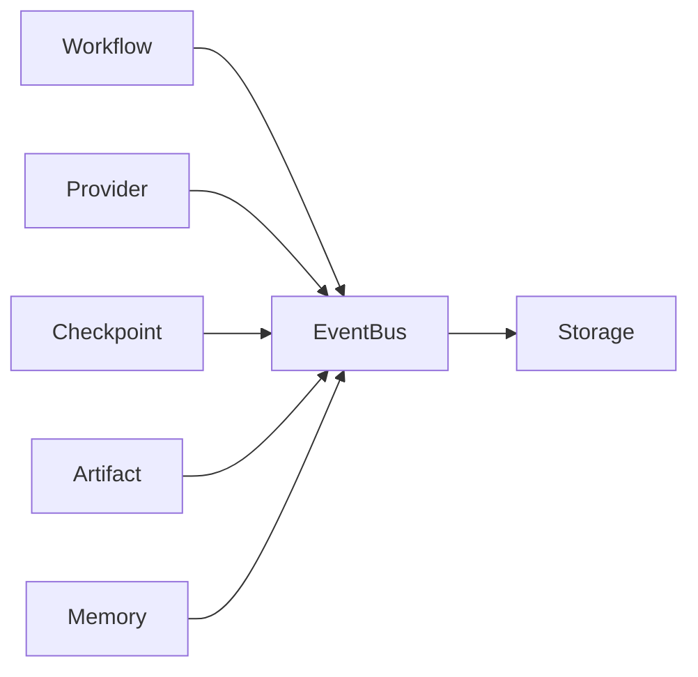

Events create the audit trail.

---

# 13.16 Runtime Timeline

A complete execution looks like

```text
Initialize Runtime

↓

Restore Session

↓

Restore Workflow

↓

Build Context

↓

Execute Provider

↓

Process Result

↓

Generate Artifact

↓

Save Checkpoint

↓

Persist Runtime

↓

Complete Workflow
```

---

# 13.17 Parallel Workflows

Future runtime.

```mermaid
flowchart TD

Runtime

↓

Workflow A

Workflow B

Workflow C

Workflow A --> Context

Workflow B --> Context

Workflow C --> Context
```

Each workflow owns an independent session.

---

# 13.18 Event Timeline

```text
Workflow Started

↓

Provider Invoked

↓

Artifact Generated

↓

Checkpoint Created

↓

Workflow Completed

↓

Session Closed
```

Events are append-only.

---

# 13.19 Recovery Timeline

```text
Crash

↓

Restart

↓

Open runtime.db

↓

Restore Session

↓

Restore Workflow

↓

Restore Context

↓

Resume Provider
```

No manual intervention.

---

# 13.20 Lifecycle Guarantees

Context OS guarantees

✓ Runtime restoration

✓ Workflow persistence

✓ Provider independence

✓ Artifact durability

✓ Checkpoint recovery

✓ Deterministic execution

---

# 13.21 Architectural Observation

One important observation emerges from these sequence diagrams:

> **The provider is never the center of execution.**

Instead,

the execution pipeline is

```
Runtime

↓

Workflow

↓

Context Builder

↓

Provider

↓

Workflow

↓

Runtime
```

This inversion is the defining characteristic of Context OS.

Traditional assistants treat the runtime as a helper around the model.

Context OS treats the model as a helper inside the runtime.

---

# 13.22 Design Decisions

## Decision 1 — Deterministic Execution

Every command follows the same lifecycle regardless of provider.

---

## Decision 2 — Runtime-Centric Architecture

The runtime orchestrates all activity.

Providers are execution engines.

---

## Decision 3 — Explicit Recovery

Recovery is a first-class feature rather than an afterthought.

---

## Decision 4 — Event-Based Observability

Every meaningful state transition emits an event.

---

# 13.23 Chapter Summary

This chapter defines the dynamic behavior of Context OS.

Through sequence diagrams, we have shown how commands flow through the runtime—from initialization and workflow execution to context construction, provider invocation, artifact generation, checkpoint creation, and recovery.

A recurring pattern emerges:

* **The runtime owns execution.**
* **The workflow owns progress.**
* **The context builder owns intelligence.**
* **The provider owns only task execution.**

This separation ensures that workflows remain durable, provider-independent, and fully recoverable.

The next chapter dives into one of the most critical architectural decisions: the **Storage Model**, explaining why Context OS uses a hybrid approach (SQLite, Markdown, JSON, and filesystem) instead of relying on a single persistence mechanism.
