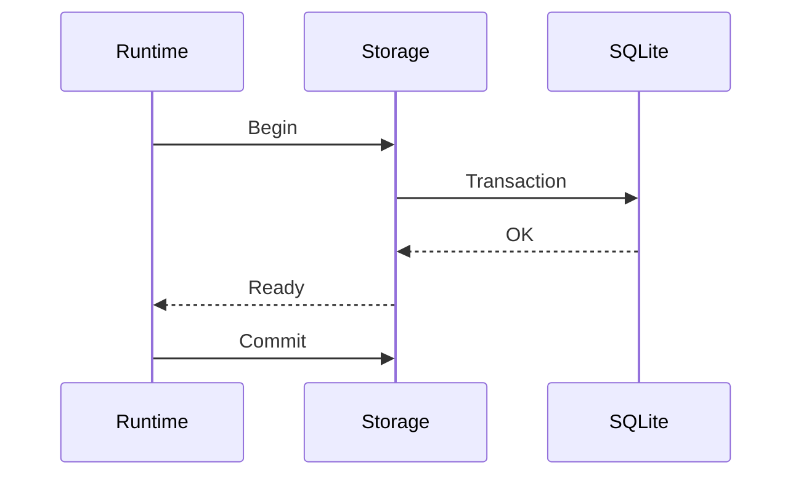

# Chapter 14 — Storage Architecture

---

# Chapter 14 — Storage Architecture

## 14.1 Overview

Storage is the foundation upon which Context OS is built.

Unlike traditional applications that store everything in a database or everything in flat files, Context OS intentionally adopts a **hybrid storage architecture**.

Each type of project information has different characteristics:

* Runtime state is highly structured.
* Design documents are human-authored.
* AI outputs are long-form Markdown.
* Events are append-only.
* Cache is disposable.

No single storage technology optimally serves all of these requirements.

Therefore, Context OS stores **each type of data using the format that best matches its access patterns**.

---

# 14.2 Design Goals

The storage architecture is designed around seven principles.

## Human Readability

Developers should be able to inspect project state without proprietary tooling.

---

## Local First

All project intelligence resides locally.

No network connection is required.

---

## Transaction Safety

Critical runtime metadata must support ACID guarantees.

---

## Incremental Growth

Large projects should not require loading the entire runtime into memory.

---

## Git Compatibility

Teams should decide what belongs in Git.

---

## Replaceability

Storage engines should be replaceable through interfaces.

---

## Performance

Runtime operations should remain fast regardless of repository size.

---

# 14.3 Hybrid Storage Model

The runtime deliberately uses multiple storage technologies.

```mermaid
flowchart TD

Runtime

Runtime --> SQLite

Runtime --> Markdown

Runtime --> JSON

Runtime --> FileSystem

Runtime --> Cache

SQLite --> Metadata

Markdown --> Documents

JSON --> Structured Files

FileSystem --> Artifacts

Cache --> Temporary Data
```

Each storage backend has one clearly defined purpose.

---

# 14.4 Storage Responsibilities

| Storage Type | Purpose                                             |
| ------------ | --------------------------------------------------- |
| SQLite       | Structured runtime metadata                         |
| Markdown     | Human-authored knowledge and AI-generated documents |
| JSON         | Lightweight structured files                        |
| File System  | Binary assets and artifacts                         |
| Cache        | Disposable runtime acceleration                     |

---

# 14.5 Why Not Store Everything in SQLite?

Many applications place every object into a relational database.

Context OS intentionally rejects this design.

Consider a generated architecture document.

```text
120 pages

Markdown

Images

Mermaid

Tables
```

Storing such content as SQL rows introduces several disadvantages:

* Poor Git diffs
* Difficult manual editing
* Difficult code review
* Less portable
* Harder debugging

Markdown is the natural representation.

---

# 14.6 Why Not Store Everything in Markdown?

The opposite approach is equally problematic.

Suppose we need to answer:

> Which workflow is currently running?

Searching Markdown files is inefficient.

Operations like

* filtering
* sorting
* indexing
* joins

are precisely what databases solve.

---

# 14.7 Storage Decision Matrix

| Data              | Storage         |
| ----------------- | --------------- |
| Workflow metadata | SQLite          |
| Session metadata  | SQLite          |
| Runtime state     | SQLite          |
| Events            | SQLite + JSONL  |
| Memory documents  | Markdown        |
| ADRs              | Markdown        |
| Research          | Markdown        |
| Reviews           | Markdown        |
| Provider output   | JSON            |
| Logs              | Text            |
| Binary assets     | File System     |
| Cache             | Cache Directory |

---

# 14.8 SQLite

SQLite is the authoritative metadata store.

---

## Why SQLite?

Advantages

* ACID transactions
* Zero configuration
* Cross-platform
* Mature ecosystem
* Excellent performance
* Embedded database
* Reliable

---

SQLite stores

```text
Projects

Workflows

Sessions

Events

Checkpoints

Indexes

Relationships
```

It deliberately does **not** store large Markdown documents.

---

# 14.9 Markdown

Markdown stores project knowledge.

Examples

```text
Design

Research

Architecture

Implementation Plans

Reviews

Benchmarks
```

Advantages

* Human readable
* Git friendly
* Searchable
* Portable
* IDE support

Markdown is the primary format for project intelligence.

---

# 14.10 JSON

JSON stores machine-generated structured documents.

Examples

```text
ExecutionContext

ProviderResponse

WorkflowSnapshot

CheckpointMetadata

CapabilityDiscovery
```

Unlike Markdown,

JSON is optimized for serialization rather than reading.

---

# 14.11 JSONL

JSON Lines are used for append-only streams.

Example

```json
{"event":"WorkflowStarted"}

{"event":"ProviderInvoked"}

{"event":"ArtifactCreated"}

{"event":"WorkflowCompleted"}
```

Advantages

* Append-only
* Stream processing
* Recovery
* Analytics

---

# 14.12 Binary Assets

Binary files remain outside SQLite.

Examples

```text
PNG

SVG

PDF

ZIP

Images

Benchmarks

Coverage Reports
```

The runtime stores only references.

---

# 14.13 Cache

Cache is completely disposable.

Examples

```text
Provider Capability Cache

Markdown Index

File Hashes

Repository Scan

Search Index

Prompt Cache
```

Everything inside cache may be deleted safely.

---

# 14.14 Storage Layout

```text
.context/

runtime.db

memory/

artifacts/

workflows/

sessions/

events/

cache/

logs/

providers/
```

Each directory maps to one storage owner.

---

# 14.15 Storage Interfaces

The runtime never depends directly on SQLite.

Instead

```go
type WorkflowRepository interface {

    Save(workflow Workflow) error

    Load(id WorkflowID) (*Workflow,error)

    List() ([]Workflow,error)

}
```

SQLite implements this interface.

Future implementations may use

* PostgreSQL
* Cloud Storage
* BadgerDB

without changing runtime code.

---

# 14.16 Transaction Model

Every runtime operation executes inside a transaction boundary.



If any operation fails,

the transaction rolls back.

---

# 14.17 Event Storage

Events are immutable.

```text
WorkflowStarted

WorkflowPaused

ProviderInvoked

CheckpointCreated

ArtifactGenerated

WorkflowCompleted
```

Events are appended.

Never modified.

Never deleted.

---

# 14.18 Runtime Snapshot

At any point,

the runtime can reconstruct project state using

```text
SQLite Metadata

+

Markdown Memory

+

Artifacts

+

Latest Checkpoint

+

Events
```

This enables deterministic recovery.

---

# 14.19 Storage Ownership

| Data             | Owner              |
| ---------------- | ------------------ |
| Project          | Project Manager    |
| Workflow         | Workflow Engine    |
| Session          | Session Manager    |
| Memory           | Memory Manager     |
| Artifact         | Artifact Manager   |
| Event            | Event Bus          |
| Checkpoint       | Checkpoint Manager |
| Provider Profile | Provider Registry  |

Ownership is exclusive.

---

# 14.20 Read Patterns

Typical reads include:

```text
Load Project

Load Active Workflow

Retrieve Memory

Find Artifacts

Restore Session

Restore Checkpoint
```

These should execute in milliseconds.

---

# 14.21 Write Patterns

Typical writes include:

```text
Persist Workflow

Create Artifact

Save Checkpoint

Append Event

Update Session
```

Writes are relatively infrequent compared to reads.

---

# 14.22 Recovery Strategy

Recovery order

```text
Open SQLite

↓

Load Runtime

↓

Restore Sessions

↓

Restore Workflow

↓

Restore Memory

↓

Locate Artifacts

↓

Resume
```

Recovery should never depend upon replaying conversations.

---

# 14.23 Backup Strategy

A complete runtime backup consists of

```text
.context/

+

Git Repository
```

No external services required.

Future versions may support

```bash
context backup

context restore
```

---

# 14.24 Design Decisions

## Decision 1 — Hybrid Storage

Different data deserves different storage technologies.

---

## Decision 2 — Markdown First

Human knowledge remains readable.

---

## Decision 3 — SQLite for Metadata

Structured runtime state belongs in a relational database.

---

## Decision 4 — Disposable Cache

Cache should never contain critical information.

---

## Decision 5 — Storage Abstraction

Runtime depends upon repositories,

not storage engines.

---

# 14.25 Alternatives Considered

## PostgreSQL

Rejected.

Reasons

* Requires installation
* Network dependency
* Heavyweight
* Poor portability

---

## MongoDB

Rejected.

Reasons

* Weak transactional model
* Poor local-first experience

---

## Flat Files Only

Rejected.

Reasons

* Slow queries
* Difficult indexing
* Poor scalability

---

## SQLite Only

Rejected.

Reasons

* Human-readable documents become difficult to edit
* Poor Git experience

---

# 14.26 Future Evolution

Future storage extensions may include:

* Cloud synchronization
* Object storage
* Vector indexes
* Semantic search
* Remote runtime
* Team collaboration
* Encrypted storage
* Incremental backups

These should integrate without changing higher runtime layers.

---

# 14.27 Architectural Observation

One important architectural insight emerges from this chapter:

> **Context OS does not have a database.**
>
> **It has a storage architecture.**

SQLite is only one component.

Markdown is equally important.

Artifacts are equally important.

Events are equally important.

This hybrid model gives Context OS the best characteristics of databases, source control, and local filesystems while remaining fully transparent to developers.

---

# 14.28 Chapter Summary

The storage architecture of Context OS intentionally combines SQLite, Markdown, JSON, JSONL, the filesystem, and disposable caches into a unified persistence model.

Each storage technology is used for what it does best, ensuring that runtime metadata remains transactional, project knowledge remains human-readable, and generated artifacts remain portable.

This hybrid approach is a defining characteristic of Context OS and underpins its goals of durability, portability, transparency, and provider independence.

The next chapter formalizes the **data model** by defining the SQLite schema, entity relationships, indexes, constraints, and the ER diagram that support this storage architecture.
