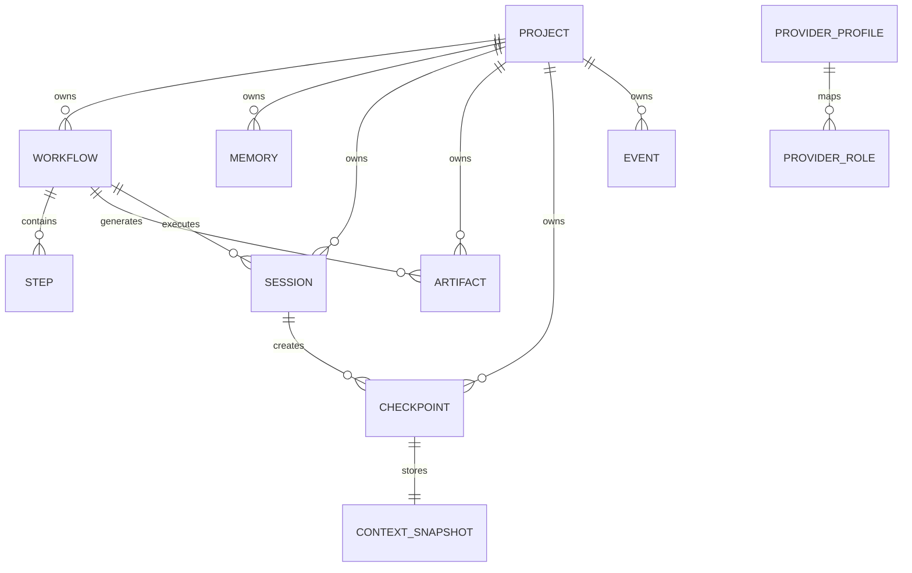
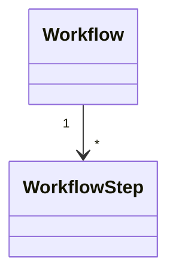
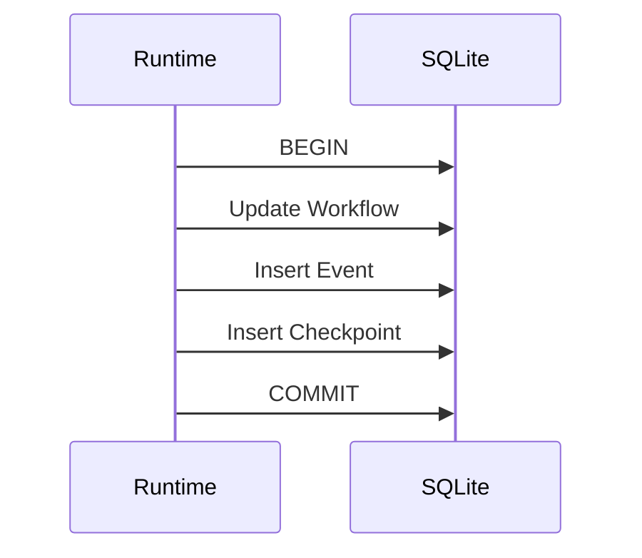

# Chapter 15 — Data Model & Database Schema

---

# Chapter 15 — Data Model & Database Schema

## 15.1 Overview

The previous chapter defined **how** Context OS stores information.

This chapter defines **what** is stored inside the relational metadata database.

The SQLite database serves as the **authoritative metadata store** for Context OS.

It intentionally stores only **structured metadata**.

Large documents such as:

* Research
* Reviews
* Architecture Documents
* ADRs
* Benchmarks

remain as Markdown files inside the runtime directory.

The database stores references to these files rather than their contents.

---

# 15.2 Design Goals

The database schema has been designed around the following principles.

## Single Source of Truth

Metadata exists in exactly one location.

---

## Normalized

Avoid duplicate information.

---

## Fast Recovery

Runtime restoration should require only a handful of indexed queries.

---

## Event Friendly

Historical execution should remain recoverable.

---

## Extensible

Future features should require additive schema changes.

---

# 15.3 High-Level Entity Relationship



---

# 15.4 Database Overview

The initial schema contains the following tables.

| Table            | Purpose                  |
| ---------------- | ------------------------ |
| project          | Project metadata         |
| workflow         | Workflow definitions     |
| workflow_step    | Workflow execution steps |
| session          | Runtime sessions         |
| memory           | Memory index             |
| artifact         | Artifact metadata        |
| checkpoint       | Recovery points          |
| provider_profile | Provider mappings        |
| provider_role    | Role → Provider mapping  |
| event            | Immutable runtime events |
| context_snapshot | Checkpoint context       |
| migration        | Schema version history   |

---

# 15.5 Project Table

Represents one initialized repository.

```sql
CREATE TABLE project (

id TEXT PRIMARY KEY,

name TEXT NOT NULL,

root_path TEXT NOT NULL,

language TEXT,

runtime_version INTEGER,

schema_version INTEGER,

created_at DATETIME,

updated_at DATETIME

);
```

Only one row exists per repository.

---

# 15.6 Workflow Table

Represents long-running engineering work.

```sql
CREATE TABLE workflow (

id TEXT PRIMARY KEY,

project_id TEXT,

name TEXT,

description TEXT,

state TEXT,

priority INTEGER,

owner TEXT,

created_at DATETIME,

updated_at DATETIME

);
```

---

## Workflow States

```text
PENDING

RUNNING

WAITING

FAILED

COMPLETED

ARCHIVED
```

---

# 15.7 Workflow Step Table

Each workflow consists of ordered steps.

```sql
CREATE TABLE workflow_step (

id TEXT PRIMARY KEY,

workflow_id TEXT,

step_number INTEGER,

name TEXT,

state TEXT,

provider_role TEXT,

started_at DATETIME,

completed_at DATETIME

);
```

---

# Relationship



---

# 15.8 Session Table

Represents one execution session.

```sql
CREATE TABLE session (

id TEXT PRIMARY KEY,

workflow_id TEXT,

provider TEXT,

state TEXT,

started_at DATETIME,

ended_at DATETIME

);
```

Sessions are transient.

Workflows are durable.

---

# 15.9 Memory Table

Markdown files remain outside SQLite.

This table indexes them.

```sql
CREATE TABLE memory (

id TEXT PRIMARY KEY,

project_id TEXT,

title TEXT,

category TEXT,

path TEXT,

checksum TEXT,

created_at DATETIME

);
```

---

## Example

```text
Architecture

↓

memory/architecture.md

↓

Indexed Here
```

---

# 15.10 Artifact Table

Artifacts are also indexed.

```sql
CREATE TABLE artifact (

id TEXT PRIMARY KEY,

workflow_id TEXT,

type TEXT,

path TEXT,

status TEXT,

created_at DATETIME

);
```

Large files remain on disk.

---

# 15.11 Checkpoint Table

```sql
CREATE TABLE checkpoint (

id TEXT PRIMARY KEY,

workflow_id TEXT,

session_id TEXT,

snapshot_id TEXT,

created_at DATETIME

);
```

---

Checkpoint metadata is small.

Actual snapshots live separately.

---

# 15.12 Context Snapshot Table

Represents the runtime state captured during checkpoint creation.

```sql
CREATE TABLE context_snapshot (

id TEXT PRIMARY KEY,

workflow_state TEXT,

memory_hash TEXT,

artifact_hash TEXT,

provider_state TEXT,

created_at DATETIME

);
```

---

Notice

Only references and hashes are stored.

Large objects remain external.

---

# 15.13 Provider Profile

```sql
CREATE TABLE provider_profile (

id TEXT PRIMARY KEY,

name TEXT,

description TEXT

);
```

Example

```text
default

high-performance

offline

experimental
```

---

# 15.14 Provider Role

Maps runtime roles to providers.

```sql
CREATE TABLE provider_role (

id TEXT PRIMARY KEY,

profile_id TEXT,

role TEXT,

provider_command TEXT

);
```

Example

| Role           | Command    |
| -------------- | ---------- |
| planning       | hrclaudeff |
| implementation | hrcodex    |
| review         | hrclaudeff |

---

# 15.15 Event Table

Events are immutable.

```sql
CREATE TABLE event (

id TEXT PRIMARY KEY,

workflow_id TEXT,

type TEXT,

payload JSON,

timestamp DATETIME

);
```

---

Examples

```text
WorkflowStarted

ArtifactCreated

CheckpointCreated

ProviderInvoked
```

---

# 15.16 Migration Table

Tracks schema evolution.

```sql
CREATE TABLE migration (

version INTEGER PRIMARY KEY,

applied_at DATETIME
);
```

---

# 15.17 Index Strategy

Frequently queried columns receive indexes.

```sql
CREATE INDEX idx_workflow_state
ON workflow(state);

CREATE INDEX idx_session_workflow
ON session(workflow_id);

CREATE INDEX idx_event_workflow
ON event(workflow_id);

CREATE INDEX idx_artifact_workflow
ON artifact(workflow_id);
```

---

# 15.18 Foreign Keys

```mermaid
erDiagram

PROJECT ||--o{ WORKFLOW

PROJECT ||--o{ MEMORY

WORKFLOW ||--o{ SESSION

WORKFLOW ||--o{ ARTIFACT

WORKFLOW ||--o{ STEP

SESSION ||--o{ CHECKPOINT

CHECKPOINT ||--|| CONTEXT_SNAPSHOT
```

---

# 15.19 Database Ownership

| Table            | Owner              |
| ---------------- | ------------------ |
| project          | Project Manager    |
| workflow         | Workflow Engine    |
| workflow_step    | Workflow Engine    |
| session          | Session Manager    |
| memory           | Memory Manager     |
| artifact         | Artifact Manager   |
| checkpoint       | Checkpoint Manager |
| provider_profile | Provider Registry  |
| provider_role    | Provider Registry  |
| event            | Event Bus          |
| migration        | Storage Manager    |

Only the owning service may modify its table.

---

# 15.20 Typical Queries

## Active Workflow

```sql
SELECT *

FROM workflow

WHERE state='RUNNING'

LIMIT 1;
```

---

## Current Session

```sql
SELECT *

FROM session

WHERE state='ACTIVE';
```

---

## Workflow Artifacts

```sql
SELECT *

FROM artifact

WHERE workflow_id=?;
```

---

## Latest Checkpoint

```sql
SELECT *

FROM checkpoint

WHERE workflow_id=?

ORDER BY created_at DESC

LIMIT 1;
```

---

# 15.21 Transaction Boundaries

Every workflow execution executes inside a transaction.



Partial updates are never allowed.

---

# 15.22 Event Sourcing

Although Context OS is **not** a pure Event Sourced system, events provide an append-only audit log.

Future versions may replay events for debugging and analytics.

Current runtime state is derived from metadata tables rather than replaying events.

---

# 15.23 Design Decisions

## Decision 1 — Metadata Only

SQLite stores structured metadata.

Documents remain as Markdown.

---

## Decision 2 — Immutable Events

Events are append-only.

Updates create new events rather than modifying old ones.

---

## Decision 3 — Small Tables

Large blobs are never stored inside SQLite.

The database remains lightweight and performant.

---

## Decision 4 — Explicit Ownership

Every table belongs to exactly one runtime service.

Cross-service writes are prohibited.

---

# 15.24 Alternatives Considered

## Full Event Sourcing

Rejected for Version 1.

Pros:

* Perfect audit trail
* Replayable history

Cons:

* Complex recovery
* Steeper contributor learning curve
* More difficult debugging

May be revisited in Version 2.

---

## Single Metadata Table

Rejected.

Reason:

Poor normalization.

Difficult indexing.

Hard to evolve.

---

## Storing Markdown in SQLite

Rejected.

Reasons:

* Poor Git integration
* Difficult manual editing
* Larger database
* Reduced portability

---

# 15.25 Future Schema Evolution

Potential future tables include:

```text
knowledge_graph

semantic_embedding

team

workspace

remote_execution

plugin_state

telemetry

analytics
```

These can be added without altering the core schema.

---

# 15.26 Architectural Observation

The database is intentionally **small**.

It answers questions like:

* Which workflow is active?
* Where is the latest checkpoint?
* Which artifact belongs to this workflow?
* Which provider profile is configured?

It **does not** attempt to become a document store.

Markdown remains the primary representation for project knowledge.

---

# 15.27 Chapter Summary

The SQLite schema provides the structured backbone of Context OS while remaining intentionally lightweight.

By storing only metadata and references, the runtime achieves:

* Fast startup
* Efficient queries
* Deterministic recovery
* Strong transactional guarantees
* Human-readable project knowledge

This design reinforces a core architectural principle established throughout this document:

> **Context OS stores metadata in the database, knowledge in Markdown, events as immutable logs, and large artifacts in the filesystem.**

The next chapter examines the **Context Builder**, the component that transforms this persistent project intelligence into the minimal, task-specific execution context sent to AI providers. It is the component that ultimately enables Context OS to reduce context usage while preserving long-term project understanding.
