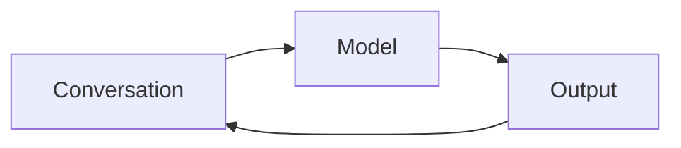
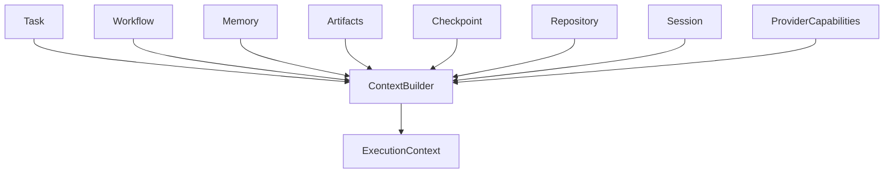
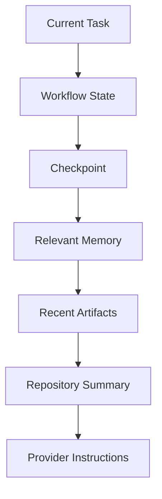
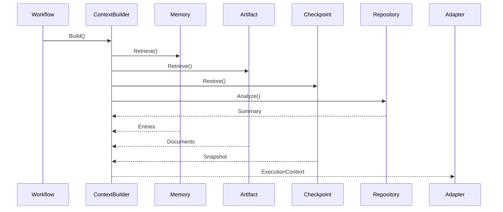

# Chapter 16 — Context Builder Architecture

---

# Chapter 16 — Context Builder Architecture

## 16.1 Overview

If the **Workflow Engine** is the heart of Context OS,

the **Context Builder** is its brain.

Every AI coding assistant today fundamentally works the same way:

```text
Conversation History
        +
Current Prompt
        ↓
LLM
```

This architecture assumes that the conversation itself is the source of truth.

As conversations become longer, they are eventually summarized, compacted, or discarded, causing the model to lose important project information.

Context OS takes a fundamentally different approach.

> **Conversations are ephemeral.**
>
> **Project state is permanent.**

The Context Builder reconstructs the execution context directly from durable project intelligence rather than replaying chat history.

---

# 16.2 The Context Problem

Today's coding assistants tightly couple context to a conversation.



Problems:

* Context window limitations
* Conversation compaction
* Provider switching loses state
* Difficult recovery
* Expensive prompt growth
* Duplicate information

Eventually the conversation becomes the bottleneck.

---

# 16.3 Context OS Philosophy

Context should be **assembled**, not remembered.

Instead of storing everything inside one chat, Context OS stores information according to its lifecycle.

```text
Architecture Decisions

↓

Project Memory

↓

Workflow State

↓

Artifacts

↓

Checkpoints

↓

Repository

↓

Current Task

↓

Execution Context
```

The provider only receives what is needed for the current execution.

---

# 16.4 Responsibilities

The Context Builder owns:

✓ Context assembly

✓ Context prioritization

✓ Token budgeting

✓ Artifact selection

✓ Memory retrieval

✓ Checkpoint integration

✓ Repository summarization

✓ Provider packaging

It explicitly does **not** own:

✗ Workflow execution

✗ Provider invocation

✗ Memory persistence

✗ Artifact creation

---

# 16.5 High-Level Architecture



Everything flows into one deterministic output.

---

# 16.6 Context Layers

Not every piece of information is equally important.

The Context Builder assembles context in layers.



The upper layers always receive higher priority.

---

# 16.7 Context Sources

The builder collects information from multiple runtime services.

| Source           | Purpose               |
| ---------------- | --------------------- |
| Workflow         | Current execution     |
| Session          | Runtime metadata      |
| Memory           | Long-term knowledge   |
| Artifacts        | Previous work         |
| Checkpoint       | Recovery              |
| Repository       | Current codebase      |
| Provider Profile | Execution constraints |

No conversations are required.

---

# 16.8 Context Assembly Pipeline

The Context Builder follows a deterministic pipeline.

```mermaid
flowchart LR

Task

↓

Retrieve Workflow

↓

Retrieve Session

↓

Retrieve Checkpoint

↓

Retrieve Memory

↓

Retrieve Artifacts

↓

Repository Analysis

↓

Prioritize

↓

Compress

↓

Execution Context
```

Every execution follows the same pipeline.

---

# 16.9 Context Budget

One of the most important responsibilities of the Context Builder is **token budgeting**.

Every provider has a different context limit.

Example

| Provider     | Context Window |
| ------------ | -------------- |
| Claude       | Large          |
| GPT          | Medium         |
| Gemini       | Large          |
| Local Models | Small          |

The Context Builder should never assume unlimited context.

Instead, every provider advertises its capabilities.

```go
type ProviderCapabilities struct {
    MaxTokens int
    SupportsStreaming bool
    SupportsTools bool
}
```

---

# 16.10 Context Allocation

Suppose the provider has 200K tokens available.

The Context Builder may reserve the budget as follows.

| Component    | Budget |
| ------------ | ------ |
| Task         | 5%     |
| Workflow     | 10%    |
| Checkpoint   | 10%    |
| Memory       | 25%    |
| Artifacts    | 25%    |
| Repository   | 20%    |
| Instructions | 5%     |

These are policies rather than hard rules.

Different providers may use different allocation strategies.

---

# 16.11 Retrieval Strategy

Not all project knowledge should be loaded.

Instead, retrieval is selective.

Example

```text
Current Task

↓

Authentication

↓

Retrieve

Architecture

OAuth ADR

JWT Review

Security Guidelines

Recent Auth Artifacts
```

Completely unrelated documents remain excluded.

---

# 16.12 Repository Context

The repository itself is also a source of context.

Examples include:

* Current Git branch
* Modified files
* Build status
* Project language
* Framework
* Dependency graph
* File summaries

The builder never dumps the repository into the prompt.

Instead, it constructs a concise repository summary.

---

# 16.13 Artifact Selection

Artifacts are ranked by relevance.

Example

```text
OAuth Task

↓

OAuth Design

★★★★★

JWT Review

★★★★★

Payment Benchmark

★

UI Notes

☆
```

Only highly relevant artifacts are included.

---

# 16.14 Memory Selection

Memory retrieval follows the same strategy.

Example

```text
Authentication Task

↓

Architecture Decisions

Coding Standards

Security Rules

Previous Lessons

Naming Conventions
```

General project knowledge remains available,

but low-priority items may be omitted under token pressure.

---

# 16.15 Checkpoint Integration

When resuming execution,

the latest checkpoint contributes:

* Previous progress
* Current objective
* Pending work
* Outstanding blockers

Instead of replaying conversation history.

---

# 16.16 Context Compression

Even after retrieval,

the assembled context may exceed the available budget.

Compression therefore occurs in stages.

```mermaid
flowchart TD

Retrieve

↓

Rank

↓

Deduplicate

↓

Summarize

↓

Truncate

↓

Execution Context
```

Compression never removes the current task.

---

# 16.17 Execution Context

The final product of the Context Builder is an immutable object.

```go
type ExecutionContext struct {
    Task Task
    Workflow Workflow
    Memory []MemoryEntry
    Artifacts []Artifact
    Repository RepositorySummary
    Checkpoint *Checkpoint
    Instructions []Instruction
}
```

Providers receive only this object.

---

# 16.18 Context Package

The execution context is translated into provider-specific prompts by adapters.

```mermaid
flowchart LR

ExecutionContext

↓

Claude Adapter

↓

Claude Prompt


ExecutionContext

↓

Codex Adapter

↓

Codex Prompt


ExecutionContext

↓

Gemini Adapter

↓

Gemini Prompt
```

The Context Builder never formats prompts.

Adapters do.

---

# 16.19 Prompt Independence

One of the defining principles of Context OS is:

> **Execution Context ≠ Prompt**

The execution context is a structured runtime object.

A prompt is merely one possible serialization.

Future providers may consume:

* JSON
* Protocol Buffers
* MCP
* APIs
* Native SDKs

without changing the Context Builder.

---

# 16.20 Failure Handling

If one source is unavailable:

```text
Artifact Missing

↓

Continue

↓

Memory Available

↓

Checkpoint Available

↓

Build Context
```

Context construction is resilient.

Missing information should degrade gracefully.

---

# 16.21 Context Caching

Some expensive computations can be cached.

Examples

* Repository summaries
* Dependency graphs
* File hashes
* Markdown indexes

Caches are disposable.

The canonical data remains elsewhere.

---

# 16.22 Sequence Diagram



---

# 16.23 Design Decisions

## Decision 1 — Assemble, Don't Replay

The runtime reconstructs context from durable state rather than replaying conversations.

---

## Decision 2 — Structured Execution Context

Providers receive structured runtime objects.

Prompt generation belongs to adapters.

---

## Decision 3 — Token Budget as a First-Class Concern

Every provider invocation is planned around a configurable token budget.

---

## Decision 4 — Relevance Before Completeness

The goal is not to include everything.

The goal is to include **everything necessary**.

---

## Decision 5 — Provider Independence

The Context Builder knows nothing about Claude, Codex, Gemini, OpenCode, or future providers.

Only provider capabilities matter.

---

# 16.24 Future Evolution

Future versions may extend the Context Builder with:

* Semantic retrieval
* Embedding search
* Knowledge graphs
* Long-term agent memory
* Team memory
* Cross-project retrieval
* Incremental context updates
* Streaming context assembly

These enhancements should not alter the core architecture.

---

# 16.25 Architectural Observation

This chapter captures the central architectural insight behind Context OS.

Traditional AI assistants treat the conversation as the source of truth.

Context OS treats the conversation as a temporary transport mechanism.

The source of truth is the project itself:

* Workflows define intent.
* Memory captures knowledge.
* Artifacts preserve outputs.
* Checkpoints preserve progress.
* The repository reflects implementation.

The Context Builder synthesizes these into a minimal execution package for the current task.

This inversion allows providers to remain stateless while the runtime preserves long-lived project intelligence.

---

# 16.26 Chapter Summary

The Context Builder is the intelligence layer of Context OS.

Rather than relying on fragile conversation history, it reconstructs task-specific execution context from durable project state, applies prioritization and token budgeting, and produces a provider-agnostic `ExecutionContext`.

This design enables:

* Provider switching without losing continuity.
* Deterministic context reconstruction.
* Efficient use of limited context windows.
* Resumable workflows independent of conversations.

The next chapter introduces the **Adapter Framework**, showing how different providers—CLI-based today and API-based in the future—translate the common `ExecutionContext` into provider-specific invocations while preserving the runtime's provider-agnostic architecture.
