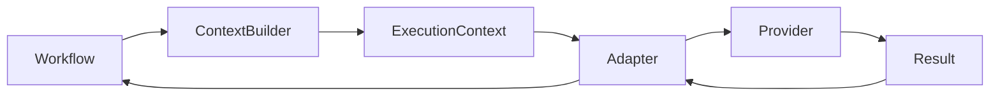
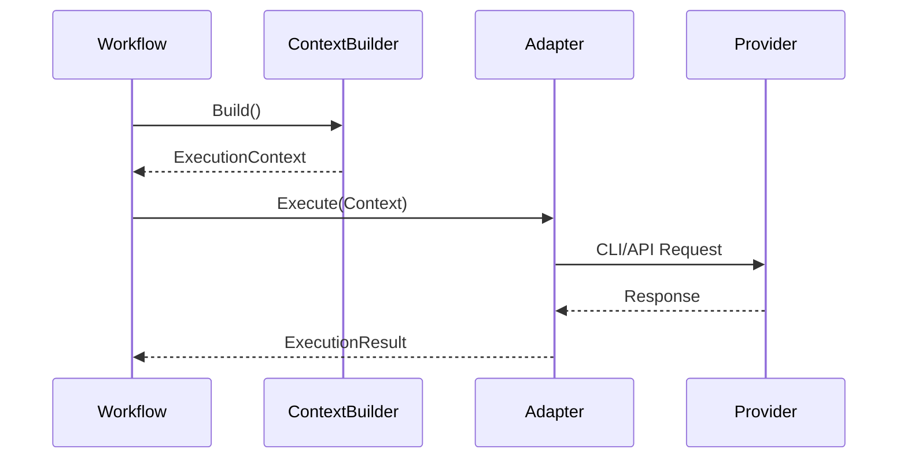
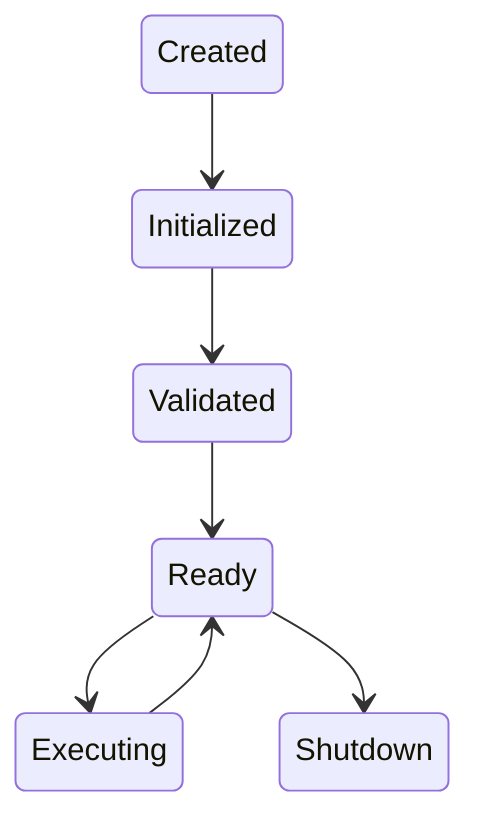
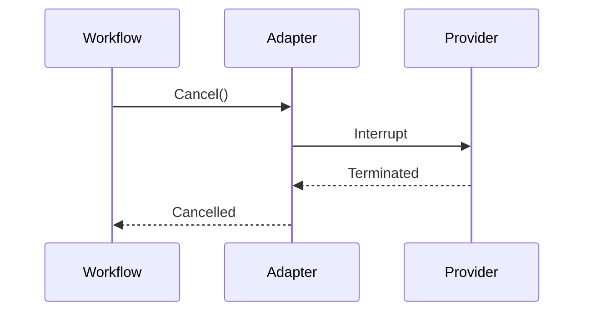

# Chapter 17 — Adapter Framework

---

# Chapter 17 — Adapter Framework

## 17.1 Overview

The Adapter Framework is the boundary between **Context OS** and **AI execution engines**.

One of the fundamental architectural principles established throughout this document is:

> **Context OS must never know how to talk to Claude, Codex, Gemini, OpenCode, Cursor, or any future provider.**

Instead, Context OS produces a **provider-independent ExecutionContext**.

Adapters translate that execution context into provider-specific invocations.

This separation is the key that makes Context OS future-proof.

---

# 17.2 Why Adapters Exist

Every coding assistant has different characteristics.

| Provider      | CLI | API    | Session | Tools | Prompt Format |
| ------------- | --- | ------ | ------- | ----- | ------------- |
| Claude Code   | ✓   | ✓      | Yes     | Yes   | Custom        |
| Codex CLI     | ✓   | API    | Partial | Yes   | Custom        |
| Gemini CLI    | ✓   | API    | Yes     | Yes   | Custom        |
| OpenCode      | ✓   | Future | Yes     | Yes   | Agent Based   |
| Future Models | ?   | ?      | ?       | ?     | Unknown       |

Without adapters,

the Workflow Engine would need to understand every provider.

That would tightly couple the runtime to AI vendors.

---

# 17.3 Architectural Position



Notice

The Workflow Engine never communicates directly with providers.

---

# 17.4 Adapter Responsibilities

Adapters own exactly five responsibilities.

✓ Capability Discovery

✓ Context Translation

✓ Provider Invocation

✓ Output Translation

✓ Error Normalization

Adapters explicitly do **not** own

✗ Workflow execution

✗ Memory

✗ Checkpoints

✗ Artifacts

✗ Context construction

---

# 17.5 Adapter Interface

Every provider implements the same interface.

```go
type Adapter interface {

    ID() string

    Capabilities() Capabilities

    Execute(
        ctx context.Context,
        request ExecutionRequest,
    ) (*ExecutionResult, error)

    Validate() error

    Shutdown() error
}
```

This is the only interface visible to the runtime.

---

# 17.6 Execution Flow



The Workflow Engine remains completely provider agnostic.

---

# 17.7 Adapter Lifecycle

Every adapter follows the same lifecycle.



---

# 17.8 Capability Discovery

Before execution,

the runtime discovers provider capabilities.

Example

```go
type Capabilities struct {

    SupportsCLI bool

    SupportsAPI bool

    SupportsStreaming bool

    SupportsTools bool

    SupportsImages bool

    SupportsInterrupt bool

    MaxContextTokens int

    MaxOutputTokens int

}
```

The Context Builder uses these capabilities when assembling context.

---

# 17.9 CLI Adapters

Version 1 focuses exclusively on CLI providers.

Supported architecture

```mermaid
flowchart TD

Workflow

↓

ExecutionContext

↓

CLI Adapter

↓

Shell Process

↓

stdout

↓

ExecutionResult
```

Examples

* Claude Code
* Codex CLI
* Gemini CLI
* OpenCode

---

# 17.10 API Adapters

API adapters are intentionally deferred.

Future architecture

```mermaid
flowchart TD

Workflow

↓

ExecutionContext

↓

HTTP Adapter

↓

REST API

↓

Response
```

No architectural changes are required.

Only a new adapter implementation.

---

# 17.11 Shell Adapter

Version 1 introduces a generic Shell Adapter.

Instead of implementing provider-specific process execution,

the Shell Adapter owns

* process creation
* stdin
* stdout
* stderr
* exit codes
* cancellation

Provider adapters compose the Shell Adapter.

---

Example

```text
Claude Adapter

↓

Shell Adapter

↓

hrclaudeff
```

---

# 17.12 Claude Adapter

Responsibilities

* Translate ExecutionContext
* Build Claude prompt
* Execute CLI
* Parse output
* Normalize errors

Example

```text
ExecutionContext

↓

Claude Prompt

↓

hrclaudeff

↓

stdout

↓

ExecutionResult
```

---

# 17.13 Codex Adapter

Responsibilities

* Build Codex request
* Execute hrcodex
* Parse structured output
* Normalize diagnostics

---

Execution

```text
ExecutionContext

↓

Codex Prompt

↓

hrcodex

↓

ExecutionResult
```

---

# 17.14 OpenCode Adapter

Unlike other providers,

OpenCode is itself an orchestrator.

Therefore,

the OpenCode Adapter delegates work rather than directly solving it.

Execution

```text
Workflow

↓

ExecutionContext

↓

OpenCode

↓

Internal Agents

↓

ExecutionResult
```

This distinction is important.

OpenCode behaves more like an orchestration runtime than a single model.

---

# 17.15 Future MCP Adapter

Future versions may expose Context OS itself through MCP.

Architecture

```text
ExecutionContext

↓

MCP Adapter

↓

MCP Server

↓

External Agent
```

No runtime changes required.

---

# 17.16 Execution Request

The runtime communicates with adapters using a structured request.

```go
type ExecutionRequest struct {

    Task Task

    Context ExecutionContext

    ProviderRole string

    Timeout time.Duration

    WorkingDirectory string

}
```

Notice

No prompts.

Only structured runtime objects.

---

# 17.17 Execution Result

Adapters normalize provider responses.

```go
type ExecutionResult struct {

    Status ExecutionStatus

    Output string

    Artifacts []ArtifactRef

    Events []RuntimeEvent

    Usage TokenUsage

    Diagnostics []Diagnostic

}
```

Regardless of provider,

the runtime receives the same object.

---

# 17.18 Error Normalization

Providers return different errors.

Examples

Claude

```text
Context Window Exceeded
```

Codex

```text
Maximum Tokens Reached
```

Gemini

```text
Request Too Large
```

The adapter translates all of these into

```go
ErrContextLimitExceeded
```

This prevents provider-specific logic from leaking into the runtime.

---

# 17.19 Streaming

Some providers stream responses.

Others do not.

The adapter hides this difference.

```mermaid
flowchart LR

Streaming

↓

Adapter

↓

ExecutionResult
```

The Workflow Engine always receives a unified abstraction.

---

# 17.20 Cancellation

Long-running providers must support cancellation.



---

# 17.21 Retry Policy

Adapters classify failures.

| Error          | Retry       |
| -------------- | ----------- |
| Timeout        | ✓           |
| Provider Crash | ✓           |
| Invalid Prompt | ✗           |
| Authentication | ✗           |
| Context Limit  | Conditional |

Retry strategy belongs to the Workflow Engine.

The adapter only classifies.

---

# 17.22 Adapter Registry

The runtime discovers adapters dynamically.

```go
type Registry interface {

    Register(Adapter)

    Resolve(Role) Adapter

    List() []Adapter

}
```

The registry owns

* discovery
* lookup
* validation

---

# 17.23 Plugin Adapters

Future plugins may contribute adapters.

Example

```text
plugins/

ollama/

anthropic/

deepseek/

custom-company/
```

No runtime modifications required.

---

# 17.24 Design Decisions

## Decision 1 — Provider Independence

The runtime knows adapters,

never providers.

---

## Decision 2 — Structured Requests

Adapters receive structured execution requests,

not formatted prompts.

---

## Decision 3 — Generic Shell Execution

CLI process management is centralized in the Shell Adapter.

Provider adapters focus only on translation.

---

## Decision 4 — Capability-Driven Context

The Context Builder adapts context based on provider capabilities rather than provider names.

---

## Decision 5 — Uniform Results

Every provider returns the same `ExecutionResult`.

The runtime never parses provider-specific output.

---

# 17.25 Future Evolution

The adapter framework has been designed to support future execution mechanisms without architectural changes.

Potential additions include:

* REST adapters
* gRPC adapters
* MCP adapters
* WebSocket adapters
* Local inference engines
* Distributed execution backends
* Cloud-hosted agents

Each would implement the same `Adapter` interface.

---

# 17.26 Architectural Observation

One subtle but important distinction emerges here:

> **Adapters are translators, not orchestrators.**

They do not decide:

* what to execute
* when to execute
* which workflow step comes next

Those decisions belong to the Workflow Engine.

Adapters simply translate between the provider-independent runtime and provider-specific execution mechanisms.

This separation is essential for maintaining provider independence.

---

# 17.27 Chapter Summary

The Adapter Framework isolates Context OS from the rapidly evolving ecosystem of AI coding assistants.

By translating a common `ExecutionContext` into provider-specific invocations and normalizing results back into a common `ExecutionResult`, adapters allow the runtime to remain stable while providers change over time.

Version 1 intentionally targets **CLI-based providers**, making it immediately useful for tools such as OpenCode, Claude Code, Codex CLI, and Gemini CLI. Future API- and MCP-based integrations can be introduced by implementing additional adapters without modifying the core runtime.

The next chapter introduces the **Workflow Engine**, defining how engineering work is modeled as resumable state machines, how tasks transition between states, and how Context OS coordinates multi-step execution independently of any individual AI provider.
