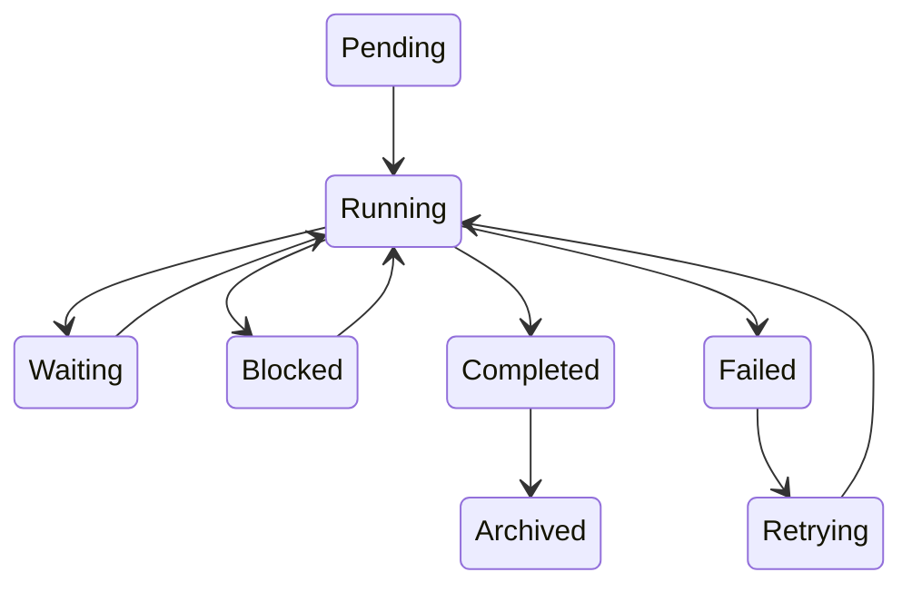
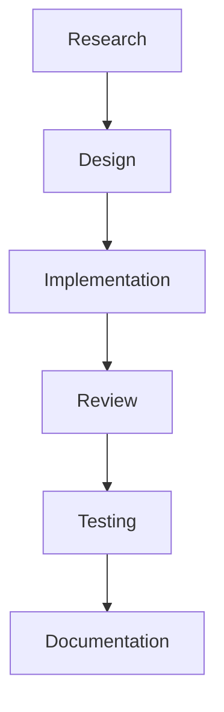
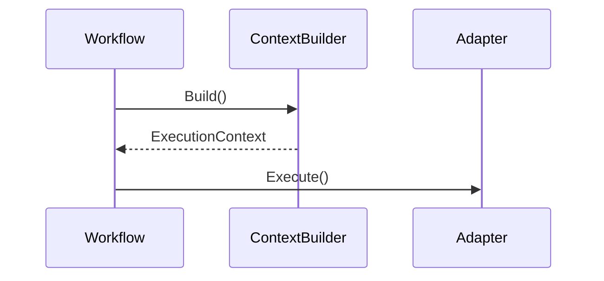
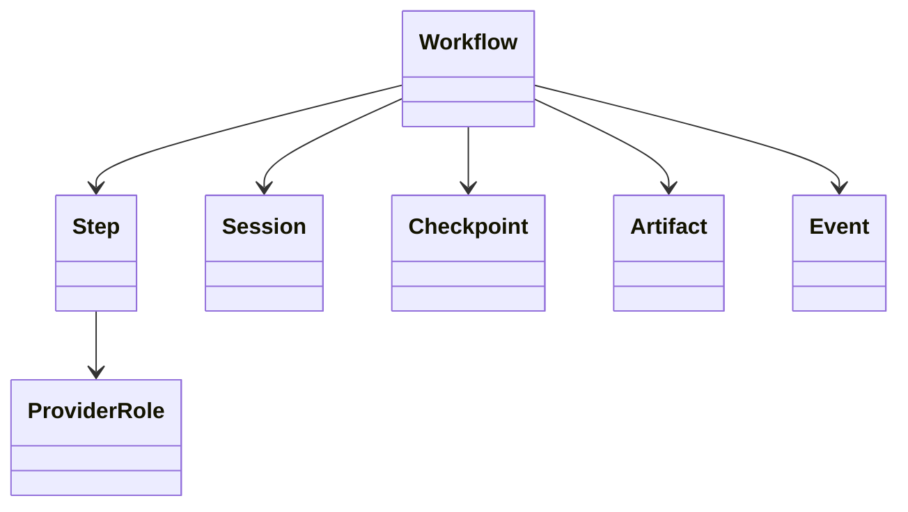

# Chapter 18 — Workflow Engine

---

# Chapter 18 — Workflow Engine

## 18.1 Overview

The Workflow Engine is the **core execution engine** of Context OS.

If the **Context Builder** is responsible for assembling project intelligence,

and the **Adapter Framework** is responsible for interacting with AI providers,

then the Workflow Engine is responsible for **moving engineering work from idea to completion**.

Every task executed by Context OS exists inside a workflow.

Examples include:

* Designing an authentication system
* Refactoring a payment service
* Reviewing a pull request
* Fixing production bugs
* Migrating a database
* Building a feature

Unlike today's AI coding assistants that primarily think in terms of conversations, Context OS thinks in terms of **workflows**.

---

# 18.2 Motivation

Current AI coding assistants are conversation-driven.

```
Conversation

↓

Prompt

↓

Response

↓

Conversation
```

This approach has several limitations.

* No durable execution state
* Difficult to resume interrupted work
* No understanding of progress
* No structured checkpoints
* Provider switching loses continuity

Context OS replaces conversations with workflows.

---

# 18.3 Workflow Philosophy

A workflow represents a **goal**, not a conversation.

Example

```
Implement OAuth Login
```

Regardless of:

* how many sessions occur
* which provider is used
* how many interruptions happen

the workflow remains the same.

The workflow becomes the permanent representation of engineering intent.

---

# 18.4 Workflow Lifecycle

Every workflow progresses through a deterministic lifecycle.



---

## State Definitions

| State     | Meaning                         |
| --------- | ------------------------------- |
| Pending   | Created but not started         |
| Running   | Currently executing             |
| Waiting   | Waiting for external dependency |
| Blocked   | Cannot continue                 |
| Failed    | Execution failed                |
| Retrying  | Automatic retry                 |
| Completed | Finished successfully           |
| Archived  | Historical workflow             |

---

# 18.5 Workflow Structure

A workflow consists of multiple ordered steps.

```text
Workflow

├── Step 1

├── Step 2

├── Step 3

├── Step 4

└── Step N
```

Each step represents one engineering activity.

---

# Example

OAuth Login

```
Research

↓

Design

↓

Implementation

↓

Review

↓

Testing

↓

Documentation
```

---

# 18.6 Workflow Object

```go
type Workflow struct {

    ID WorkflowID

    Name string

    Description string

    State WorkflowState

    Steps []Step

    Metadata WorkflowMetadata

}
```

The Workflow object is immutable except for its execution state.

---

# 18.7 Step Object

Each workflow contains multiple execution steps.

```go
type Step struct {

    ID StepID

    Name string

    Description string

    State StepState

    ProviderRole string

    Dependencies []StepID

}
```

---

# Example

```
Research

↓

Provider

hrclaudeff
```

Implementation

↓

Provider

```
hrcodex
```

---

# 18.8 Directed Workflow Graph

Although Version 1 primarily executes workflows sequentially,

internally they are represented as Directed Acyclic Graphs (DAGs).



Representing workflows as DAGs enables future parallel execution.

---

# 18.9 Parallel Execution

Suppose

Implementation

and

Documentation

do not depend on one another.

Future versions can execute them simultaneously.

```mermaid
flowchart TD

Design

↓

Implementation

↓

Review

Design

↓

Documentation
```

The DAG representation supports this naturally.

---

# 18.10 Workflow Manager

The Workflow Engine exposes a simple interface.

```go
type WorkflowEngine interface {

    Start(...)

    Pause(...)

    Resume(...)

    Retry(...)

    Complete(...)

}
```

The engine owns execution.

It never owns provider implementation.

---

# 18.11 Execution Pipeline

```mermaid
flowchart LR

Workflow

↓

Current Step

↓

Context Builder

↓

Adapter

↓

Provider

↓

Execution Result

↓

Checkpoint

↓

Next Step
```

The workflow advances only after successful completion.

---

# 18.12 Step Dependencies

Each step may depend on previous work.

Example

```text
Implementation

depends on

Design
```

The engine refuses to execute invalid transitions.

---

# Example

❌

```
Testing

↓

Implementation
```

Invalid.

---

# 18.13 Retry Policy

The Workflow Engine owns retries.

Example

| Failure           | Retry |
| ----------------- | ----- |
| Provider Crash    | ✓     |
| Timeout           | ✓     |
| Context Limit     | ✓     |
| Syntax Error      | ✗     |
| User Cancellation | ✗     |

Adapters classify failures.

The Workflow Engine decides whether to retry.

---

# 18.14 Human Approval

Some transitions require human approval.

Example

```
Implementation

↓

Review

↓

Human Approval

↓

Merge
```

Future versions may support configurable approval gates.

---

# 18.15 Workflow Events

Every state transition produces an event.

Examples

```
WorkflowStarted

StepStarted

ProviderInvoked

StepCompleted

CheckpointCreated

WorkflowCompleted
```

Events become part of the permanent runtime history.

---

# 18.16 Checkpoint Integration

Every completed step creates a checkpoint.

```mermaid
flowchart TD

Step Completed

↓

Create Checkpoint

↓

Persist Runtime

↓

Execute Next Step
```

If interruption occurs,

execution resumes from the latest checkpoint.

---

# 18.17 Provider Selection

Workflows never choose providers directly.

Instead,

each step references a **role**.

Example

```yaml
planning:

providerRole: planning

implementation:

providerRole: implementation

review:

providerRole: review
```

The Provider Registry resolves these roles at runtime.

---

# 18.18 Context Integration

Before every step,

the Workflow Engine requests a fresh execution context.



No previous prompt history is reused.

---

# 18.19 Failure Recovery

Suppose execution stops halfway.

Recovery sequence

```
Load Workflow

↓

Load Session

↓

Restore Checkpoint

↓

Determine Current Step

↓

Rebuild Context

↓

Resume
```

The provider does not need to remember anything.

---

# 18.20 Nested Workflows

Future versions may support sub-workflows.

Example

```
Authentication

├── OAuth

├── JWT

└── Session Management
```

Each child workflow behaves independently.

---

# 18.21 Workflow Templates

Common workflows can be predefined.

Examples

```
Bug Fix

Feature Development

Code Review

Architecture Review

Performance Optimization

Release Preparation
```

Templates reduce setup time.

---

# 18.22 Long-Running Workflows

Some workflows may span weeks.

Example

```
Database Migration

↓

Planning

↓

Implementation

↓

Testing

↓

Canary Deployment

↓

Monitoring

↓

Completion
```

Context OS treats these exactly like short workflows.

---

# 18.23 Workflow Metrics

The engine records operational metrics.

Examples

* Duration
* Provider usage
* Retry count
* Context size
* Token consumption
* Artifacts generated
* Checkpoints created

These metrics support future analytics.

---

# 18.24 Workflow Diagram



---

# 18.25 Design Decisions

## Decision 1 — Workflow-Centric Runtime

Engineering work is modeled as workflows rather than conversations.

---

## Decision 2 — DAG Representation

Even though Version 1 executes sequentially,

internal DAG representation enables future parallelism.

---

## Decision 3 — Role-Based Provider Selection

Steps reference provider roles rather than provider names.

This allows providers to be swapped without modifying workflows.

---

## Decision 4 — Checkpoint After Every Step

Every successful step creates a recovery point.

This minimizes lost work.

---

## Decision 5 — Context Is Rebuilt Every Step

Each execution begins with a fresh context assembled from durable project state.

This avoids stale prompts and conversation drift.

---

# 18.26 Future Evolution

Future versions may extend the Workflow Engine with:

* Parallel DAG execution
* Conditional branches
* Loops
* Scheduled workflows
* Multi-agent collaboration
* Distributed execution
* Human approval policies
* Team workflows
* Workflow marketplace

The underlying state machine remains unchanged.

---

# 18.27 Architectural Observation

The Workflow Engine is the **execution orchestrator** of Context OS.

It does not know:

* how prompts are built
* how providers execute tasks
* how memory is stored

Instead, it coordinates specialized services.

This strict separation makes the runtime resilient to changes in AI providers while preserving deterministic execution.

---

# 18.28 Chapter Summary

The Workflow Engine transforms Context OS from a simple persistence layer into a true engineering runtime.

By representing software development as resumable workflows composed of explicit steps, the engine enables:

* Durable execution
* Provider independence
* Deterministic recovery
* Checkpoint-based continuation
* Future parallel execution
* Long-running engineering tasks

The next chapter introduces the **Memory Architecture**, defining how Context OS captures, organizes, retrieves, and evolves long-term project knowledge independently of any conversation or provider session.
