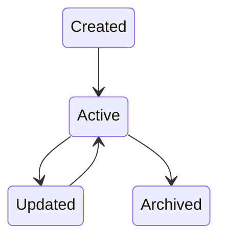
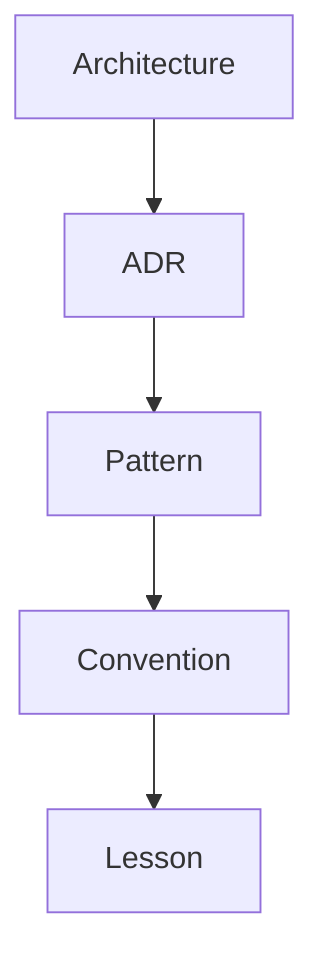

# Chapter 19 — Memory Architecture

---

# Chapter 19 — Memory Architecture

## 19.1 Overview

If the **Workflow Engine** represents *what the project is doing*,

then the **Memory System** represents *what the project knows*.

This distinction is one of the most important architectural decisions in Context OS.

Today's coding assistants treat memory as an extension of conversation history.

Context OS rejects this approach.

Instead, memory is modeled as a first-class runtime subsystem with its own lifecycle, storage model, retrieval policies, and ownership.

Memory survives:

* Sessions
* Provider switches
* Context compaction
* Workflow completion
* Runtime restarts

Memory is **project intelligence**, not conversation history.

---

# 19.2 Philosophy

Traditional assistants

```text
Conversation

↓

Summary

↓

Conversation

↓

Summary
```

Eventually,

knowledge degrades.

Context OS

```text
Project

↓

Memory

↓

Workflow

↓

Context Builder

↓

Provider
```

Knowledge is durable.

Conversation is disposable.

---

# 19.3 Design Goals

The Memory System must satisfy the following goals.

✓ Durable

✓ Searchable

✓ Provider Independent

✓ Human Readable

✓ Incrementally Updated

✓ Selectively Retrieved

✓ Versioned

✓ Explainable

---

# 19.4 Memory Hierarchy

Memory exists at multiple scopes.

```mermaid
flowchart TD

SessionMemory

↓

WorkflowMemory

↓

ProjectMemory

↓

KnowledgeMemory

↓

ArchiveMemory
```

Each scope has different ownership and retention policies.

---

# 19.5 Memory Types

Context OS distinguishes between different categories of memory.

| Memory Type | Purpose                      |
| ----------- | ---------------------------- |
| Session     | Temporary execution state    |
| Workflow    | Task-specific knowledge      |
| Project     | Long-lived project facts     |
| Knowledge   | Architecture and conventions |
| Historical  | Archived knowledge           |

Each type has independent lifecycle rules.

---

# 19.6 Session Memory

Scope

One execution session.

Examples

* Current objective
* Active files
* Temporary notes
* Intermediate reasoning
* Running commands

Lifecycle

```text
Session Start

↓

Active

↓

Session Ends

↓

Discard
```

Session Memory is intentionally temporary.

---

# 19.7 Workflow Memory

Workflow Memory survives multiple sessions.

Examples

```text
OAuth Design

Pending Review

Outstanding TODOs

Known Issues
```

Lifecycle

```text
Workflow Created

↓

Updated

↓

Completed

↓

Archived
```

---

# 19.8 Project Memory

Project Memory is the most important category.

Examples

* Architecture
* Coding Standards
* Naming Conventions
* Build Commands
* Project Structure
* ADRs
* Domain Concepts

Project Memory changes slowly.

It survives indefinitely.

---

# Example

```text
Authentication uses JWT.

↓

Always valid.
```

Not

```text
Currently editing JwtService.java.
```

That belongs to Session Memory.

---

# 19.9 Knowledge Memory

Knowledge Memory stores reusable engineering knowledge.

Examples

* Design patterns
* Lessons learned
* Reusable prompts
* Engineering playbooks
* Organization conventions

Unlike Project Memory,

Knowledge Memory may eventually be shared across projects.

---

# 19.10 Archived Memory

Some knowledge eventually becomes historical.

Examples

```text
Legacy Architecture

Deprecated APIs

Removed Services

Old Benchmarks
```

Archived Memory remains searchable,

but is excluded from default retrieval.

---

# 19.11 Memory Directory

```text
.context/

memory/

architecture.md

coding-standards.md

conventions.md

lessons.md

patterns.md

knowledge/

adr/

archive/
```

Everything is Markdown.

SQLite indexes metadata only.

---

# 19.12 Memory Entry

Every memory entry follows a common structure.

```yaml
id: ADR-004

title: Authentication Architecture

category: architecture

tags:

- auth

- jwt

- security

created: 2026-07-01

updated: 2026-07-03
```

Content follows below.

---

# 19.13 Metadata

Every memory entry contains metadata.

| Field    | Purpose             |
| -------- | ------------------- |
| ID       | Stable identifier   |
| Title    | Human-readable name |
| Category | Classification      |
| Tags     | Retrieval           |
| Created  | History             |
| Updated  | Freshness           |
| Owner    | Optional ownership  |

Metadata remains small.

The body remains Markdown.

---

# 19.14 Memory Lifecycle



Memory is append-oriented.

Deletion is discouraged.

---

# 19.15 Memory Retrieval

The Context Builder never loads all memory.

Instead,

retrieval is task-driven.

Example

Current Task

```text
OAuth Login
```

Retrieve

```text
Architecture

Security Guidelines

OAuth ADR

JWT Review

Naming Conventions
```

Do not retrieve

```text
Payment Service

Analytics

Deployment Notes
```

---

# 19.16 Retrieval Pipeline

```mermaid
flowchart TD

Task

↓

Identify Domain

↓

Find Tags

↓

Rank

↓

Filter

↓

Load Markdown

↓

Execution Context
```

Retrieval should remain deterministic.

---

# 19.17 Ranking

Each memory entry receives a relevance score.

Factors include

* Tag match
* Workflow match
* File overlap
* Recency
* Importance
* Explicit references

Example

| Memory           | Score |
| ---------------- | ----- |
| OAuth ADR        | 0.98  |
| JWT Guide        | 0.95  |
| Coding Standards | 0.91  |
| Payment Design   | 0.08  |

---

# 19.18 Memory Relationships

Future versions may establish relationships.



Version 1 stores references only.

Knowledge Graphs are deferred.

---

# 19.19 Memory Updates

Memory is intentionally difficult to modify.

Examples

Good candidates

✓ Architecture decisions

✓ New conventions

✓ Important lessons

Poor candidates

✗ Temporary TODOs

✗ Current implementation details

✗ Debug output

---

# 19.20 Automatic Memory

Version 1 introduces optional automatic memory generation.

Examples

After completing a workflow,

the runtime may suggest

```text
"This workflow introduced a new coding convention.

Would you like to save it?"
```

Human approval remains required.

---

# 19.21 Memory Ownership

| Memory    | Owner           |
| --------- | --------------- |
| Session   | Session Manager |
| Workflow  | Workflow Engine |
| Project   | Memory Manager  |
| Knowledge | Memory Manager  |
| Archive   | Memory Manager  |

Ownership remains explicit.

---

# 19.22 Context Integration

Memory contributes directly to context construction.

```mermaid
flowchart LR

Memory

↓

Context Builder

↓

Execution Context

↓

Provider
```

Notice

Memory never communicates directly with providers.

---

# 19.23 Memory Search

Version 1 supports structured search.

Examples

```bash
context memory list

context memory search auth

context memory show ADR-004
```

Future versions may support semantic search.

---

# 19.24 Memory Compression

Large memory collections require prioritization.

Pipeline

```text
Retrieve

↓

Rank

↓

Deduplicate

↓

Summarize

↓

Include
```

Compression occurs before prompt generation.

---

# 19.25 Future Semantic Memory

Future versions may introduce embeddings.

Architecture

```mermaid
flowchart TD

Markdown

↓

Embedding

↓

Vector Index

↓

Retriever

↓

Context Builder
```

Importantly,

the embedding index augments—not replaces—the canonical Markdown memory.

---

# 19.26 Design Decisions

## Decision 1 — Memory Is Not Conversation

Conversations are transient.

Memory is durable.

---

## Decision 2 — Markdown Is Canonical

Developers should own their knowledge.

The runtime indexes Markdown rather than hiding it in proprietary formats.

---

## Decision 3 — Retrieval Is Explicit

Memory is selected deliberately.

Not every memory entry belongs in every execution.

---

## Decision 4 — Human Approval

Important project knowledge should not be created automatically without review.

---

## Decision 5 — Future-Proof

The memory architecture supports semantic retrieval and knowledge graphs without changing the canonical storage model.

---

# 19.27 Risks

Potential risks include:

* Memory bloat
* Duplicate knowledge
* Stale documentation
* Retrieval bias
* Overloaded context

Mitigations include:

* Metadata
* Ranking
* Archiving
* Summarization
* Human review

---

# 19.28 Architectural Observation

The Memory System fundamentally changes how AI-assisted software development operates.

Instead of asking the model to remember,

Context OS asks the runtime to remember.

This shift transforms memory from an emergent property of conversations into an explicit engineering artifact that can be versioned, searched, reviewed, and evolved over time.

As a result, the Context Builder retrieves durable knowledge rather than reconstructed summaries, enabling consistent behavior across sessions, providers, and workflows.

---

# 19.29 Chapter Summary

The Memory Architecture establishes long-term project intelligence as a first-class subsystem of Context OS.

By separating Session, Workflow, Project, Knowledge, and Archived Memory—and storing canonical knowledge in Markdown while indexing metadata in SQLite—the runtime achieves durable, explainable, and provider-independent memory.

This design ensures that future capabilities such as semantic search, embeddings, and knowledge graphs can be added incrementally without changing the fundamental contract: **the project remembers, not the conversation.**

The next chapter examines the **Security Architecture**, defining how Context OS protects project data, isolates plugins, manages permissions, handles secrets, and maintains trust boundaries between the runtime and external AI providers.
