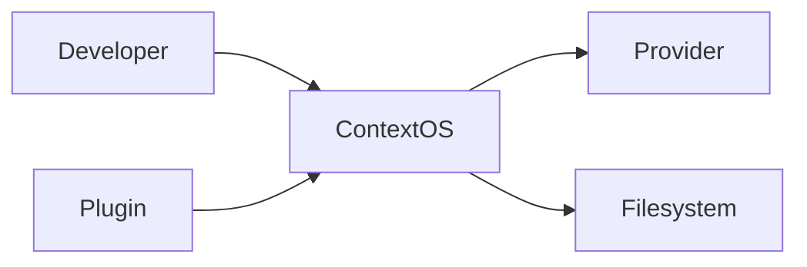
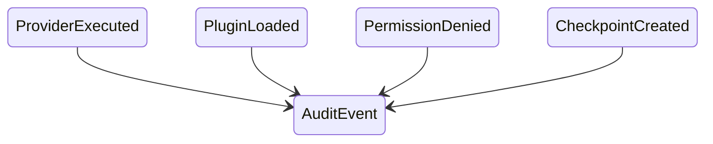

# Chapter 20 — Security Architecture

---

# Chapter 20 — Security Architecture

## 20.1 Overview

Context OS operates at the center of a software project.

It has visibility into:

* Source code
* Build systems
* Repository structure
* Secrets (potentially)
* AI providers
* Shell execution
* Plugins
* Local storage

Because of this privileged position, **security cannot be treated as an afterthought**.

Unlike web applications, Context OS is a **local runtime**.

Its primary threat model is therefore different.

Instead of defending against internet attackers, Context OS primarily defends against:

* Accidental data exposure
* Malicious plugins
* Provider overreach
* Unsafe shell execution
* Data corruption
* Unauthorized file access

This chapter defines the trust model and security architecture of Context OS.

---

# 20.2 Security Goals

The runtime is designed around the following security principles.

✓ Local First

✓ Explicit Permissions

✓ Least Privilege

✓ Transparent Execution

✓ Provider Isolation

✓ Secure Defaults

✓ Human Control

✓ Auditability

---

# 20.3 Trust Boundary

The first architectural decision is identifying trust boundaries.



Notice

The developer trusts Context OS.

Context OS does **not** automatically trust providers or plugins.

---

# 20.4 Threat Model

Version 1 considers the following threats.

| Threat                           | Included |
| -------------------------------- | -------- |
| Malicious Plugin                 | ✓        |
| Accidental File Modification     | ✓        |
| Secret Leakage                   | ✓        |
| Provider Misconfiguration        | ✓        |
| Runtime Corruption               | ✓        |
| Data Loss                        | ✓        |
| Remote Code Execution via Plugin | ✓        |

Out of scope

* Operating system compromise
* Physical access attacks
* Kernel exploits
* Supply chain attacks

---

# 20.5 Security Layers

```mermaid
flowchart TD

Developer

↓

CLI

↓

Runtime

↓

Permission Layer

↓

Provider Adapter

↓

Shell/API

↓

Filesystem
```

Every request passes through permission validation.

---

# 20.6 Permission Model

Every operation belongs to one capability.

Examples

```text
Read Files

Write Files

Execute Shell

Create Workflow

Modify Memory

Generate Artifact

Create Checkpoint

Load Plugin
```

Capabilities can later be granted independently.

---

# 20.7 Principle of Least Privilege

Every runtime component receives only the permissions it requires.

Example

Workflow Engine

Needs

✓ Workflow

✓ Checkpoints

Does not need

✗ Direct filesystem writes

---

Provider Adapter

Needs

✓ Execute CLI

Does not need

✗ Runtime database access

---

Plugin

Needs

✓ Registered hooks

Does not need

✗ Full runtime control

---

# 20.8 Filesystem Isolation

Context OS distinguishes between

Runtime Files

and

Project Files.

```text
Project

src/

README.md

.context/
```

Only the runtime owns `.context/`.

Providers operate on the project through controlled interfaces.

---

# 20.9 Runtime Ownership

The runtime owns

```text
.context/

runtime.db

memory/

workflow/

sessions/

artifacts/

checkpoints/
```

External providers should never modify these files directly.

Instead,

changes are mediated through runtime services.

---

# 20.10 Secret Handling

Secrets are intentionally excluded from runtime state.

Examples

```text
API Keys

SSH Keys

Access Tokens

Credentials

Certificates
```

Version 1 policy

> Never copy secrets into Memory or Artifacts.

---

Future versions may integrate

* macOS Keychain
* Windows Credential Manager
* Linux Secret Service

---

# 20.11 Provider Isolation

Providers execute outside the runtime.

```mermaid
flowchart LR

Runtime

↓

Adapter

↓

CLI Process

↓

Provider
```

The runtime communicates only through adapters.

Provider failures cannot corrupt runtime state.

---

# 20.12 Shell Execution

Version 1 primarily targets CLI providers.

Shell execution therefore becomes a security boundary.

Execution follows

```text
Workflow

↓

Adapter

↓

Shell Adapter

↓

CLI
```

The Shell Adapter validates

* executable
* arguments
* working directory
* timeout

before launching any process.

---

# 20.13 Command Validation

Commands are resolved from Provider Profiles.

Example

```yaml
implementation:

command: hrcodex

review:

command: hrclaudeff
```

Arbitrary shell strings are discouraged.

Future versions may support signed provider definitions.

---

# 20.14 Plugin Isolation

Plugins are isolated through interfaces.

```mermaid
flowchart LR

Plugin

↓

Plugin API

↓

Runtime
```

Plugins never access internal runtime objects directly.

They communicate only through exported interfaces.

---

# 20.15 Plugin Permissions

Future plugin manifests

```yaml
name: jira

permissions:

- workflows.read

- artifacts.read

- events.subscribe
```

The runtime validates permissions during plugin loading.

---

# 20.16 Audit Trail

Every privileged operation becomes an event.

Examples

```text
PluginLoaded

ProviderExecuted

CheckpointCreated

WorkflowDeleted

MemoryUpdated
```

Events support forensic analysis.

---

# 20.17 Runtime Integrity

Critical runtime files include

```text
project.yaml

runtime.db

provider profiles

workflow metadata
```

Future versions may protect these using

* checksums
* signatures
* integrity verification

---

# 20.18 Recovery

If corruption is detected

```text
Detect

↓

Validate

↓

Restore Checkpoint

↓

Recover Runtime
```

No recovery should require replaying provider conversations.

---

# 20.19 Logging

Logs should never contain

* secrets
* access tokens
* private keys
* passwords

Logs should contain

* timestamps
* workflow IDs
* provider IDs
* execution status

Sensitive values must be redacted.

---

# 20.20 Data Privacy

Version 1 is Local First.

Project intelligence remains on the developer's machine.

Only the execution request sent through an adapter reaches an external provider.

This minimizes unnecessary data exposure.

---

# 20.21 Future Sandboxing

Future releases may support

* Process sandboxing
* Container execution
* Provider isolation
* Filesystem virtualization
* Read-only execution

These are intentionally deferred.

---

# 20.22 Security Events



Security-relevant events become part of the permanent audit history.

---

# 20.23 Design Decisions

## Decision 1 — Local First

Project intelligence never requires cloud storage.

---

## Decision 2 — Explicit Permissions

Capabilities are explicit rather than implicit.

---

## Decision 3 — Runtime Owns `.context/`

Providers should not directly modify runtime state.

---

## Decision 4 — Secrets Stay Outside Context

Secrets are never intentionally persisted in Memory or Artifacts.

---

## Decision 5 — Provider Isolation

Adapters isolate runtime services from external execution engines.

---

# 20.24 Risks

Potential risks include

* Plugin privilege escalation
* Provider output injection
* Secret leakage through prompts
* Corrupted runtime metadata
* Misconfigured provider commands

Mitigation strategies include

* Permission validation
* Audit logs
* Runtime ownership
* Checkpoint recovery
* Explicit trust boundaries

---

# 20.25 Future Security Enhancements

Potential Version 2 additions include

* Signed plugins
* Runtime encryption
* Hardware-backed secret storage
* Remote attestation
* Fine-grained RBAC
* Multi-user workspaces
* Enterprise policy enforcement

The Version 1 architecture is intentionally designed to accommodate these features without major restructuring.

---

# 20.26 Architectural Observation

Unlike many AI developer tools that embed security within provider integrations, Context OS treats security as a **runtime responsibility**.

The runtime governs:

* who may execute,
* what may be executed,
* what data may be persisted,
* what information may leave the machine,
* and how privileged operations are audited.

Providers remain execution engines operating within clearly defined trust boundaries.

---

# 20.27 Chapter Summary

The Security Architecture establishes Context OS as a secure, local-first runtime that prioritizes explicit permissions, provider isolation, runtime integrity, and human oversight.

By clearly separating trust boundaries between the runtime, providers, plugins, and the filesystem, Context OS minimizes accidental data exposure while remaining extensible for future enterprise security features.

The next chapter introduces the **Plugin Architecture**, describing how third-party extensions can safely add new providers, commands, workflows, storage backends, and user interfaces without compromising the integrity of the core runtime.
