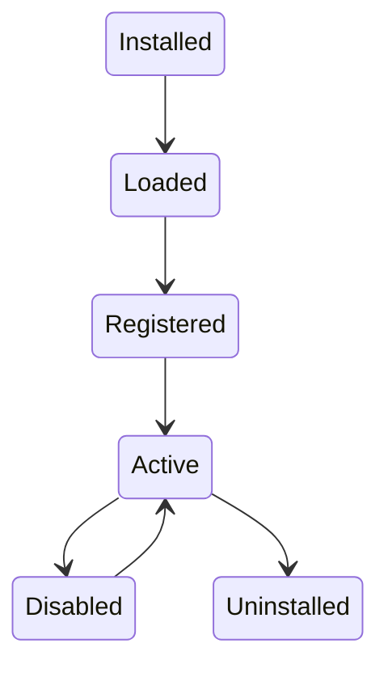
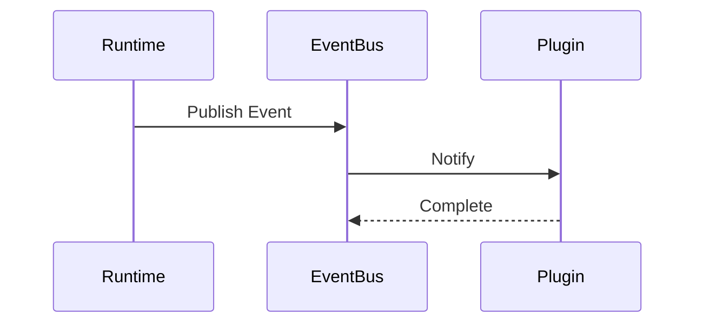

# Chapter 21 — Plugin Architecture

---

# Chapter 21 — Plugin Architecture

## 21.1 Overview

Context OS is designed to become a long-lived engineering platform rather than a single-purpose CLI.

While the core runtime intentionally remains small, many capabilities should be implemented as **plugins**.

Examples include:

* New AI providers
* Jira integration
* GitHub integration
* Slack integration
* Deployment pipelines
* Custom workflows
* Organization-specific tooling

Instead of continuously expanding the core runtime, Context OS provides a **Plugin Framework** that allows external developers to extend functionality while preserving the integrity of the core architecture.

The guiding philosophy is:

> **The runtime should remain stable. Innovation should happen through plugins.**

---

# 21.2 Design Goals

The Plugin Framework is designed around the following principles.

✓ Extensible

✓ Safe

✓ Versioned

✓ Isolated

✓ Discoverable

✓ Capability Based

✓ Hot Loadable (Future)

✓ Backward Compatible

---

# 21.3 Why Plugins?

Without plugins, every new feature requires changes to the runtime.

```text
Feature Request

↓

Modify Runtime

↓

Release New Version

↓

Upgrade Runtime
```

This creates:

* Tight coupling
* Large codebase
* Slower releases
* Difficult maintenance

Instead:

```text
Feature Request

↓

Install Plugin

↓

Register Capability

↓

Runtime Discovers Plugin
```

---

# 21.4 Plugin Architecture

```mermaid
flowchart TD

Runtime

↓

Plugin Manager

↓

Plugin Registry

↓

Plugin

↓

Capabilities
```

The runtime owns plugin lifecycle.

Plugins own functionality.

---

# 21.5 Plugin Lifecycle

Every plugin follows the same lifecycle.



---

# 21.6 Plugin Types

Context OS supports multiple plugin categories.

| Plugin Type | Responsibility         |
| ----------- | ---------------------- |
| Provider    | AI providers           |
| Workflow    | New workflow templates |
| Command     | CLI commands           |
| Storage     | Storage backends       |
| UI          | TUI panels             |
| Integration | External services      |
| Automation  | Background jobs        |
| Analytics   | Metrics                |

Plugins may implement one or more categories.

---

# 21.7 Plugin Directory

Version 1

```text
.context/

plugins/

github/

jira/

slack/

ollama/

company-plugin/
```

The runtime discovers plugins automatically.

---

# 21.8 Plugin Manifest

Every plugin contains a manifest.

Example

```yaml
name: github

version: 1.0.0

author: Context OS

apiVersion: v1

description: GitHub integration

permissions:

- workflows.read

- artifacts.read

- events.subscribe

capabilities:

- github

- pull-request

- issues
```

The manifest is the plugin contract.

---

# 21.9 Plugin Interface

Every plugin implements a common interface.

```go
type Plugin interface {

    ID() string

    Manifest() Manifest

    Register(ctx Context) error

    Shutdown() error

}
```

The runtime communicates only through this interface.

---

# 21.10 Plugin Manager

The Plugin Manager owns:

* Discovery
* Validation
* Loading
* Registration
* Shutdown
* Upgrade
* Removal

The manager is the only component allowed to manipulate plugins.

---

# 21.11 Plugin Registry

After loading,

plugins register capabilities.

```mermaid
flowchart LR

Plugin

↓

Registry

↓

Capabilities
```

Runtime services query capabilities through the registry.

They never communicate directly with plugins.

---

# 21.12 Capability Model

Capabilities define what a plugin contributes.

Examples

```text
Provider

Workflow

Command

View

Storage

Event Handler

Scheduler
```

Capabilities are additive.

---

# 21.13 Provider Plugin

Example

```text
Claude Plugin

↓

Registers

↓

Provider Capability
```

The Workflow Engine does not know whether a provider is built-in or supplied by a plugin.

---

# 21.14 Workflow Plugin

Example

```text
Security Review

↓

Workflow Template

↓

Plugin
```

After installation

```bash
context workflow start security-review
```

becomes available automatically.

---

# 21.15 Command Plugin

Plugins may introduce new CLI commands.

Example

```bash
context jira sync

context github pr review

context deploy staging
```

These commands are dynamically registered.

---

# 21.16 UI Plugin

Future versions allow plugins to contribute TUI views.

Example

```text
Dashboard

Artifacts

GitHub

Jira

Deployments
```

The runtime discovers views during startup.

---

# 21.17 Event Hooks

Plugins respond to runtime events.

Examples

```text
WorkflowStarted

WorkflowCompleted

ArtifactCreated

CheckpointCreated

ProviderExecuted
```

Instead of polling,

plugins subscribe to events.

---

# 21.18 Hook Lifecycle



Plugins cannot block runtime execution indefinitely.

---

# 21.19 Plugin Permissions

Every plugin declares required permissions.

Example

```yaml
permissions:

- workflows.read

- workflows.write

- artifacts.read

- memory.read

- events.subscribe
```

The runtime validates permissions before activation.

---

# 21.20 Dependency Management

Plugins may depend on other plugins.

Example

```text
GitHub Actions Plugin

↓

GitHub Plugin
```

Dependency resolution occurs before activation.

Circular dependencies are prohibited.

---

# 21.21 Plugin Isolation

Plugins execute inside controlled runtime boundaries.

They never receive direct access to:

* SQLite
* Runtime internals
* Private services
* Internal package APIs

Instead,

they communicate through stable interfaces.

---

# 21.22 Version Compatibility

Plugins specify supported runtime versions.

Example

```yaml
apiVersion: v1

runtime:

min: 1.0.0

max: 1.x
```

Incompatible plugins are rejected during startup.

---

# 21.23 Failure Handling

Suppose a plugin crashes.

Recovery

```text
Plugin Failure

↓

Disable Plugin

↓

Publish Event

↓

Continue Runtime
```

One faulty plugin must never stop the runtime.

---

# 21.24 Plugin Repository (Future)

Future versions may support

```bash
context plugin search github

context plugin install jira

context plugin update
```

A central registry may distribute signed plugins.

Version 1 does not include a marketplace.

---

# 21.25 Plugin Development SDK

Public interfaces exposed through

```text
pkg/

plugin/

provider/

workflow/
```

The SDK remains stable across minor runtime releases.

---

# 21.26 Plugin Testing

Plugins should support

* Unit Tests
* Integration Tests
* Runtime Validation

The runtime provides mock interfaces for testing.

---

# 21.27 Plugin Security

The runtime validates:

* Manifest
* Version
* Permissions
* Dependencies
* Compatibility

Future versions may additionally support:

* Digital signatures
* Sandboxing
* Resource limits
* Execution quotas

---

# 21.28 Plugin Architecture Diagram

```mermaid
flowchart TD

Runtime

↓

Plugin Manager

↓

Plugin Registry

↓

Provider Plugins

Workflow Plugins

Storage Plugins

Integration Plugins

↓

Runtime Services
```

Notice

The runtime communicates only through the registry.

---

# 21.29 Design Decisions

## Decision 1 — Capability-Based Plugins

Plugins register capabilities rather than modifying runtime behavior directly.

---

## Decision 2 — Stable SDK

The runtime exposes a minimal, versioned Plugin SDK.

Internal packages remain private.

---

## Decision 3 — Event-Driven Extensions

Plugins react to runtime events rather than polling or modifying workflows directly.

---

## Decision 4 — Runtime Isolation

Plugins execute through controlled interfaces with explicit permissions.

---

## Decision 5 — Core Remains Small

Features that are not fundamental to project intelligence should be implemented as plugins whenever possible.

---

# 21.30 Future Evolution

The plugin system is designed to support:

* Marketplace distribution
* Enterprise plugin catalogs
* Organization-specific plugins
* Cloud-hosted plugins
* Remote execution plugins
* Team collaboration plugins
* AI evaluation plugins
* Custom Context Builder extensions

These capabilities can be introduced incrementally without changing the core runtime.

---

# 21.31 Architectural Observation

One of the defining characteristics of Context OS is that **extensibility is designed in from the beginning**.

Rather than exposing internal implementation details, the runtime offers a stable capability-based plugin model.

This allows the ecosystem to evolve independently of the runtime while preserving architectural integrity.

As the ecosystem grows, most innovation should occur through plugins—not modifications to the core engine.

---

# 21.32 Chapter Summary

The Plugin Architecture transforms Context OS from a standalone CLI into an extensible engineering platform.

By introducing a capability-driven plugin model, stable SDKs, event-based extensions, and explicit permission boundaries, Context OS enables third-party innovation while keeping the core runtime focused on its primary responsibility: managing long-lived project intelligence.

The next chapter explores the **Future Architecture**, outlining how Context OS evolves beyond a local runtime into a distributed platform supporting cloud synchronization, collaborative workflows, API providers, MCP, multi-agent execution, and knowledge graphs without compromising the core architectural principles established throughout this document.
