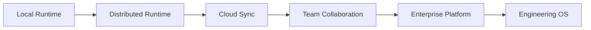
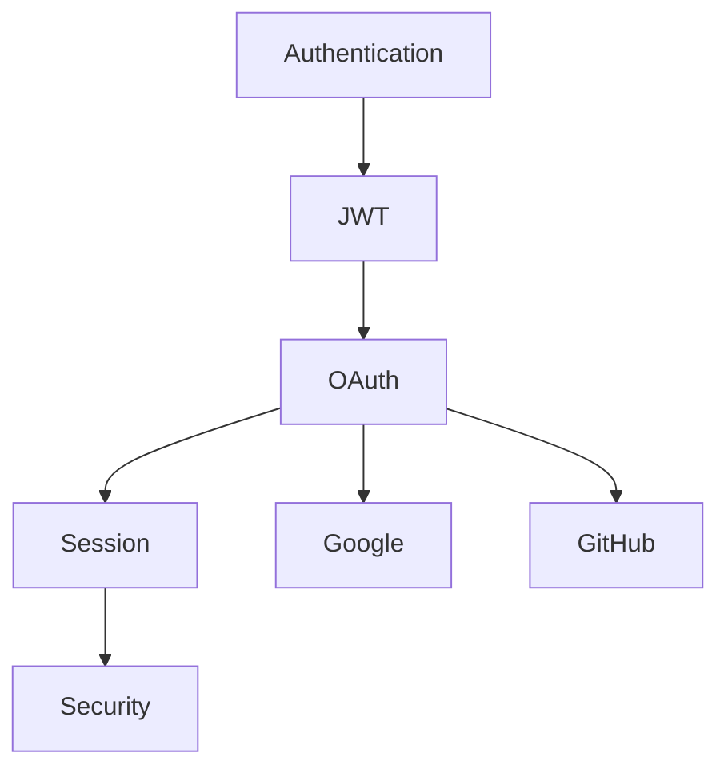

# Chapter 22 — Future Architecture

---

# Chapter 22 — Future Architecture

## 22.1 Overview

The previous chapters describe **Context OS Version 1**, a local-first runtime for orchestrating AI coding assistants.

However, the architecture has deliberately been designed for much more than a local CLI.

The long-term vision is:

> **Context OS becomes the operating system for software engineering.**

Just as Git became the universal version control layer, Context OS aims to become the universal **project intelligence layer**.

This chapter explores how the architecture evolves beyond Version 1 while preserving backward compatibility.

---

# 22.2 Guiding Principles

Every future enhancement must preserve the core architectural principles established throughout this document.

✓ Local First

✓ Provider Independent

✓ Workflow Driven

✓ Context Assembled, Not Remembered

✓ Human Readable

✓ Extensible

✓ Recoverable

✓ Deterministic

These principles are non-negotiable.

---

# 22.3 Evolution Roadmap

The architecture evolves through successive stages.



Each stage builds upon the previous one.

---

# 22.4 Distributed Runtime

Version 1 assumes a single developer.

Future versions support multiple runtimes.

```mermaid
flowchart TD

Developer A

Developer B

Developer C

↓

Shared Runtime

↓

Project Intelligence
```

Each developer maintains a local runtime while synchronizing selected project intelligence.

---

# 22.5 Cloud Synchronization

Project intelligence may optionally synchronize across devices.

Architecture

```mermaid
flowchart TD

Laptop

Desktop

Server

↓

Cloud Sync

↓

Encrypted Store
```

Important principles

* Local remains canonical.
* Cloud is optional.
* Offline continues to work.

---

# 22.6 Team Memory

Today,

memory belongs to a project.

Future

```text
Project

↓

Team Memory

↓

Organization Memory

↓

Global Knowledge
```

Knowledge becomes reusable across projects.

Example

Organization Coding Standards

↓

Automatically available

↓

New Projects

---

# 22.7 Shared Workflows

Future workflows may span multiple engineers.

Example

```text
Architecture

↓

Backend

↓

Frontend

↓

QA

↓

Deployment
```

Each participant contributes independently.

The workflow remains unified.

---

# 22.8 Multi-Agent Runtime

Version 1 executes one provider at a time.

Future versions support concurrent agents.

```mermaid
flowchart TD

Workflow

↓

Planner

Reviewer

Implementer

Tester

↓

Checkpoint

↓

Merge Results
```

Each agent receives a specialized execution context.

---

# 22.9 Agent Roles

Instead of provider names,

future workflows reference semantic roles.

Examples

```text
Planner

Researcher

Architect

Implementer

Reviewer

Tester

Optimizer

Security

Documentation
```

Multiple providers may fulfill the same role.

---

# 22.10 Distributed Context Builder

Today

one Context Builder serves one provider.

Future

```mermaid
flowchart TD

Project Intelligence

↓

Context Builder

↓

Planner Context

Reviewer Context

Implementation Context

Testing Context
```

Each role receives optimized context.

---

# 22.11 Knowledge Graph

Current Memory

```text
Markdown

↓

Tags
```

Future



Relationships become explicit.

---

# 22.12 Semantic Search

Instead of keyword search,

future versions support semantic retrieval.

Architecture

```mermaid
flowchart TD

Markdown

↓

Embedding

↓

Vector Index

↓

Retriever

↓

Context Builder
```

Canonical knowledge remains Markdown.

Embeddings accelerate retrieval.

---

# 22.13 API Runtime

Version 1

CLI only.

Future

```mermaid
flowchart LR

Workflow

↓

REST API

↓

Provider

↓

Execution Result
```

The runtime architecture remains unchanged.

Only adapters evolve.

---

# 22.14 MCP Integration

Future versions expose Context OS through the **Model Context Protocol (MCP)**.

Architecture

```mermaid
flowchart LR

IDE

↓

MCP Client

↓

Context OS

↓

Workflow Engine
```

External AI assistants interact with Context OS as an MCP server rather than directly reading project files.

---

# 22.15 IDE Integration

Future IDE integrations include

* VS Code
* JetBrains IDEs
* Cursor
* Windsurf
* Zed
* Neovim

These become presentation layers.

The runtime remains unchanged.

---

# 22.16 Background Services

Some tasks should execute continuously.

Examples

```text
Dependency Updates

Security Scanning

Architecture Drift Detection

Documentation Freshness

Workflow Monitoring
```

Future Scheduler

```mermaid
flowchart TD

Scheduler

↓

Workflow

↓

Provider

↓

Checkpoint
```

---

# 22.17 Event Streaming

Current

Events remain local.

Future

```mermaid
flowchart LR

Runtime

↓

Event Stream

↓

Analytics

↓

Dashboard
```

Supports

* Metrics
* Monitoring
* Notifications

---

# 22.18 Enterprise Architecture

Large organizations require additional capabilities.

Future additions include:

* SSO
* RBAC
* Organization Policies
* Central Plugin Registry
* Audit Compliance
* Secret Management
* Team Dashboards

These remain optional layers above the core runtime.

---

# 22.19 Remote Execution

Today

providers execute locally.

Future

```mermaid
flowchart TD

Workflow

↓

Remote Executor

↓

Cloud Agent

↓

Execution Result
```

Useful for

* CI/CD
* GPU inference
* Enterprise environments

---

# 22.20 Collaboration Model

```mermaid
flowchart TD

Developer A

Developer B

Developer C

↓

Workflow

↓

Shared Checkpoints

↓

Project Memory
```

Multiple engineers collaborate without sharing conversations.

They share project intelligence.

---

# 22.21 Marketplace

Future ecosystem

```text
Providers

↓

Plugins

↓

Workflow Templates

↓

Memory Packs

↓

Best Practices

↓

Marketplace
```

Organizations can publish reusable engineering assets.

---

# 22.22 Context Federation

Large organizations maintain many repositories.

Future

```text
Repository A

Repository B

Repository C

↓

Organization Knowledge

↓

Execution Context
```

Cross-project knowledge becomes possible.

---

# 22.23 AI Evaluation Framework

Future versions may benchmark providers.

Example

```text
Claude

Codex

Gemini

↓

Evaluation Runtime

↓

Metrics

↓

Recommendation
```

The runtime can recommend the most effective provider for a given workflow.

---

# 22.24 Autonomous Engineering

Long-term vision

```mermaid
flowchart TD

Goal

↓

Workflow

↓

Planner

↓

Implementer

↓

Reviewer

↓

Tester

↓

Human Approval

↓

Deploy
```

Humans supervise.

The runtime coordinates.

Providers execute.

---

# 22.25 Design Decisions

## Decision 1 — Evolution Without Rewrites

Future capabilities extend existing abstractions rather than replacing them.

---

## Decision 2 — Runtime Remains the Center

Whether execution is local, remote, or distributed, the runtime continues to orchestrate workflows.

---

## Decision 3 — Project Intelligence Remains Canonical

Even with semantic search, knowledge graphs, or cloud sync, the canonical source of truth remains the project's durable intelligence—not conversations.

---

## Decision 4 — Providers Remain Replaceable

No future enhancement should introduce provider-specific assumptions into the runtime.

---

## Decision 5 — Local First Forever

Cloud capabilities are additive.

The runtime must remain fully functional offline.

---

# 22.26 Risks

Potential challenges include:

* Distributed consistency
* Synchronization conflicts
* Multi-agent deadlocks
* Knowledge graph complexity
* Plugin compatibility
* Cloud security
* Vendor lock-in

These risks reinforce the importance of maintaining clear runtime boundaries.

---

# 22.27 Architectural Observation

The architecture presented in this document deliberately separates **what changes quickly** from **what changes slowly**.

Rapidly evolving components:

* AI models
* Providers
* APIs
* IDEs
* Plugins

Stable components:

* Workflows
* Memory
* Checkpoints
* Context Builder
* Storage
* Runtime

This separation allows Context OS to evolve with the AI ecosystem while preserving long-term architectural stability.

---

# 22.28 Vision Statement

The long-term vision of Context OS is not to become another coding assistant.

It is to become the **persistent engineering runtime** that every coding assistant can build upon.

In the same way that Git abstracts version control and Docker abstracts execution environments, Context OS abstracts project intelligence.

Developers should be free to choose any AI provider, IDE, or interface while retaining the same workflows, memory, artifacts, checkpoints, and engineering knowledge.

---

# 22.29 Chapter Summary

This chapter outlines the evolutionary path of Context OS beyond Version 1.

By extending the existing architecture with distributed runtimes, cloud synchronization, team memory, semantic retrieval, knowledge graphs, MCP integration, remote execution, and multi-agent workflows, Context OS can grow into a comprehensive engineering platform without abandoning its foundational principles.

The next chapter returns to the present by precisely defining the **Version 0.1 MVP Scope**, identifying the minimal feature set required to deliver a practical, provider-agnostic runtime that solves the immediate problem of durable project context for CLI-based AI coding assistants.
