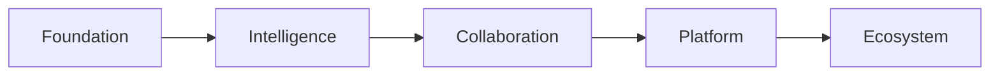
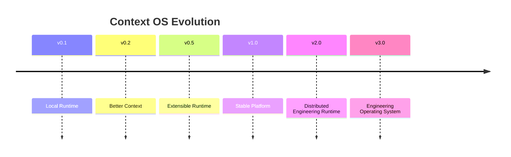

# Chapter 24 — Product Roadmap

---

# Chapter 24 — Product Roadmap

## 24.1 Overview

The previous chapter defined **what Version 0.1 includes**.

This chapter defines **how Context OS evolves** from an MVP into a mature engineering platform.

Unlike feature lists, this roadmap is organized around **architectural maturity**.

Each release introduces exactly one major capability while preserving the stability of the runtime.

Every milestone must satisfy three principles:

* No architectural rewrites
* Backward compatibility
* Incremental value

---

# 24.2 Guiding Philosophy

The roadmap is intentionally conservative.

Instead of adding features as quickly as possible,

Context OS evolves by strengthening the runtime.



Every release builds upon the previous one.

---

# 24.3 Release Timeline



---

# 24.4 Version 0.1

**Theme**

> Durable Project Context

Primary Objective

Prove that project intelligence can exist independently of conversations.

Major Features

✓ Runtime

✓ Workflow Engine

✓ Context Builder

✓ SQLite Storage

✓ Checkpoints

✓ Memory

✓ Artifacts

✓ CLI Adapters

✓ Bubble Tea Dashboard

Success Criteria

A workflow can survive:

* Provider switch
* Runtime restart
* Context compaction

without losing progress.

---

# 24.5 Version 0.2

Theme

> Intelligent Context Assembly

Focus

Improve context quality rather than adding new infrastructure.

Features

✓ Better repository summarization

✓ Improved artifact ranking

✓ Memory ranking

✓ Adaptive token budgeting

✓ Automatic checkpoint optimization

✓ Better diagnostics

✓ Workflow visualization

Still excluded

✗ Embeddings

✗ Cloud

✗ APIs

---

# 24.6 Version 0.3

Theme

> Better Developer Experience

Major Improvements

✓ Interactive workflow editing

✓ Better TUI

✓ Rich logs

✓ Runtime dashboard

✓ Better search

✓ Configuration wizard

✓ Provider validation

✓ Health checks

This release focuses on usability.

---

# 24.7 Version 0.5

Theme

> Extensible Runtime

Major Features

✓ Stable Plugin SDK

✓ Workflow templates

✓ Custom commands

✓ Event hooks

✓ Plugin registry

✓ Plugin permissions

Third-party developers can now extend Context OS.

---

# 24.8 Version 0.6

Theme

> AI-Aware Runtime

Features

✓ Automatic memory suggestions

✓ Context diagnostics

✓ Prompt inspection

✓ Context explainability

✓ Execution replay

✓ Provider comparison

This release helps developers understand why context was assembled the way it was.

---

# 24.9 Version 1.0

Theme

> Stable Engineering Runtime

Version 1.0 represents the first production-ready release.

Requirements

✓ Stable SDK

✓ Stable Storage

✓ Stable Runtime

✓ Stable Adapter API

✓ Stable Workflow API

✓ Migration support

✓ Documentation

✓ Cross-platform support

✓ Extensive testing

Backward compatibility becomes a commitment from this point onward.

---

# 24.10 Version 1.x

Version 1.x focuses on refinement rather than new architecture.

Potential improvements

* Better TUI
* Faster startup
* Additional CLI providers
* Better diagnostics
* Improved plugins
* Performance optimizations
* Better repository indexing

The architecture remains unchanged.

---

# 24.11 Version 2.0

Theme

> Distributed Runtime

Major Features

✓ Cloud synchronization

✓ Team memory

✓ Shared workflows

✓ Remote execution

✓ Multi-device support

✓ Organization profiles

This is the first release introducing collaboration.

---

# 24.12 Version 2.x

Future enhancements

✓ Enterprise authentication

✓ RBAC

✓ Remote providers

✓ Distributed checkpoints

✓ Runtime federation

✓ Team dashboards

These extend Version 2 without changing the underlying architecture.

---

# 24.13 Version 3.0

Theme

> Engineering Operating System

Major Features

✓ Knowledge Graph

✓ Semantic Memory

✓ Multi-agent workflows

✓ Autonomous planning

✓ Distributed orchestration

✓ Organization knowledge

✓ AI evaluation framework

This fulfills the long-term vision introduced in Chapter 22.

---

# 24.14 Technology Evolution

The technology stack also evolves.

| Version | Storage           | Retrieval       | Providers          |
| ------- | ----------------- | --------------- | ------------------ |
| v0.1    | SQLite + Markdown | Metadata        | CLI                |
| v0.2    | Same              | Better ranking  | CLI                |
| v0.5    | Same              | Same            | Plugin Providers   |
| v1.0    | Stable            | Same            | Stable Adapter API |
| v2.0    | Hybrid            | Semantic        | CLI + API          |
| v3.0    | Distributed       | Knowledge Graph | Everything         |

Notice

Storage remains largely stable.

Only retrieval evolves.

---

# 24.15 Runtime Evolution

```mermaid
flowchart TD

Runtime

↓

Workflow

↓

Context Builder

↓

Adapters

↓

Plugins

↓

Distributed Runtime

↓

Engineering Platform
```

No component is replaced.

Only extended.

---

# 24.16 Migration Strategy

Every release must support migration.

```text
v0.1

↓

context migrate

↓

v0.2

↓

context migrate

↓

v0.5

↓

context migrate

↓

v1.0
```

Project intelligence should never become obsolete.

---

# 24.17 Compatibility Policy

| Version | Compatibility  |
| ------- | -------------- |
| Patch   | Full           |
| Minor   | Full           |
| Major   | Migration Tool |

Developers should never manually edit runtime metadata.

---

# 24.18 Success Metrics

Each milestone has measurable goals.

### v0.1

* Successful provider switching
* Workflow recovery
* Stable checkpoints

---

### v0.5

* Plugin ecosystem
* Community workflow templates
* Third-party adapters

---

### v1.0

* Stable public SDK
* Production adoption
* Extensive documentation

---

### v2.0

* Team adoption
* Cloud synchronization
* Shared workflows

---

### v3.0

* Organization knowledge
* Multi-agent engineering
* Autonomous workflows

---

# 24.19 Open Source Strategy

The roadmap also defines community growth.

Phase 1

```text
Core Team
```

↓

Phase 2

```text
Early Contributors
```

↓

Phase 3

```text
Plugin Authors
```

↓

Phase 4

```text
Organizations
```

↓

Phase 5

```text
Large Ecosystem
```

The community grows alongside the platform.

---

# 24.20 Risks Per Phase

| Version | Primary Risk                        |
| ------- | ----------------------------------- |
| v0.1    | Proving core hypothesis             |
| v0.5    | API stability                       |
| v1.0    | Backward compatibility              |
| v2.0    | Synchronization complexity          |
| v3.0    | Distributed intelligence complexity |

The roadmap intentionally postpones higher-risk capabilities.

---

# 24.21 Deprecation Policy

Context OS follows a predictable lifecycle.

```text
Experimental

↓

Stable

↓

Deprecated

↓

Removed
```

Deprecation notices must appear at least one major release before removal.

---

# 24.22 Architectural Invariants

Regardless of version,

the following principles never change.

✓ Project intelligence is durable.

✓ Workflows are provider independent.

✓ Context is assembled.

✓ Storage is local first.

✓ Providers remain replaceable.

✓ Runtime owns orchestration.

These invariants define Context OS.

---

# 24.23 What Success Looks Like

The roadmap reaches its destination when developers stop asking:

> "Which AI assistant should I use?"

Instead they ask:

> "Which provider should execute this workflow step?"

The provider becomes an interchangeable execution engine.

The runtime remains constant.

---

# 24.24 Long-Term Vision

Ultimately,

Context OS should occupy the same architectural role that Git occupies today.

Git manages:

* source code history

Context OS manages:

* engineering intelligence

Git stores commits.

Context OS stores:

* workflows
* memory
* checkpoints
* artifacts
* engineering knowledge

Together they become complementary layers of software engineering.

---

# 24.25 Design Decisions

## Decision 1 — Evolution Over Revolution

Every release extends the runtime rather than replacing it.

---

## Decision 2 — Stable Core

Architectural stability is prioritized over rapid feature expansion.

---

## Decision 3 — Community Before Complexity

The roadmap favors a healthy ecosystem over an oversized core runtime.

---

## Decision 4 — Infrastructure Before Intelligence

Strong foundations come before advanced AI features.

---

## Decision 5 — Backward Compatibility

Project intelligence created today should remain usable years into the future.

---

# 24.26 Chapter Summary

This roadmap defines a deliberate evolution for Context OS, beginning with a focused local runtime and gradually expanding into a distributed engineering platform.

Each release adds a single layer of capability while preserving the architectural principles established throughout this document.

By treating the runtime as the long-term investment—and providers as replaceable execution engines—Context OS can evolve alongside the rapidly changing AI ecosystem without sacrificing stability, portability, or developer trust.

The next chapter examines the **Risks & Trade-offs**, evaluating the architectural decisions made throughout this design and identifying potential technical, operational, and product risks along with their mitigation strategies.
